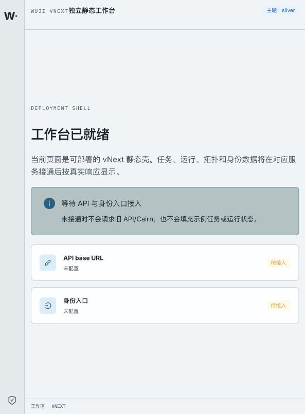

# P13 public API on Kubernetes — 2026-09-15

Status: **implemented and locally verified for the bounded read slice**.

This evidence binds the isolated public `api` Deployment and the P13 topology route to source commit `24f984f`. The route uses the same `ProjectionRepository` implementation already covered by the P13 database tests, with a non owner `wuji_app` connection and issuer signed bearer verification. The deployment is in `wuji-vnext-test`, backed by the new synthetic database `wuji_vnext_ui_20260915` and Task `a41a59ed-29e1-4801-b68b-dfea395eae30`.



The complete authenticated and unauthenticated HTTP exchanges are in [http-reproduction.md](http-reproduction.md). The machine readable Pod, Service, image and scope binding is in [k8s-binding.json](k8s-binding.json); credentials are not included.

Observed results:

- `GET /api/v2/tasks/{task_id}/topology` with the fresh operator bearer returned `200`, a persisted `snapshot_id`, a `view_id`, two real nodes, and zero edges for the newly initialized Task.
- The same request without a bearer returned `401/UNAUTHENTICATED`.
- PostgreSQL contained the materialization, two views and two cursors created by the two live/history reads; no internal event sequence was returned in the public document.
- `runtime`, `scheduler`, `gates`, `api`, and the existing K8s Web Pod were Ready after deployment. The Web page remains the static shell because browser session/identity integration is a separate pending slice.

Validation executed against the current source:

```text
./scripts/vnext/uv.sh run --frozen pytest tests/vnext/test_view_snapshots.py -q       # 13 passed
PYTHONPATH=packages/task-runtime/src:ops/vnext/.venv/lib/python3.13/site-packages \
  ./scripts/vnext/uv.sh run --frozen pytest tests/vnext/test_k8s_runtime.py tests/vnext/test_configure_refresh.py -q  # 4 passed
```

The live HTTP check is a local synthetic mechanism check. It does not claim full P11/P12/P13–P15 acceptance, browser OIDC/session support, layout CAS, ViewStream, or production release readiness.
