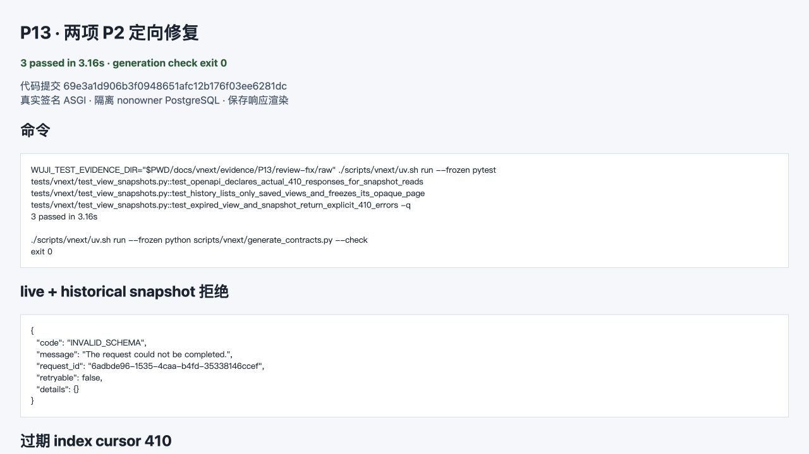

# P13 独立审查两项 P2 定向修复

状态：**修复已定向验证，等待 Turing 复审**。代码提交 `69e3a1d906b3f0948651afc12b176f03ee6281dc`；原 P13 runtime slice 的 12 项结果保持历史记录，本轮没有重跑或改写。



[截图来源](screenshots/provenance.json)是浏览器对已保存结果的实际渲染，不是产品 UI，截图阶段没有重新调用数据库或 API。

## 修复

- `ProjectionRepository.topology` 现在只接受 `live + snapshot_id=None` 或 `history + 已保存 snapshot_id`。历史页不能再取得 live 查询身份；history continuation 仍绑定原 mode、snapshot、query、主体和 access digest。
- 冻结 OpenAPI 为 snapshots index 与 record detail 增加实际 `410/Expired` 响应；TypeScript 生成物同步。没有改 DTO 字段、权限、DDL、其他路由或 Python generated models。
- 过期用例新增真实 index cursor 410，同时保留 snapshot record 410；未通过放宽错误或删除权限守卫实现。

## RED / GREEN

[RED](red.txt)真实观察到 OpenAPI 缺 410，以及 `live+H1` 返回 200。

```text
WUJI_TEST_EVIDENCE_DIR="$PWD/docs/vnext/evidence/P13/review-fix/raw" ./scripts/vnext/uv.sh run --frozen pytest tests/vnext/test_view_snapshots.py::test_openapi_declares_actual_410_responses_for_snapshot_reads tests/vnext/test_view_snapshots.py::test_history_lists_only_saved_views_and_freezes_its_opaque_page tests/vnext/test_view_snapshots.py::test_expired_view_and_snapshot_return_explicit_410_errors -q
...                                                                      [100%]
3 passed in 3.16s
```

```text
./scripts/vnext/uv.sh run --frozen python scripts/vnext/generate_contracts.py --check
Generated Python and TypeScript v2 contracts match OpenAPI.
exit 0
```

[binding.json](binding.json)记录提交、命令、退出码与四个受测/生成文件摘要。[完整 HTTP](http-reproduction.md)共 22 组，保留方法、URL、headers、请求体和响应；Authorization 已替换为可重签的测试变量并保留原 Header SHA-256。[raw/](raw/)保存脱敏 HTTP、身份事件、夹具 bytes 与 gzip PostgreSQL 完整事件，[evidence-index.json](evidence-index.json)记录摘要。

本轮只证明两个 P2 及其 history continuation/410 相邻路径。未运行旧 12 项、pure builder、M1、P14/Layout/Stream、P08 或 M2；没有收费模型、外部目标或生产切换。API 路径均为既有冻结接口，没有发现新资产，无需更新资产梳理。
