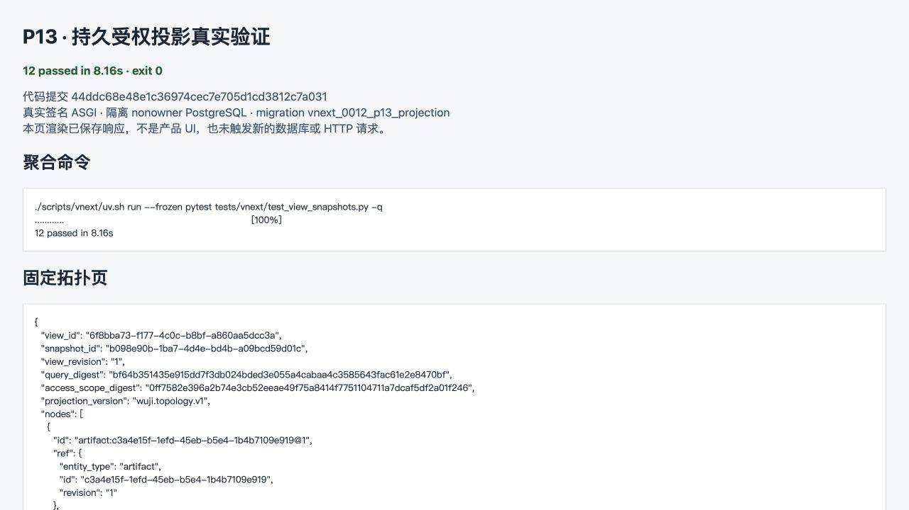

# P13 持久受权投影后端验证

日期：2026-09-13。状态：**后端持久投影/API 定向运行验证通过；M4 仍为 partial**。Layout、ViewStream 和 P14 正式容器接线不在本次通过范围。

实现来源为 P13 core `3015ca6a56b31aaa666e12bd9e81781b3bc1ff9b`、P04 existing-transaction port `592bed2`，0012 migration 与真实测试提交 `44ddc68e48e1c36974cec7e705d1cd3812c7a031`。本报告与截图是后续证据提交，不预写自身 SHA。



[截图来源](screenshots/provenance.json)说明这是 loopback 浏览器对已保存命令和响应的实际渲染，不是产品 UI，也没有在截图阶段重新调用数据库或 API。

## 实际结果

```text
./scripts/vnext/uv.sh run --frozen pytest tests/vnext/test_view_snapshots.py -q
............                                                             [100%]
12 passed in 8.16s
```

输入实现、命令、退出码与九份源码/测试文件摘要见 [binding.json](binding.json)。测试先在工作树运行，随后只提交相同内容；打包脚本逐文件确认 `44ddc68` blob 与受测工作树一致。最初缺模块 RED 保留在 [persistence-initial-red](../persistence-initial-red/)。

实际验证内容：

- `vnext_0012_p13_projection` 可从真实 0011 head 安装；三张派生表启用 RLS。应用角色仅获 SELECT/INSERT 和两个窄函数 EXECUTE，没有 UPDATE/DELETE；PUBLIC 无函数执行权。原 0010/0011 未重写。
- 签名 reader 首次读取生成持久 SnapshotManifest/materialization/view/cursor。第一页后写入 Claim revision 2，后续页和 snapshot 详情仍固定 revision 1 与原 Fact display；当前 revision 2 保持未评估 Claim。
- opaque cursor 是服务端保存的随机 handle。修改 node limit 或换另一签名主体均返回 404；缺认证返回 401。公开快照、详情和 handle 不含 board/event sequence、Assignment digest、credential ref 或隐藏计数。
- 将 reader clearance 从 2 降到 1 后，旧 view continuation 失效，旧高权限记录不可读取；新视图不含私有 Artifact、Observation、Claim、正文、边标题或派生计数。
- 历史索引只列真实 P13 materialization；第一页建立后新增 snapshot 不进入旧 index cursor。已保存 H1 可创建新 history view，未知 H0 返回 `410/HISTORY_UNAVAILABLE`，无 snapshot 的 history query 返回 422；过期 view/snapshot 分别返回明确 410。
- topology GET 前后 Task execution epoch/runtime attempt/state/event sequence、AgentRun、Assignment、Run credential 与 Outbox 计数不变。P03 夹具中的无来源旧 Run 没有投影节点。
- `FactLedger.read_in_transaction` 在同一尚未提交的真实 Repeatable Read snapshot 事务读取 canonical frozen Fact；伪造 caller states 返回 503，foreign-task manifest 返回 404。
- P09 Scheduler 真实创建 Assignment/Run/outbox 后，普通 reader 对 `scheduler_assignment` SELECT 得到空集，但 `projection_run_origin` 仅返回 `created_at`。跨 Task、撤权和无真实来源均无返回。签名 topology/详情显示真实 Run，公开 DTO 不含 sequence 或 Assignment 字段。
- 真实初始 TaskCreate definition 只映射 Task Origin 的 `goal_revision=1`；没有 P12 生产者时不创建 GoalRecord，也不为 Verification/Completion/Report 等类型造数据。

## 完整复现数据

[完整 HTTP 请求与响应](http-reproduction.md)共 49 组，逐条保留 method、URL、headers、请求体、响应状态/headers/响应体和漏洞/控制点标注。Authorization 只替换为可重新签发的隔离 fixture 变量，原 Header SHA-256 保存在 runtime JSONL；未提交 bearer 或私钥。

[runtime/](runtime/)保存 43 个原生文件：HTTP body 的完整 base64 字节、身份签发事件、外部夹具 bytes，以及无损 gzip 的 PostgreSQL SQL/参数/结果、事务提交/回滚记录。[evidence-index.json](evidence-index.json)记录打包字节和原始字节摘要。没有截断关键数据。

## 边界与交接

本次是 SOL/xhigh 执行者的定向验证，不称独立审查。既有 pure builder 9 项与 M1 SDK 未重跑。没有收费模型、外部目标、旧服务、生产切换、推送或用户数据删除。

P14 可按 [consumer handoff](P14-consumer-handoff.md)使用真实 P13 API。正式 TopologyContainer 接线、Layout CAS、ViewStream/P15、规模 p95 与后续真实 P12 类型仍待各自实现/验收，因此不标 M4 全过。三个 API 路径已在冻结 OpenAPI 中存在，本次没有发现新资产或新接口，无需更新资产梳理清单。
