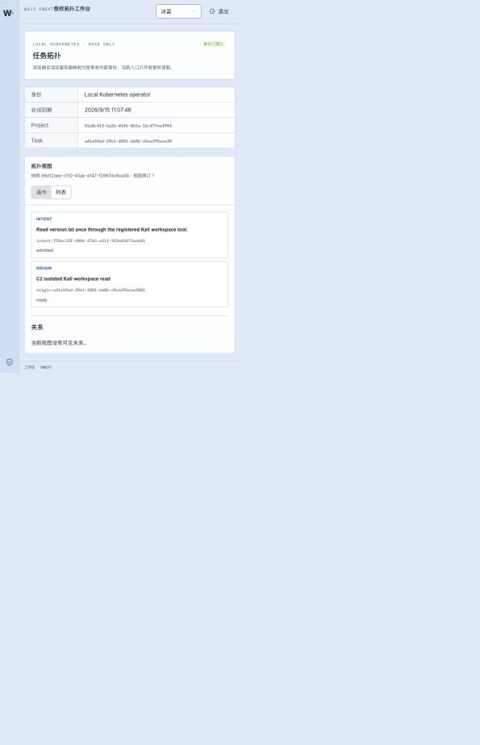
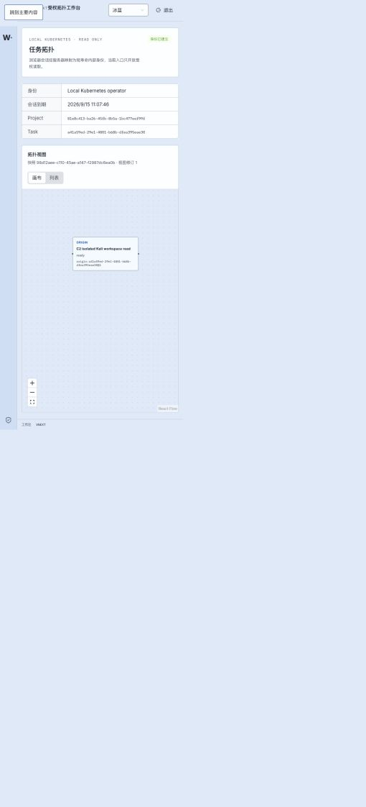

# P14 Kubernetes browser workbench — 2026-09-15

Status: **bounded read-only browser slice verified**.

The workbench at `http://127.0.0.1:44180/` now runs entirely through Kubernetes. `Deployment/wuji-web` contains the Nginx frontend and a loopback browser-session gateway. The browser holds only an HttpOnly, SameSite=Strict session cookie. The gateway maps that session to a newly signed, at-most-60-second internal bearer and permits only the fixed Task's topology, snapshot and record GET paths. The signing and session keys are mounted from `Secret/wuji-web-gateway-credentials`; neither value is present in `config.js`, page content, Git or this report.



The canvas rendering is also preserved:



The complete redacted HTTP exchanges are in [http-reproduction.md](http-reproduction.md), including anonymous rejection, session creation, current-session read, real topology response, cross-Task rejection, logout and post-logout rejection. Cookie values are redacted as credentials; response bodies are complete. [k8s-binding.json](k8s-binding.json) records Pod UIDs and immutable images without Secret values. [interface-inventory.md](interface-inventory.md) records utilized and pending interfaces.

Observed browser result:

- session display name: `Local Kubernetes operator`;
- Task: `a41a59ed-29e1-4801-b68b-dfea395eae30`;
- P13 snapshot: real persisted view returned through the public API and gateway;
- visible nodes: admitted Intent and ready Task Origin;
- canvas/list switch: successful;
- browser console errors: zero during the observed render.

Validation:

```text
PYTHONPATH=packages/task-runtime/src:ops/vnext/.venv/lib/python3.13/site-packages \
  ./scripts/vnext/uv.sh run --frozen pytest \
  tests/vnext/test_web_gateway.py tests/vnext/test_web_manifest.py tests/vnext/test_k8s_runtime.py -q
# 10 passed

PYTHONPATH=packages/task-runtime/src:ops/vnext/.venv/lib/python3.13/site-packages \
  ./scripts/vnext/uv.sh run --frozen pytest tests/vnext/test_configure_refresh.py -q
# 2 passed

work/toolchain/bin/pnpm --filter @wuji/web typecheck
# exit 0

work/toolchain/bin/pnpm --filter @wuji/web build
# exit 0; existing large-bundle warning only
```

The deployed Web and gateway code is `e8a51621f4afcc68a697cb634aaa9b7844378b8a`; the group-readable Secret mount fix is `09ad034`. Later commits `f51612c` and `eacaf34` add test-only coverage. This does not claim production OIDC, full P11 identity, P15 stream/layout/history integration, record details, or complete M4 acceptance.
