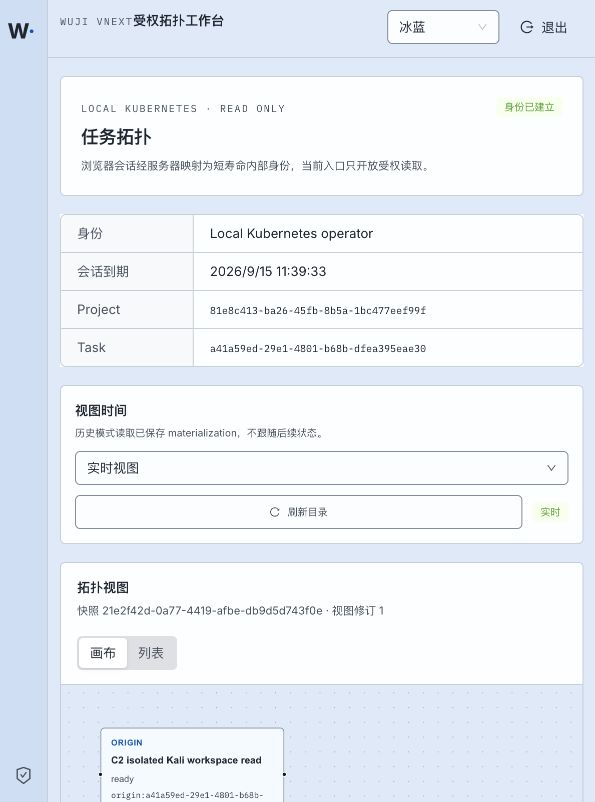

# P14 Kubernetes-managed browser entry — 2026-09-15

Status: **verified** for the local Docker Desktop Kubernetes environment.

Code commit `8e0f30e` changes the generated `wuji-web` Service from `ClusterIP` plus an operator-owned `kubectl port-forward` to `type: LoadBalancer` on service port 44180. Docker Desktop assigned external hostname `localhost` and node port 32452. The existing Service UID and Web Pod remained in use; the Web and gateway images were unchanged.

After stopping the old port-forward, the host listener was owned by `com.docker.backend`, no matching `kubectl port-forward` process remained, and both `GET /healthz` and `GET /` returned 200 through `127.0.0.1:44180`.



The browser displayed the real authenticated Task topology and reported zero console errors. The screenshot SHA-256 is `5006cdd292d36720134864c51132156bdd2d15057f6af281c5064d1b979ca5d0`.

Validation:

```text
./scripts/vnext/uv.sh run --frozen pytest tests/vnext/test_web_manifest.py -q
5 passed in 0.01s

Service/wuji-web: LoadBalancer, EXTERNAL-IP localhost, 44180:32452/TCP
EndpointSlice: 10.1.0.85:8080
Host listener: com.docker.backend on TCP *:44180
kubectl port-forward for 44180: absent
GET /healthz: HTTP 200, body "ok\n"
GET /: HTTP 200, complete 431-byte HTML
Browser console errors: 0
```

[Complete HTTP requests and responses](http-reproduction.md), [asset/interface inventory](interface-inventory.md), and [`raw/`](raw/) retain the exact service object, Pod binding, listener, HTTP traces and registry observations.

The registry audit confirms that application runtime components are in Kubernetes. `wuji-vnext-build-registry` remains Docker Desktop node-side image distribution infrastructure because Kubernetes nodes must fetch images before application Pods start. The empty legacy `wuji-vnext-registry` container is recorded as unused and was not deleted.
