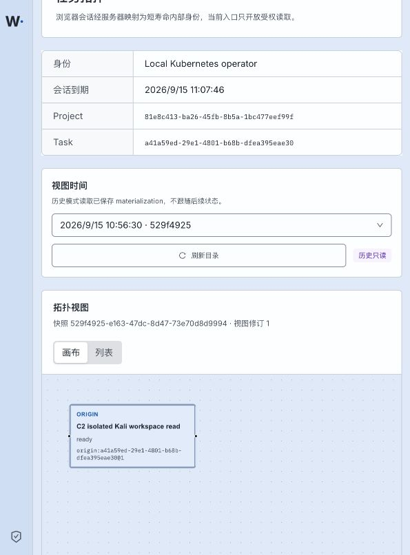

# P15 historical snapshot browser — 2026-09-15

Status: **bounded history-selection slice verified**.

The Kubernetes workbench now reads the P13 snapshot directory and lets the user switch from live mode to a retained materialization. Selecting a saved entry clears the previous selection, opens a new history view with the exact snapshot ID and keeps record detail reads bound to that same snapshot.



The complete login, snapshot-index, history-topology and historical-record HTTP packets are in [http-reproduction.md](http-reproduction.md). The cookie is redacted as a credential; all response bodies and opaque snapshot/view identifiers are complete. [k8s-binding.json](k8s-binding.json) records the current Pod and immutable images. [interface-inventory.md](interface-inventory.md) records coverage and pending P15 work.

Observed results:

- snapshot index: `200`, seven retained summaries in the current page;
- selected snapshot: `529f4925-e163-47dc-8d47-73e70d8d9994`;
- history topology: `200`, response `snapshot_id` exactly matched the selection, two visible nodes;
- historical Origin detail: `200`, revision `1`, same snapshot binding;
- browser: `历史只读` visible, selected snapshot shown in both selector and topology header, zero console errors.

Validation:

```text
work/toolchain/bin/pnpm exec vitest run \
  --config tests/topology/vitest.config.ts \
  tests/topology/history.test.ts --reporter=verbose
# 2 passed

work/toolchain/bin/pnpm --filter @wuji/web typecheck
# exit 0

work/toolchain/bin/pnpm --filter @wuji/web build
# exit 0; existing large-bundle warning only
```

The deployed Web code and image bind to `f55f2ab`. Directory pagination is implemented with the server-provided opaque cursor but was not exercised because this page had no continuation. ViewStream, reconnect/reset and Layout CAS remain pending, so full P15 acceptance is not claimed.
