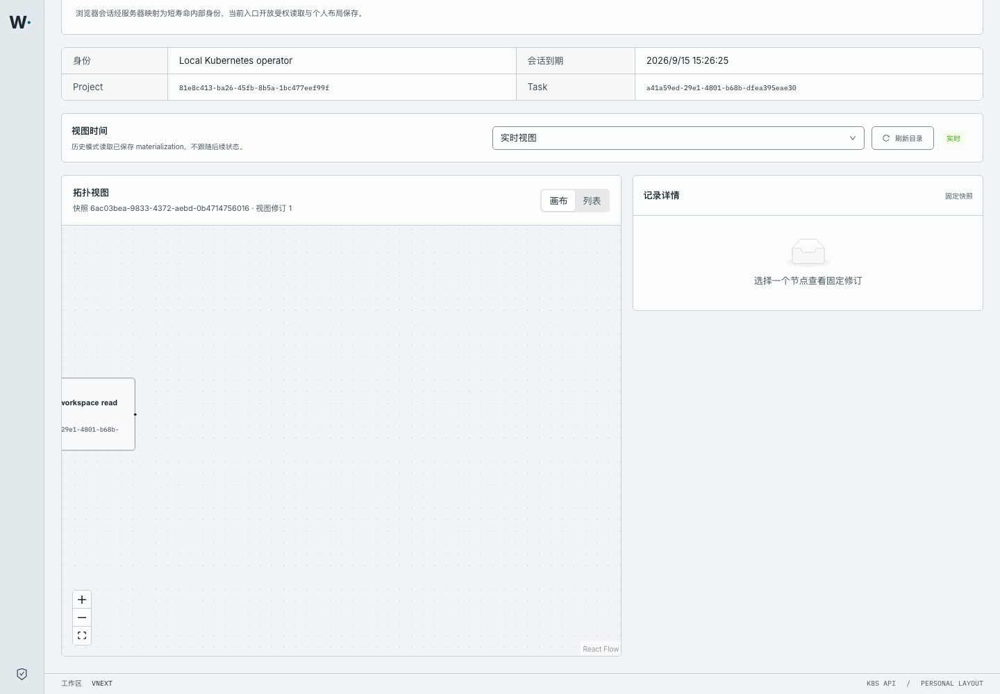
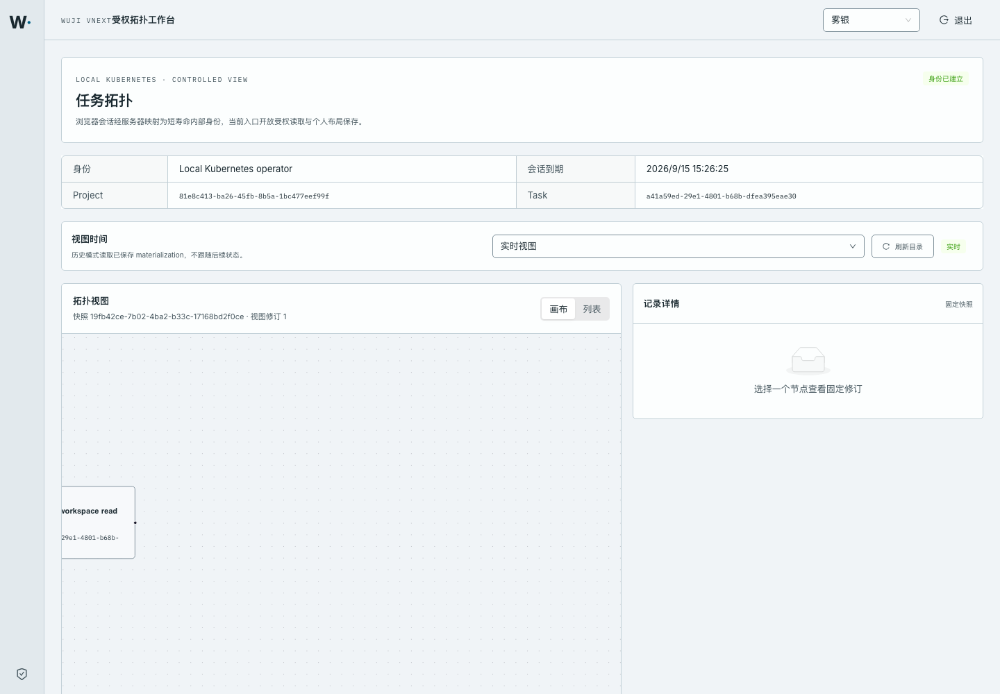
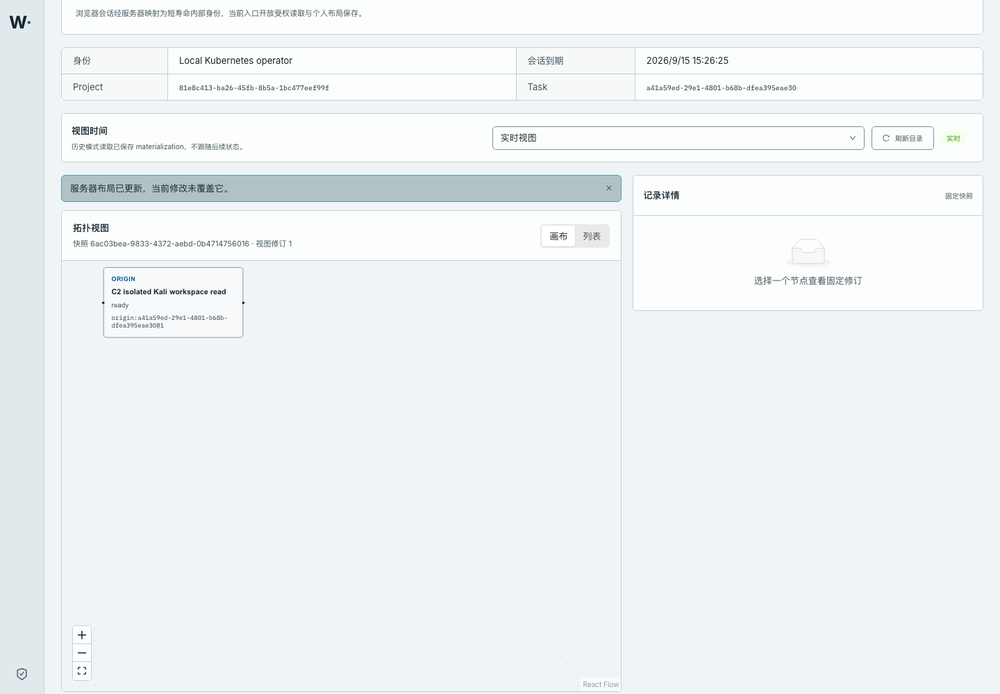
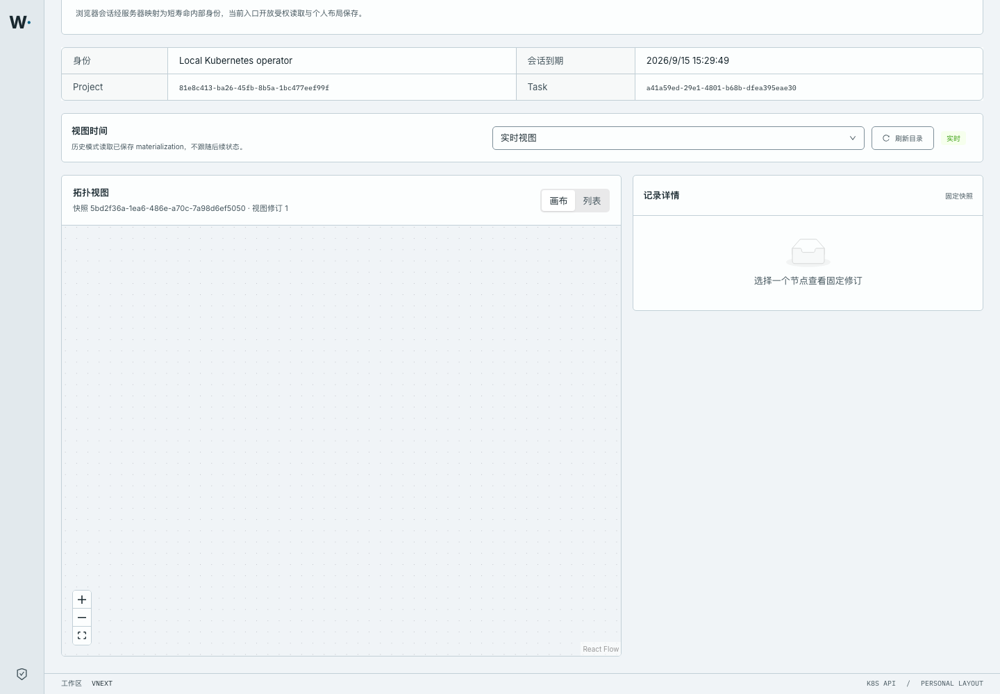

# P15-L personal layout CAS — 2026-09-15

Status: **verified** for the isolated Docker Desktop Kubernetes slice.

The workbench at `http://127.0.0.1:44180/` now stores a per-user, per-view topology layout in
PostgreSQL through an `If-Match` compare-and-swap. Dragging a node or moving the canvas survives a
browser refresh, two tabs that start from the same revision cannot overwrite each other, and the
stale request is rejected with `409 STALE_VERSION` without changing Task, Claim, Intent, Artifact,
WorkItem, Run, snapshot or outbox state.





The conflict path is visible to the user and does not write the discarded edit back:



## What was built

| Layer | Change |
| --- | --- |
| Contract | `GET`/`PUT /api/v2/tasks/{task_id}/layouts/{view_name}`, new `LayoutPreference`, bounded `LayoutViewport`, regenerated Python and TypeScript DTOs |
| Persistence | migration `vnext_0018_p15_layout`, table `vnext.layout_preference` with RLS `layout_read`/`layout_insert`/`layout_update`, `LayoutRepository` compare-and-swap |
| HTTP | `wuji_core/http/layouts.py` mounted in the isolated public API; anchors are validated against the authorized projection |
| BFF | `services/wuji-web-gateway/main.py` forwards only the fixed Task layout GET/PUT with exact Origin, JSON, `If-Match` and body bound |
| Web | workbench reads, saves, rebases and conflicts on the personal layout; a conflict discards local and queued edits, remounts the canvas and keeps the notice visible |

## Observed results

HTTP, through the Kubernetes `Service/wuji-web` LoadBalancer (`127.0.0.1:44180`):

```text
GET  /healthz                                                  -> 200
GET  /api/v2/tasks/{task}/layouts/knowledge-live (anonymous)    -> 401 UNAUTHENTICATED
POST /auth/login                                                -> 200, HttpOnly SameSite=strict cookie
GET  /api/v2/tasks/{task}/layouts/knowledge-live                -> 200, layout_revision 51
PUT  /api/v2/tasks/{task}/layouts/knowledge-live (If-Match 51)  -> 200, layout_revision 52
PUT  /api/v2/tasks/{task}/layouts/knowledge-live (If-Match 51)  -> 409 STALE_VERSION
GET  /api/v2/tasks/{task}/layouts/knowledge-live                -> 200, revision 52 unchanged after the 409
GET  /api/v2/tasks/{task}/layouts/knowledge-history             -> 200, separate revision 0 preference
GET  /api/v2/tasks/<other-task>/layouts/knowledge-live          -> 404 NOT_FOUND_OR_FORBIDDEN
PUT  ... (no Origin / wrong Origin)                             -> 403 FORBIDDEN (never forwarded)
PUT  ... (If-Match 01)                                          -> 422 INVALID_SCHEMA
PUT  ... (text/plain)                                           -> 422 INVALID_SCHEMA
PUT  ... (unknown anchor)                                       -> 422 INVALID_REFERENCE
PUT  ... (duplicate anchors)                                    -> 422 INVALID_SCHEMA
PUT  ... (viewport zoom NaN)                                    -> 422 INVALID_SCHEMA ("not strict JSON")
PUT  ... (selection_mode explicit_revision on knowledge-live)   -> 422 INVALID_SCHEMA
PUT  /api/v2/tasks/{task}/commands                              -> 404 (BFF does not forward writes)
POST /api/v2/tasks/{task}/commands                              -> 405 (BFF route table, no upstream call)
```

Browser, through the real Chromium session on the same URL:

```text
session established; canvas and list render the real Task topology
drag the Intent node + wheel zoom        -> layout_revision 55 -> 58, node entry persisted with x=1138.27 y=148.39, zoom 0.928
page reload                              -> node box delta 0 px / 0 px, viewport transform identical to the pre-reload value
second tab writes the same revision      -> first tab gets 409, shows "服务器布局已更新，当前修改未覆盖它。",
                                            server stays at the second tab's revision/entries/viewport for the full 14 s observation window
stale PUT from the browser               -> 409 STALE_VERSION, stored preference unchanged
browser console                          -> 3 expected protocol errors (pre-login 401, two deliberate 409 conflicts); 0 page errors, 0 failed requests
```

Real PostgreSQL state after the whole run ([`raw/db-state.txt`](raw/db-state.txt)):

```text
migration_head=vnext_0018_p15_layout
layout_row=operator|knowledge-live|105|follow_latest|entries=1
layout_columns=tenant_id,project_id,task_id,subject,view_name,layout_schema,layout_revision,selection_mode,entries_json,viewport_json,updated_at
rls_enabled=true
policies=layout_insert,layout_read,layout_update
domain=tasks:1 outbox:1 claim_revision:0 intent_revision:1 artifact:0 observation:0 work_item:0 agent_run:0 tool_call:0 board_revision:1 event_seq:1
```

Layout writes only move `layout_revision` for the acting subject; the domain counters, `board_revision`
and `event_seq` are identical before and after every layout request.

## Conflict write-back defect found and fixed

The first live browser run exposed a real defect. When the node drag was long enough for React Flow to
auto-pan the canvas, the workbench kept writing the canvas's leftover drag and pan state after the
stale `PUT` had been rejected, so it silently re-applied the very change the conflict notice claimed
not to apply, and the notice disappeared.

The identical aggressive gesture was replayed against both builds (`conflict-trace-pan.mjs`, 40 mouse
steps past the canvas edge during the stale save):

| | before the fix (`wuji-web@sha256:4719b20d…`) | after the fix (`wuji-web@sha256:db056ea8…`, commit `b465238`) |
| --- | --- | --- |
| `PUT` requests observed | 41 (1 stale `409` + 40 follow-up `200`) | 2 (1 baseline `200` + 1 stale `409`) |
| stored revision after the run | 103 with the discarded drag re-applied | 105, the other tab's layout |
| stored entry count | 2 | 1 |
| conflict notice at the end | absent | `服务器布局已更新，当前修改未覆盖它。` |
| raw trace | [`raw/conflict-trace-before-fix.json`](raw/conflict-trace-before-fix.json) | [`raw/conflict-trace-after-fix.json`](raw/conflict-trace-after-fix.json) |




The fix keeps the last server-confirmed revision, drops any layout change computed from a different
revision, and remounts the canvas from the server layout on conflict. A repository regression test
covers the same contract (`tests/topology/browser.spec.ts`,
`a stale personal layout save reports the conflict and never rewrites the newer layout`), together with
the container fixes for the request-isolation fixture and the conditional loading copy.

## Validation

```text
./scripts/vnext/uv.sh run --frozen pytest tests/vnext/test_layouts.py -q      # 5 passed (real PostgreSQL + signed HTTP)
./scripts/vnext/uv.sh run --frozen pytest tests/vnext/test_web_gateway.py -q  # 3 passed (BFF)
work/toolchain/bin/pnpm contracts:check:v2                                    # generated Python/TS match OpenAPI
work/toolchain/bin/pnpm exec vitest run --config tests/topology/vitest.config.ts   # 25 passed
work/toolchain/bin/pnpm exec playwright test --config playwright.topology.config.ts # 5 passed
work/toolchain/bin/pnpm --filter @wuji/web typecheck                          # exit 0
work/toolchain/bin/pnpm --filter @wuji/web build                              # exit 0 (pre-existing bundle-size warning)
node work/vnext/p15l-browser/verify-layout.mjs                                # browser persistence/conflict report
```

Raw command output is in [`raw/`](raw/) (`pytest-*`, `contracts-check.txt`, `vitest-topology.txt`,
`playwright-topology.txt`, `web-typecheck.txt`, `web-build.txt`, `browser-verification.log`,
`conflict-trace.json`, `db-state.txt`, `migrate-0018.log`).

## Scope and limitations

Tested code revision **b465238486d3ffd0476bbfa9384dcf60656be237**; both images were rebuilt from
`git archive` of that commit and labelled with it. Pod UIDs, image digests and the migration job are
recorded in [k8s-binding.json](k8s-binding.json); file hashes are in [sha256.json](sha256.json).

- The session is the local mechanism operator minted by the BFF; production OIDC, project selection
  and Task creation are still P11 work.
- Only the two knowledge views (`knowledge-live`, `knowledge-history`) have layout preferences; the
  legacy workbench view keeps `persistLayout={false}`.
- The Task authorization window of the fixture had already expired; the layout slice only requires
  the current Task read ACL, which is why it still reads and writes. This result does not extend or
  renew any Task authorization.
- Only API, browser gateway and web images were rebuilt and rolled out; `runtime`, `scheduler` and
  `gates` still run the earlier platform digest.
- ViewStream, reconnect/reset, artifact preview, governance and scale targets remain
  pending/not_run, so P15 is not fully accepted.
