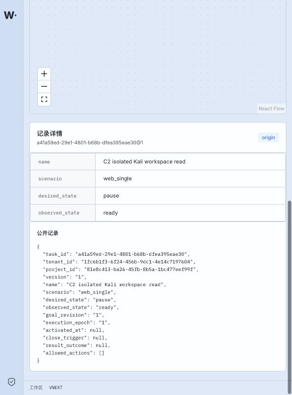

# P15 snapshot-bound record detail — 2026-09-15

Status: **bounded record-detail slice verified**.

The Kubernetes workbench now carries the actual P13 `snapshot_id` out of `TopologyContainer`. Selecting a graph or list node resolves to one exact visible revision and calls the P13 record route with that same snapshot. The panel rejects a response whose outer `KnowledgeRef` differs from the selected revision and displays only the public `RecordView` returned by the server.



The complete login, topology, Intent-record and Origin-record HTTP exchanges are in [http-reproduction.md](http-reproduction.md). The HttpOnly cookie is redacted; record response bodies are complete. [k8s-binding.json](k8s-binding.json) binds the Web Pod, immutable images, Task and HTTP snapshot. [interface-inventory.md](interface-inventory.md) records utilized and pending interfaces.

Observed results:

- Intent `778ac2ff-d006-4764-a11f-9f3e83473ade@1` returned `200`, `acceptance_state=admitted`, and its fixed question.
- Origin `a41a59ed-29e1-4801-b68b-dfea395eae30@1` returned `200`, `desired_state=pause` and `observed_state=ready`.
- Both responses were fetched using snapshot `529f4925-e163-47dc-8d47-73e70d8d9994` in the HTTP capture.
- Browser selection independently rendered the same Origin fields from its current snapshot and reported no console errors.

Validation:

```text
work/toolchain/bin/pnpm exec vitest run \
  --config tests/topology/vitest.config.ts \
  tests/topology/record-panel.test.ts --reporter=verbose
# 3 passed

work/toolchain/bin/pnpm --filter @wuji/web typecheck
# exit 0

work/toolchain/bin/pnpm --filter @wuji/web build
# exit 0; existing large-bundle warning only
```

The deployed record-panel code and Web image bind to `e3ce5c8`. This slice does not implement ViewStream, saved layout CAS, snapshot history selection, artifact byte preview or full P15 acceptance.
