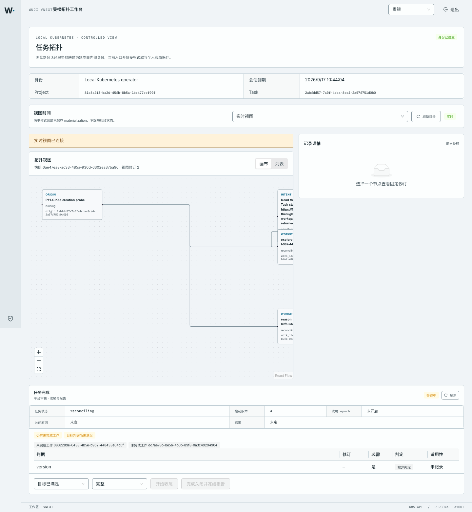

# P15 实测：受权 ViewStream 与工作台实时视图

- 日期：2026-09-17；工作树 `work/worktrees/vnext-maf`，分支 `codex/vnext-maf`；被测代码 `94a1122`。
- 集群：`docker-desktop` / `wuji-vnext-test`；迁移头 **`vnext_0025_p15_view_stream`**；入口 `http://127.0.0.1:44180/`。
- 镜像：api 与 web 的 gateway sidecar `127.0.0.1:56615/wuji-vnext-platform@sha256:f1a7029e…`；web `…wuji-web@sha256:aba52896…`。
- 对象：Task `2abfdd57-7a0f-4cba-8ce4-2a57f751d0b0`（running，operator 持有 can_read/can_write/can_control）。

## 1. 本切片交付

P13 的投影视图被固定在 `view_revision=1`：每次 live 读取都新建 materialization 与 view，客户端无法跟随同一个视图。现在：

- 迁移 `vnext_0025_p15_view_stream` 允许同一视图推进（`view_revision>=1`），为应用角色加上受 subject/`wuji.snapshot`/materialization 约束的 UPDATE 策略，
  `projection_cursor` 接受 `stream` 类型，并新增 `vnext.task_for_view(view_id)` 只按当前 tenant+subject 解析视图所属 Task；
- `ProjectionRepository.stream_step` 在同一个视图上写出新的 materialization，对比新旧图得到最多 2000 条 node/edge patch，
  并返回可续传的 opaque cursor；没有可见变化时不发空批次；
- `GET /api/v2/views/{view_id}/events` 以 SSE 输出 `ViewEventBatch`；访问被撤销、视图/快照过期或变更过大时输出
  `ViewReset`（`action=resnapshot`）而不是部分更新；空闲时发 keepalive，单连接寿命 300 秒后由客户端带 cursor 续传；
- 同源 BFF 只转发“本 Task 拓扑刚刚发布过”的 view id（内存有界账本，64 条 / 1 小时），并带 45 秒 read bound 独立流式客户端；
- 工作台在 live 模式订阅该流，把 patch 应用到当前快照；无法应用（基准修订不符、形状异常）或收到 reset 时改为显式重读快照，
  页面上显示“实时视图已连接 / 重连中 / 已暂停”。

## 2. 真实 Kubernetes 链路

同源 BFF 上的完整 SSE 会话（`raw/sse-live.txt`，`curl -N` 原文）：

```text
GET /api/v2/views/33c1a3bf-2278-4c53-a5f9-7bbcb5acdad2/events HTTP/1.1
Host: 127.0.0.1:44180
Accept: text/event-stream

: keepalive
: keepalive
: keepalive
: keepalive
id: bcS_Afq7Dnfl…
event: view
data: {"schema_version":"wuji.view-event.v2","view_id":"33c1a3bf-…","base_view_revision":"1","view_revision":"2",
       "cursor":"bcS_Afq7Dnfl…","patches":[16 条 upsert/remove]}      ← pause，work item 变为 reconciling

: keepalive （×5）

id: CnxzxLOpXvbi…
event: view
data: {"schema_version":"wuji.view-event.v2","view_id":"33c1a3bf-…","base_view_revision":"2","view_revision":"3",
       "cursor":"CnxzxLOpXvbi…","patches":[16 条 upsert/remove]}      ← resume，origin 回到 running
```

同一个连接上收到两个批次（`sse-live.txt`：20 帧、2 个 `event: view`），修订连续推进 `1 → 2 → 3`。

触发这次变更的是真实平台命令（`raw/pause.request.txt` / `raw/pause.response.json`）：

```http
POST /api/v2/tasks/2abfdd57…/commands HTTP/1.1
Host: 127.0.0.1:18455 (kubectl port-forward svc/runtime)
Authorization: Bearer <operator>
Idempotency-Key: p15-stream-pause-1
{"schema_version":"wuji.api.v2","command":"pause","expected_version":"2","reason":"P15 ViewStream proof: pause changes work item state"}

HTTP/1.1 202 Accepted
{"command_id":"p15-stream-pause-1","disposition":"accepted","resource_ref":{…"revision":"4"},"resource_version":"4"}
```

16 条 patch 里既有新的节点修订，也有被替换的旧修订（原文节选）：

```text
upsert_node origin:2abfdd57…@4      state=reconciling
upsert_node work_item:083228de…@7   state=reconciling
upsert_node work_item:dd7ae78b…@5   state=reconciling
remove_node origin:2abfdd57…@2
```

浏览器（Playwright/Chromium，1440×1000）**不刷新页面**跟随同一个视图（`raw/browser-stream.json`）：

```text
建立会话                         -> 面板显示“实时视图已连接”，GET /api/v2/views/4b42901f…/events 200
记录画布节点 data-id 集合         -> 6 个节点，origin:2abfdd57…@4
外部发送 resume（operator 202）   -> 画布节点集合变为 origin:2abfdd57…@5（其余节点不变）
控制台                           -> 仅登录前预期 401，无页面异常
```

## 3. 数据库事实（`raw/database-state.txt`）

```text
task         running|run|control_version=5|event_seq=11|board_revision=9
view         33c1a3bf…|snapshot=2fa4d2b7…|view_revision=3|expires_at>now()=true
stream cursors 3
cursor check kind IN ('page','index','stream') ； (kind='index' OR view_id IS NOT NULL)
view check   view_revision>=1 AND view_revision=trunc(view_revision)
policies     projection_insert / projection_read / projection_update
head         vnext_0025_p15_view_stream
```

## 4. 证据与检查

- 截图：[`01-stream-connected.png`](screenshots/01-stream-connected.png)（实时视图已连接）、
  [`02-stream-applied-change.png`](screenshots/02-stream-applied-change.png)（无刷新后的新修订）。
- HTTP 原文：[`raw/sse-live.txt`](raw/sse-live.txt)、[`raw/pause.request.txt`](raw/pause.request.txt)、
  [`raw/pause.response.json`](raw/pause.response.json)、[`raw/topology.json`](raw/topology.json)、
  [`raw/browser-stream.json`](raw/browser-stream.json)（含浏览器观测到的节点集合变化）。
- 权威数据库截面：[`raw/database-state.txt`](raw/database-state.txt)；部署绑定与镜像：[`raw/deployment-state.json`](raw/deployment-state.json)。
- 检查原文：[`raw/checks-pytest.txt`](raw/checks-pytest.txt)（29 passed / exit 0，含真实 PostgreSQL + 签名 HTTP 的 ViewStream 与 P13/P15 邻居套件）、
  [`raw/checks-vitest.txt`](raw/checks-vitest.txt)（29 passed，含新增 `view-stream.test.ts`）、
  [`raw/checks-web-build.txt`](raw/checks-web-build.txt)（exit 0）。



## 5. 未覆盖

- 增量 patch 只在真实 PostgreSQL 与本地集群上按单连接验证：未验证跨 BFF 重启后的账本丢失（客户端会收到 404 并重新读取拓扑）、
  未验证多浏览器标签长时间并发订阅的公平性，也未做规模 p95 测量。
- `ViewReset` 的四种原因里，`view_expired`/`snapshot_expired`/`change_too_large` 只有单元路径覆盖，
  集群上实测到的是正常批次与空闲 keepalive；权限撤销路径在 `tests/vnext/test_view_stream.py` 用真实 PostgreSQL 覆盖。
- 工作台仍按 web 部署绑定一个 Task；多 Task 并发入口（T8）与每 Task 独立 supervisor 端点依旧未做。
