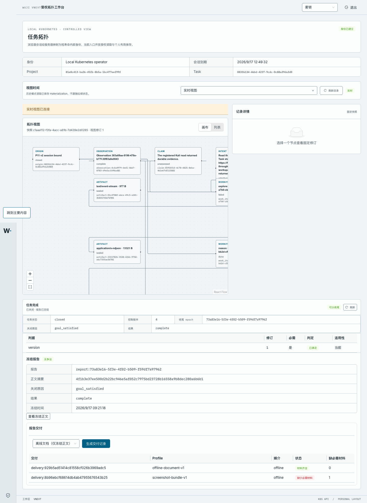
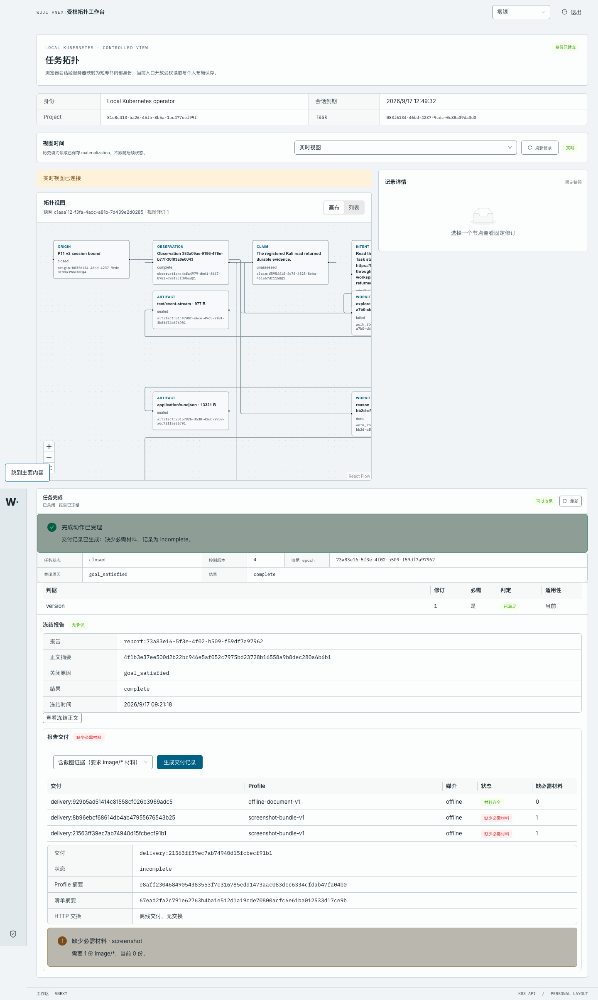
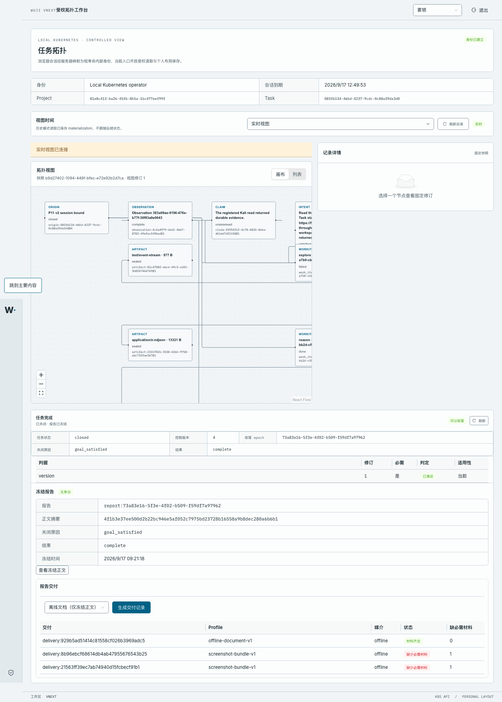

# P16-A · 报告交付（ReportDelivery）与交付媒介适用性

**代码：** `6cfa411`（交付核心）+ `3843311`（错误码映射修复，见“已知限制”）
**迁移头：** `vnext_0026_p16_report_delivery`
**集群：** docker-desktop / `wuji-vnext-test` / 工作台 <http://127.0.0.1:44180/>
**验收切片：** AC-069（交付媒介适用性），并为 AC-053/AC-067 的“报告不被改写”提供相邻依据
**范围：** 冻结核对 → 交付记录；不含保留/GC/purge（AC-066/067/068 仍未做）

## 1. 这一步交付了什么

关闭后的报告只是一份冻结正文。`ReportDelivery` 是它的**交付记录**：声明一个 profile，平台按该 profile 的媒介要求核对
真实材料，写入不可变的交付行。

- 迁移 `vnext_0026_p16_report_delivery`：`vnext.report_delivery` 只读（RLS + 应用角色仅 SELECT），
  写入只能经 `vnext.record_report_delivery(...)` 这个 `SECURITY DEFINER` 生产者，要求 `wuji.control`
  权限位、当前 scope、已关闭 Task 的同一 epoch，并且**必须引用冻结正文的 digest**。
- 消费者 `wuji_core.audit.delivery.ReportDeliveryService`：校验 profile、索引密封材料、评估缺失项。
- 产品路由：`GET/POST /api/v2/tasks/{task_id}/reports/{report_id}/deliveries` 与单条读取；
  同源 BFF 只转发“本部署固定 Task”的这一条路径；工作台“报告交付”面板列出记录、按 profile 生成新记录并显示缺失项。
- 诚实性守卫（数据库层，不靠服务自觉）：
  - `ready` 必须没有任何 `required` 缺失项；`incomplete` 必须至少有一项；
  - `offline` 交付**不允许**携带 HTTP 交换；`http` 且 `ready` **必须**携带真实交换回执；
  - 同一 `delivery_id` 复用于不同内容 → `23505` → 公开 `INPUT_DIGEST_CONFLICT`；
  - `manifest_digest` / `profile_digest` 由数据库计算，调用者无法自带摘要。

## 2. 真实集群行为（可复现请求包）

操作者身份：`sub=operator roles=["operator"]`（900 秒 JWT，已在证据中脱敏为 `<operator-jwt-redacted>`）；
API 经 `kubectl port-forward svc/api 18456:8443` 访问，CA 为 `work/vnext/k8s/tls/ca.crt`。
完整原始报文见 `raw/*.http` 与会话记录 `raw/session.txt`。

### 2.1 冻结核对（前置）

```
GET /api/v2/tasks/083f6134-46bd-4237-9cdc-0c88a39da3d0/reports/report:73a83e16-5f3e-4f02-b509-f59df7a97962
Authorization: Bearer <operator-jwt-redacted>
```

```http
HTTP/1.1 200 OK
date: Thu, 17 Sep 2026 04:12:36 GMT
server: uvicorn
cache-control: no-store
content-length: 1049
content-type: application/json
x-request-id: 554154d6-9385-41d9-b140-7693076b0478

{"report_id":"report:73a83e16-5f3e-4f02-b509-f59df7a97962","task_id":"083f6134-46bd-4237-9cdc-0c88a39da3d0","epoch_id":"73a83e16-5f3e-4f02-b509-f59df7a97962","close_trigger":"goal_satisfied","result_outcome":"complete","body":{"close_trigger":"goal_satisfied","criteria":[{"applicability":"current","criterion_id":"version","revision":"1","status":"met"}],"epoch_id":"73a83e16-5f3e-4f02-b509-f59df7a97962","result_outcome":"complete","runs":[{"agent_run_id":"a7fd3791-cca3-436b-8038-1227dd7e8b24","process_state":"exited","result_state":"incomplete","stop_kind":"exited"},{"agent_run_id":"c3e30b1f-9fe7-4386-856e-907034fe77ca","process_state":"exited","result_state":"accepted","stop_kind":"exited"}],"schema_version":"wuji.report.v1","task_id":"083f6134-46bd-4237-9cdc-0c88a39da3d0","work_items":[{"kind":"explore","state":"failed","terminal_reason":"process_failure"},{"kind":"reason","state":"done","terminal_reason":null}]},"body_digest":"4f1b3e37ee500d2b22bc946e5af052c7975bd23728b16558a9b8dec280a6b6b1","dispute_state":"clear","amendments":[]}
```

### 2.2 离线文档 profile → `ready`

profile 只要求冻结正文本身（媒介 `application/vnd.wuji.report+json`），因此平台不需要任何截图即可交付；
记录里 `exchange` 为 `null`，`manifest.materials` 只有一条 `source=report_commit` 的材料。

```
POST /api/v2/tasks/083f6134-46bd-4237-9cdc-0c88a39da3d0/reports/report:73a83e16-5f3e-4f02-b509-f59df7a97962/deliveries
Authorization: Bearer <operator-jwt-redacted>
Content-Type: application/json
Idempotency-Key: p16-offline-document-1

{"profile":{"schema_version":"wuji.delivery-profile.v1","profile_id":"offline-document-v1","mode":"offline","requirements":[{"role":"report_body","media_type":"application/vnd.wuji.report+json","min_count":1,"required":true}]}}
```

```http
HTTP/1.1 200 OK
date: Thu, 17 Sep 2026 04:12:36 GMT
server: uvicorn
cache-control: no-store
content-length: 2021
content-type: application/json
x-request-id: 1a42e6c0-9ff2-421e-a976-0ed0f7c91daf

{"delivery_id":"delivery:929b5ad51414c81558cf026b3969adc5","task_id":"083f6134-46bd-4237-9cdc-0c88a39da3d0","report_id":"report:73a83e16-5f3e-4f02-b509-f59df7a97962","report_digest":"4f1b3e37ee500d2b22bc946e5af052c7975bd23728b16558a9b8dec280a6b6b1","epoch_id":"73a83e16-5f3e-4f02-b509-f59df7a97962","profile":{"schema_version":"wuji.delivery-profile.v1","profile_id":"offline-document-v1","mode":"offline","requirements":[{"role":"report_body","media_type":"application/vnd.wuji.report+json","min_count":1,"required":true}]},"profile_digest":"68f5af88d46294ee475a8312704da11eb741ea3b16699e0d80a0cb4908333c36","state":"ready","mode":"offline","missing":[],"manifest":{"schema_version":"wuji.report-delivery.v1","report_id":"report:73a83e16-5f3e-4f02-b509-f59df7a97962","report_digest":"4f1b3e37ee500d2b22bc946e5af052c7975bd23728b16558a9b8dec280a6b6b1","epoch_id":"73a83e16-5f3e-4f02-b509-f59df7a97962","profile":{"schema_version":"wuji.delivery-profile.v1","profile_id":"offline-document-v1","mode":"offline","requirements":[{"role":"report_body","media_type":"application/vnd.wuji.report+json","min_count":1,"required":true}]},"mode":"offline","state":"ready","requirements":[{"role":"report_body","media_type":"application/vnd.wuji.report+json","min_count":1,"required":true,"present_count":1,"present":[{"source":"report_commit","source_ref":"report:73a83e16-5f3e-4f02-b509-f59df7a97962","media_type":"application/vnd.wuji.report+json","sha256":"4f1b3e37ee500d2b22bc946e5af052c7975bd23728b16558a9b8dec280a6b6b1","size_bytes":701,"access_level":1}],"missing_count":0}],"materials":[{"source":"report_commit","source_ref":"report:73a83e16-5f3e-4f02-b509-f59df7a97962","media_type":"application/vnd.wuji.report+json","sha256":"4f1b3e37ee500d2b22bc946e5af052c7975bd23728b16558a9b8dec280a6b6b1","size_bytes":701,"access_level":1}],"missing":[]},"manifest_digest":"2a7922b9a546baa755c4b75644ef555b45733b8893d086e925b1cdfcce1e9fd6","exchange":null,"error_code":null,"access_level":1,"created_at":"2026-09-17T04:12:38.026573Z"}
```

### 2.3 明确要求截图的 profile → `incomplete`

同一个报告，换成显式要求 `image/*` 材料的 profile。平台**没有**编造“不适用”，而是记下缺了一份必需材料，
并把已经存在的正文材料照实列出（`present_count=1`）。

```
POST /api/v2/tasks/083f6134-46bd-4237-9cdc-0c88a39da3d0/reports/report:73a83e16-5f3e-4f02-b509-f59df7a97962/deliveries
Authorization: Bearer <operator-jwt-redacted>
Content-Type: application/json
Idempotency-Key: p16-screenshot-bundle-1

{"profile":{"schema_version":"wuji.delivery-profile.v1","profile_id":"screenshot-bundle-v1","mode":"offline","requirements":[{"role":"report_body","media_type":"application/vnd.wuji.report+json","min_count":1,"required":true},{"role":"screenshot","media_type":"image/*","min_count":1,"required":true}]}}
```

```http
HTTP/1.1 200 OK
date: Thu, 17 Sep 2026 04:12:38 GMT
server: uvicorn
cache-control: no-store
content-length: 2527
content-type: application/json
x-request-id: dec78c01-d875-4582-b6b4-841b667c956b

{"delivery_id":"delivery:8b96ebcf68614db4ab47955676543b25","task_id":"083f6134-46bd-4237-9cdc-0c88a39da3d0","report_id":"report:73a83e16-5f3e-4f02-b509-f59df7a97962","report_digest":"4f1b3e37ee500d2b22bc946e5af052c7975bd23728b16558a9b8dec280a6b6b1","epoch_id":"73a83e16-5f3e-4f02-b509-f59df7a97962","profile":{"schema_version":"wuji.delivery-profile.v1","profile_id":"screenshot-bundle-v1","mode":"offline","requirements":[{"role":"report_body","media_type":"application/vnd.wuji.report+json","min_count":1,"required":true},{"role":"screenshot","media_type":"image/*","min_count":1,"required":true}]},"profile_digest":"e8aff23046849054383553f7c316785edd1473aac083dcc6334cfdab47fa04b0","state":"incomplete","mode":"offline","missing":[{"role":"screenshot","media_type":"image/*","min_count":1,"present_count":0,"missing_count":1,"required":true}],"manifest":{"schema_version":"wuji.report-delivery.v1","report_id":"report:73a83e16-5f3e-4f02-b509-f59df7a97962","report_digest":"4f1b3e37ee500d2b22bc946e5af052c7975bd23728b16558a9b8dec280a6b6b1","epoch_id":"73a83e16-5f3e-4f02-b509-f59df7a97962","profile":{"schema_version":"wuji.delivery-profile.v1","profile_id":"screenshot-bundle-v1","mode":"offline","requirements":[{"role":"report_body","media_type":"application/vnd.wuji.report+json","min_count":1,"required":true},{"role":"screenshot","media_type":"image/*","min_count":1,"required":true}]},"mode":"offline","state":"incomplete","requirements":[{"role":"report_body","media_type":"application/vnd.wuji.report+json","min_count":1,"required":true,"present_count":1,"present":[{"source":"report_commit","source_ref":"report:73a83e16-5f3e-4f02-b509-f59df7a97962","media_type":"application/vnd.wuji.report+json","sha256":"4f1b3e37ee500d2b22bc946e5af052c7975bd23728b16558a9b8dec280a6b6b1","size_bytes":701,"access_level":1}],"missing_count":0},{"role":"screenshot","media_type":"image/*","min_count":1,"required":true,"present_count":0,"present":[],"missing_count":1}],"materials":[{"source":"report_commit","source_ref":"report:73a83e16-5f3e-4f02-b509-f59df7a97962","media_type":"application/vnd.wuji.report+json","sha256":"4f1b3e37ee500d2b22bc946e5af052c7975bd23728b16558a9b8dec280a6b6b1","size_bytes":701,"access_level":1}],"missing":[{"role":"screenshot","media_type":"image/*","min_count":1,"present_count":0,"missing_count":1,"required":true}]},"manifest_digest":"67ead2fa2c791e62763b4ba1e512d1a19cde70800acfc6e61ba012533d17ce9b","exchange":null,"error_code":null,"access_level":1,"created_at":"2026-09-17T04:12:38.105933Z"}
```

### 2.4 同一幂等键重放 → 同一条记录

```
POST /api/v2/tasks/083f6134-46bd-4237-9cdc-0c88a39da3d0/reports/report:73a83e16-5f3e-4f02-b509-f59df7a97962/deliveries   （与 2.3 完全相同的 body 与 Idempotency-Key）
```

```http
HTTP/1.1 200 OK
date: Thu, 17 Sep 2026 04:12:38 GMT
server: uvicorn
cache-control: no-store
content-length: 2527
content-type: application/json
x-request-id: 4b5f9392-be71-454e-96d5-dd48168f61a5

{"delivery_id":"delivery:8b96ebcf68614db4ab47955676543b25","task_id":"083f6134-46bd-4237-9cdc-0c88a39da3d0","report_id":"report:73a83e16-5f3e-4f02-b509-f59df7a97962","report_digest":"4f1b3e37ee500d2b22bc946e5af052c7975bd23728b16558a9b8dec280a6b6b1","epoch_id":"73a83e16-5f3e-4f02-b509-f59df7a97962","profile":{"schema_version":"wuji.delivery-profile.v1","profile_id":"screenshot-bundle-v1","mode":"offline","requirements":[{"role":"report_body","media_type":"application/vnd.wuji.report+json","min_count":1,"required":true},{"role":"screenshot","media_type":"image/*","min_count":1,"required":true}]},"profile_digest":"e8aff23046849054383553f7c316785edd1473aac083dcc6334cfdab47fa04b0","state":"incomplete","mode":"offline","missing":[{"role":"screenshot","media_type":"image/*","min_count":1,"present_count":0,"missing_count":1,"required":true}],"manifest":{"schema_version":"wuji.report-delivery.v1","report_id":"report:73a83e16-5f3e-4f02-b509-f59df7a97962","report_digest":"4f1b3e37ee500d2b22bc946e5af052c7975bd23728b16558a9b8dec280a6b6b1","epoch_id":"73a83e16-5f3e-4f02-b509-f59df7a97962","profile":{"schema_version":"wuji.delivery-profile.v1","profile_id":"screenshot-bundle-v1","mode":"offline","requirements":[{"role":"report_body","media_type":"application/vnd.wuji.report+json","min_count":1,"required":true},{"role":"screenshot","media_type":"image/*","min_count":1,"required":true}]},"mode":"offline","state":"incomplete","requirements":[{"role":"report_body","media_type":"application/vnd.wuji.report+json","min_count":1,"required":true,"present_count":1,"present":[{"source":"report_commit","source_ref":"report:73a83e16-5f3e-4f02-b509-f59df7a97962","media_type":"application/vnd.wuji.report+json","sha256":"4f1b3e37ee500d2b22bc946e5af052c7975bd23728b16558a9b8dec280a6b6b1","size_bytes":701,"access_level":1}],"missing_count":0},{"role":"screenshot","media_type":"image/*","min_count":1,"required":true,"present_count":0,"present":[],"missing_count":1}],"materials":[{"source":"report_commit","source_ref":"report:73a83e16-5f3e-4f02-b509-f59df7a97962","media_type":"application/vnd.wuji.report+json","sha256":"4f1b3e37ee500d2b22bc946e5af052c7975bd23728b16558a9b8dec280a6b6b1","size_bytes":701,"access_level":1}],"missing":[{"role":"screenshot","media_type":"image/*","min_count":1,"present_count":0,"missing_count":1,"required":true}]},"manifest_digest":"67ead2fa2c791e62763b4ba1e512d1a19cde70800acfc6e61ba012533d17ce9b","exchange":null,"error_code":null,"access_level":1,"created_at":"2026-09-17T04:12:38.105933Z"}
```

### 2.5 列出与读取

```
GET /api/v2/tasks/083f6134-46bd-4237-9cdc-0c88a39da3d0/reports/report:73a83e16-5f3e-4f02-b509-f59df7a97962/deliveries
Authorization: Bearer <operator-jwt-redacted>
```

```http
HTTP/1.1 200 OK
date: Thu, 17 Sep 2026 04:12:38 GMT
server: uvicorn
cache-control: no-store
content-length: 543
content-type: application/json
x-request-id: d0327766-4c54-46f4-87c7-55f773bcbcca

[{"delivery_id":"delivery:929b5ad51414c81558cf026b3969adc5","report_id":"report:73a83e16-5f3e-4f02-b509-f59df7a97962","profile_id":"offline-document-v1","mode":"offline","state":"ready","missing_required":0,"error_code":null,"created_at":"2026-09-17T04:12:38.026573Z"},{"delivery_id":"delivery:8b96ebcf68614db4ab47955676543b25","report_id":"report:73a83e16-5f3e-4f02-b509-f59df7a97962","profile_id":"screenshot-bundle-v1","mode":"offline","state":"incomplete","missing_required":1,"error_code":null,"created_at":"2026-09-17T04:12:38.105933Z"}]
```

```
GET /api/v2/tasks/083f6134-46bd-4237-9cdc-0c88a39da3d0/reports/report:73a83e16-5f3e-4f02-b509-f59df7a97962/deliveries/<delivery_id>
Authorization: Bearer <operator-jwt-redacted>
```

```http
HTTP/1.1 200 OK
date: Thu, 17 Sep 2026 04:12:38 GMT
server: uvicorn
cache-control: no-store
content-length: 2527
content-type: application/json
x-request-id: 5922c441-a526-4ac6-ad53-352896aa3396

{"delivery_id":"delivery:8b96ebcf68614db4ab47955676543b25","task_id":"083f6134-46bd-4237-9cdc-0c88a39da3d0","report_id":"report:73a83e16-5f3e-4f02-b509-f59df7a97962","report_digest":"4f1b3e37ee500d2b22bc946e5af052c7975bd23728b16558a9b8dec280a6b6b1","epoch_id":"73a83e16-5f3e-4f02-b509-f59df7a97962","profile":{"schema_version":"wuji.delivery-profile.v1","profile_id":"screenshot-bundle-v1","mode":"offline","requirements":[{"role":"report_body","media_type":"application/vnd.wuji.report+json","min_count":1,"required":true},{"role":"screenshot","media_type":"image/*","min_count":1,"required":true}]},"profile_digest":"e8aff23046849054383553f7c316785edd1473aac083dcc6334cfdab47fa04b0","state":"incomplete","mode":"offline","missing":[{"role":"screenshot","media_type":"image/*","min_count":1,"present_count":0,"missing_count":1,"required":true}],"manifest":{"schema_version":"wuji.report-delivery.v1","report_id":"report:73a83e16-5f3e-4f02-b509-f59df7a97962","report_digest":"4f1b3e37ee500d2b22bc946e5af052c7975bd23728b16558a9b8dec280a6b6b1","epoch_id":"73a83e16-5f3e-4f02-b509-f59df7a97962","profile":{"schema_version":"wuji.delivery-profile.v1","profile_id":"screenshot-bundle-v1","mode":"offline","requirements":[{"role":"report_body","media_type":"application/vnd.wuji.report+json","min_count":1,"required":true},{"role":"screenshot","media_type":"image/*","min_count":1,"required":true}]},"mode":"offline","state":"incomplete","requirements":[{"role":"report_body","media_type":"application/vnd.wuji.report+json","min_count":1,"required":true,"present_count":1,"present":[{"source":"report_commit","source_ref":"report:73a83e16-5f3e-4f02-b509-f59df7a97962","media_type":"application/vnd.wuji.report+json","sha256":"4f1b3e37ee500d2b22bc946e5af052c7975bd23728b16558a9b8dec280a6b6b1","size_bytes":701,"access_level":1}],"missing_count":0},{"role":"screenshot","media_type":"image/*","min_count":1,"required":true,"present_count":0,"present":[],"missing_count":1}],"materials":[{"source":"report_commit","source_ref":"report:73a83e16-5f3e-4f02-b509-f59df7a97962","media_type":"application/vnd.wuji.report+json","sha256":"4f1b3e37ee500d2b22bc946e5af052c7975bd23728b16558a9b8dec280a6b6b1","size_bytes":701,"access_level":1}],"missing":[{"role":"screenshot","media_type":"image/*","min_count":1,"present_count":0,"missing_count":1,"required":true}]},"manifest_digest":"67ead2fa2c791e62763b4ba1e512d1a19cde70800acfc6e61ba012533d17ce9b","exchange":null,"error_code":null,"access_level":1,"created_at":"2026-09-17T04:12:38.105933Z"}
```

### 2.6 反例（必须拒绝）

| 请求 | 预期 | 实测 |
| --- | --- | --- |
| 离线 profile 却携带 `exchange` 回执 | 拒绝，不写入任何记录 | 422 `INVALID_SCHEMA` |
| HTTP profile 但没有真实交换回执 | 拒绝，不写“已交付” | 本集群镜像 `6cfa411` 返回 500；`3843311` 修复后为 409 `DELIVERY_EXCHANGE_REQUIRED`（见已知限制 2） |
| 缺少 `Idempotency-Key` | 拒绝 | 422（`Idempotency-Key` 为必填 header） |
| `reader` 身份（无 `can_control`） | 不泄露记录是否存在 | 404 `NOT_FOUND_OR_FORBIDDEN` |
| 其他 Task 的报告路径 | 不泄露记录是否存在 | 404 `NOT_FOUND_OR_FORBIDDEN` |

```
POST /api/v2/tasks/083f6134-46bd-4237-9cdc-0c88a39da3d0/reports/report:73a83e16-5f3e-4f02-b509-f59df7a97962/deliveries
Authorization: Bearer <operator-jwt-redacted>
Content-Type: application/json
Idempotency-Key: p16-offline-with-exchange

{"profile":{"schema_version":"wuji.delivery-profile.v1","profile_id":"offline-document-v1","mode":"offline","requirements":[{"role":"report_body","media_type":"application/vnd.wuji.report+json","min_count":1,"required":true}],"exchange":{"url":"https://sink.invalid/deliver","status":200}}
```

```http
HTTP/1.1 422 Unprocessable Content
date: Thu, 17 Sep 2026 04:12:38 GMT
server: uvicorn
content-length: 156
content-type: application/json
cache-control: no-store
x-request-id: c6450d12-1943-44b9-8dbf-646eb883ecc2

{"code":"INVALID_SCHEMA","message":"The request could not be completed.","request_id":"c6450d12-1943-44b9-8dbf-646eb883ecc2","retryable":false,"details":{}}
```

```
POST /api/v2/tasks/083f6134-46bd-4237-9cdc-0c88a39da3d0/reports/report:73a83e16-5f3e-4f02-b509-f59df7a97962/deliveries
Authorization: Bearer <operator-jwt-redacted>
Content-Type: application/json
Idempotency-Key: p16-http-without-exchange

{"profile":{"schema_version":"wuji.delivery-profile.v1","profile_id":"http-bundle-v1","mode":"http","requirements":[{"role":"report_body","media_type":"application/vnd.wuji.report+json","min_count":1,"required":true}]}}
```

```http
HTTP/1.1 500 Internal Server Error
date: Thu, 17 Sep 2026 04:12:38 GMT
server: uvicorn
content-length: 21
content-type: text/plain; charset=utf-8
x-request-id: 4c7504d2-f4d8-4ac5-86e5-98ce800f6a47

Internal Server Error
```

```
POST /api/v2/tasks/083f6134-46bd-4237-9cdc-0c88a39da3d0/reports/report:73a83e16-5f3e-4f02-b509-f59df7a97962/deliveries                （缺少 Idempotency-Key）
Authorization: Bearer <operator-jwt-redacted>
Content-Type: application/json

{"profile":{"schema_version":"wuji.delivery-profile.v1","profile_id":"offline-document-v1","mode":"offline","requirements":[{"role":"report_body","media_type":"application/vnd.wuji.report+json","min_count":1,"required":true}]}}
```

```http
HTTP/1.1 422 Unprocessable Content
date: Thu, 17 Sep 2026 04:12:38 GMT
server: uvicorn
content-length: 287
content-type: application/json
x-request-id: b44e76d6-ec1d-46b9-9e83-8d47ad009c26

{"code":"INVALID_SCHEMA","message":"Request does not satisfy the v2 contract.","request_id":"b44e76d6-ec1d-46b9-9e83-8d47ad009c26","retryable":false,"details":{"errors":[{"type":"missing","loc":["header","<field>"],"msg":"Input does not satisfy the field contract."}],"truncated":false}}
```

```
POST /api/v2/tasks/083f6134-46bd-4237-9cdc-0c88a39da3d0/reports/report:73a83e16-5f3e-4f02-b509-f59df7a97962/deliveries
Authorization: Bearer <reader-jwt-redacted>     （roles=["reader"]）
Content-Type: application/json
Idempotency-Key: p16-reader-refused

{"profile":{"schema_version":"wuji.delivery-profile.v1","profile_id":"offline-document-v1","mode":"offline","requirements":[{"role":"report_body","media_type":"application/vnd.wuji.report+json","min_count":1,"required":true}]}}
```

```http
HTTP/1.1 404 Not Found
date: Thu, 17 Sep 2026 04:12:38 GMT
server: uvicorn
content-length: 164
content-type: application/json
cache-control: no-store
x-request-id: 4ad508ef-c4c6-437d-8187-12bc5d36142c

{"code":"NOT_FOUND_OR_FORBIDDEN","message":"The request could not be completed.","request_id":"4ad508ef-c4c6-437d-8187-12bc5d36142c","retryable":false,"details":{}}
```

```
GET /api/v2/tasks/2abfdd57-7a0f-4cba-8ce4-2a57f751d0b0/reports/report:73a83e16-5f3e-4f02-b509-f59df7a97962/deliveries
Authorization: Bearer <operator-jwt-redacted>
```

```http
HTTP/1.1 404 Not Found
date: Thu, 17 Sep 2026 04:12:39 GMT
server: uvicorn
content-length: 164
content-type: application/json
cache-control: no-store
x-request-id: 61454118-8a1b-4905-8e1f-fae20e82ec25

{"code":"NOT_FOUND_OR_FORBIDDEN","message":"The request could not be completed.","request_id":"61454118-8a1b-4905-8e1f-fae20e82ec25","retryable":false,"details":{}}
```

### 2.7 数据库回读

`raw/database-readback.txt`（迁移角色只读查询）：

```
delivery:929b5ad51414c81558cf026b3969adc5|ready|offline|offline-document-v1|68f5af88d46294ee|2a7922b9a546baa7|<null>|-
delivery:8b96ebcf68614db4ab47955676543b25|incomplete|offline|screenshot-bundle-v1|e8aff23046849054|67ead2fa2c791e62|<null>|-
delivery:21563ff39ec7ab74940d15fcbecf91b1|incomplete|offline|screenshot-bundle-v1|e8aff23046849054|67ead2fa2c791e62|<null>|-
```

- 三条记录状态与接口一致；`offline` 交付的交换字段为空（`<null>`），没有伪造 HTTP。
- `ready` 记录 `manifest_digest` 非空且由数据库计算；没有任何 `state='ready'` 的行缺少清单
  （守卫探针 `SELECT count(*) ... WHERE state='ready' AND manifest_json IS NULL` = `0`）。

## 3. 工作台证据（真实浏览器）

浏览器：Playwright Chromium，同源会话登录 `http://127.0.0.1:44180/`；页面调用链与响应体见
`raw/browser-delivery-events.json`（含 `GET .../deliveries` 与 `POST .../deliveries` 的完整报文）。







面板文本（`raw/browser-delivery-panel.txt`，节选）：

```
报告交付
离线文档（仅冻结正文）
生成交付记录
交付	Profile	媒介	状态	缺必需材料
delivery:929b5ad51414c81558cf026b3969adc5	offline-document-v1	offline	材料齐全	0
delivery:8b96ebcf68614db4ab47955676543b25	screenshot-bundle-v1	offline	缺少必需材料	1
delivery:21563ff39ec7ab74940d15fcbecf91b1	screenshot-bundle-v1	offline	缺少必需材料	1
```

浏览器本次会话中与交付相关的 API 调用（`raw/browser-delivery-events.json`）：

```
GET  /tasks/083f6134-…/reports/report%3A73a83e16-…/deliveries -> 200
POST /tasks/083f6134-…/reports/report%3A73a83e16-…/deliveries -> 200
GET  /tasks/083f6134-…/reports/report%3A73a83e16-…/deliveries -> 200
```

控制台只有登录前的 401（预期），没有应用错误。

> 说明：本部署的工作台固定绑定一个 Task。为在浏览器中查看已冻结报告，本次把
> `wuji-web-gateway-config` / `wuji-web-config` 的 `task_id` 临时指向已关闭的 `083f6134-…`；
> 证据采集后已恢复为 P15 的 `2abfdd57-…`。

## 4. 自动化检查

- `pytest tests/vnext/test_retention_and_delivery.py -q` → **9 passed**（真实 PostgreSQL，每例独立库与迁移）。
  覆盖：离线文档 `ready`、截图 profile `incomplete` → 密封材料后 `ready`、可选要求不阻塞、
  数据库拒绝“缺必需材料却写 ready”、幂等键不可改写、离线不得带交换、失败态需有界错误码、
  只有持 `can_control` 的非 agent 身份可交付、签名 HTTP 路由（含列表/单读/404/422/409）。
- `pytest tests/vnext/test_completion_portal.py tests/vnext/test_completion_protocol.py -q` → 相邻 P12 用例全绿，
  其中新加断言证明“未开 epoch 直接关闭”在 HTTP 边界返回 409 `COMPLETION_EPOCH_ABSENT`。
- `pytest tests/vnext/test_web_gateway.py -q` → 6 passed（同源 BFF 只允许本 Task 的交付路径，
  缺少 `Idempotency-Key` 直接 422，不再转发）。
- `pytest tests/vnext/test_session_writer_exit_migration.py -q` → 2 passed（0016 升级检查跳过新 head）。
- `python scripts/vnext/generate_contracts.py --check` → 生成的 Python/TypeScript 合同与 OpenAPI 一致。
- `pnpm --filter @wuji/web typecheck` / `build` → exit 0。

## 5. 已知限制与未覆盖

1. **HTTP 交付适配器未实现。** `mode="http"` 只能由持有真实交换回执的调用方记录；平台自身不发外网请求。
   因此本切片实际产生的是 `offline` 交付，HTTP 交付只有拒绝路径被验证。
2. **错误码映射修复（`3843311`）尚未在本集群生效。** 首次采集发现：公开 `ErrorResponse.code` 是一个封闭枚举，
   服务内部码未在枚举内时会在 HTTP 边界变成 500（同一缺陷此前也潜伏在 P12 完成入口的拒绝路径上）。
   修复提交把 7 个内部码映射为公开码并在契约中登记；本机 ASGI 用例已覆盖该路径，
   但**本集群镜像仍是 `6cfa411`**（采集时段 PyPI 与本地代理均不可达，镜像无法重建）。
   镜像重建后必须重跑 `work/vnext/p16/delivery-http-evidence.sh` 并更新本节与 2.6。
3. **未做**：保留/GC/purge 与 tombstone（AC-066/067）、审计/观测/费用分离（AC-068）、
   交付投递到外部媒介、历史交付分页、`delivery_pending` 的产品路径（数据库守卫已覆盖，产品侧不走该状态）。
4. 交付记录只索引 `state='sealed'` 且 `access_level <= clearance` 的产物；未密封的对象不计入证据（这正是 2.3 的 `incomplete` 原因）。
5. 数据库只保证“清单与状态自洽”，不校验清单内容与外部世界的一致性；材料摘要来自平台自己的产物表与冻结正文。
