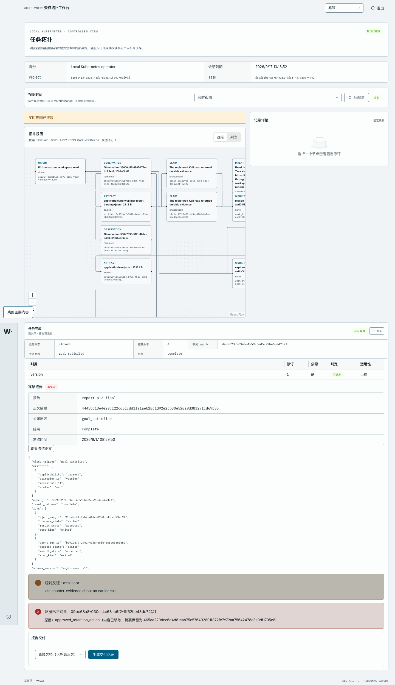

# P16-B · 受权 purge、tombstone 与不可用提示

**代码：** `8393f31` + `039a48d`（`039a48d` 为本包实测提交）
**迁移头：** `vnext_0027_p16_artifact_purge`
**集群：** docker-desktop / `wuji-vnext-test`（api 已挂载共享对象存储 `platform-artifacts`）
**验收切片：** AC-067（受权 purge 不伪装完整证据），相邻覆盖 AC-066 的 GC/保全边界
**范围：** purge + tombstone + 读取侧不可用提示；不含审计/观测/费用分离（AC-068）

## 1. 这一步交付了什么

1. **purge 是一次被记录的行为，不是静默删除。** `vnext.artifact_purge`（只读表）保存被移除的确切版本、摘要、原因与
   授权来源；写入只能经 `vnext.purge_artifact(...)`，该生产者同时要求 `wuji.gc`（保留权限）与 `wuji.purge`
   （控制决定），任一单独存在都不足以销毁证据。
2. **GC 与 purge 分工明确。** 普通 GC 仍拒绝任何被 publication/observation/relation/assessment/snapshot 引用的对象；
   显式 purge 允许退役**已被冻结报告引用**的内容（这正是它存在的理由），但**任何存活租约**都会让两者都停下——
   正在提交的字节不能被删。
3. **读取侧如实降级。** `ReportDeliveryView.unavailable_materials` 与 `ReportView.unavailable_evidence` 在读取时
   从产物行与 purge 记录计算：摘要保持不变、状态保持原样，只新增“不可用 + 原因 + purge 记录”。冻结正文与清单
   不会被改写，也不会重新采集伪补。
4. **产品入口：** `POST /api/v2/tasks/{task_id}/artifacts/{artifact_id}/purges`（本次只在平台 API 暴露，
   不经浏览器同源 BFF；工作台以只读方式展示不可用提示）。

## 2. 真实集群行为（完整请求包）

操作者仍是 `sub=operator roles=["operator"]`（900 秒 JWT，已脱敏）；`kubectl port-forward svc/api 18456:8443`。
被 purge 的对象是本地夹具任务上、**被冻结报告 amendment 引用**的固化产物（`09bc68a8-…@1`）。

### 2.1 purge 前的报告

```
GET /api/v2/tasks/fc2ff1b0-a578-4131-9fc3-4a7a80c74442/reports/report-p12-final
Authorization: Bearer <operator-jwt-redacted>
```

```http
HTTP/1.1 200 OK
date: Thu, 17 Sep 2026 04:44:33 GMT
server: uvicorn
cache-control: no-store
content-length: 1582
content-type: application/json
x-request-id: 621d9efb-8055-40fd-82ec-f5860dfb268d

{"report_id":"report-p12-final","task_id":"fc2ff1b0-a578-4131-9fc3-4a7a80c74442","epoch_id":"da99b237-09ab-4559-bed5-a9be68e473af","close_trigger":"goal_satisfied","result_outcome":"complete","body":{"close_trigger":"goal_satisfied","criteria":[{"applicability":"current","criterion_id":"version","revision":"1","status":"met"}],"epoch_id":"da99b237-09ab-4559-bed5-a9be68e473af","result_outcome":"complete","runs":[{"agent_run_id":"2ccd9c74-f9b2-443c-8998-dd3dc3737c9f","process_state":"exited","result_state":"accepted","stop_kind":"exited"},{"agent_run_id":"bd912879-2941-41d8-befb-6c8c6356055c","process_state":"exited","result_state":"accepted","stop_kind":"exited"}],"schema_version":"wuji.report.v1","task_id":"fc2ff1b0-a578-4131-9fc3-4a7a80c74442","work_items":[{"kind":"explore","state":"done","terminal_reason":null},{"kind":"reason","state":"done","terminal_reason":null}]},"body_digest":"4445bc13e4e29cf22c651cdd1fe1aeb28c1d92e2cb30e520a9d38327fcd69b85","dispute_state":"disputed","amendments":[{"amendment_id":"amendment-p12-final","reason":"late counter-evidence about an earlier call","authority":"assessor","source_receipt":{"access_level":1,"amendment_id":"amendment-p12-final","authority":"assessor","evidence":[{"access_level":1,"digest":"465ee220dcc6d4d81eab75c576492801f872fc7c72aa75642478c3a0df1705c8","ref":{"id":"09bc68a8-030c-4c68-b6f2-8f52be48dc72","sha256":"465ee220dcc6d4d81eab75c576492801f872fc7c72aa75642478c3a0df1705c8","version":"1"}}],"reason":"late counter-evidence about an earlier call","report_id":"report-p12-final"}}],"unavailable_evidence":[]}
```

### 2.2 受权 purge

```
POST /api/v2/tasks/fc2ff1b0-a578-4131-9fc3-4a7a80c74442/artifacts/09bc68a8-030c-4c68-b6f2-8f52be48dc72/purges
Authorization: Bearer <operator-jwt-redacted>
Content-Type: application/json
Idempotency-Key: p16-purge-1

{"revision":"1","reason":"approved_retention_action"}
```

```http
HTTP/1.1 200 OK
date: Thu, 17 Sep 2026 04:44:33 GMT
server: uvicorn
cache-control: no-store
content-length: 408
content-type: application/json
x-request-id: e2d055fd-647d-456b-ab23-5dc5aaefbf59

{"purge_id":"purge:4a53fe1dc567709cf9f4eeb13fffc5a8","task_id":"fc2ff1b0-a578-4131-9fc3-4a7a80c74442","artifact_id":"09bc68a8-030c-4c68-b6f2-8f52be48dc72","artifact_revision":"1","artifact_sha256":"465ee220dcc6d4d81eab75c576492801f872fc7c72aa75642478c3a0df1705c8","reason":"approved_retention_action","authority":"operator","state":"tombstoned","body_removed":true,"created_at":"2026-09-17T04:44:33.906100Z"}
```

### 2.3 同一幂等键重放 → 同一条 purge 记录

```http
HTTP/1.1 200 OK
date: Thu, 17 Sep 2026 04:44:33 GMT
server: uvicorn
cache-control: no-store
content-length: 408
content-type: application/json
x-request-id: 144b9e4f-ac32-49f0-a688-927003f3daff

{"purge_id":"purge:4a53fe1dc567709cf9f4eeb13fffc5a8","task_id":"fc2ff1b0-a578-4131-9fc3-4a7a80c74442","artifact_id":"09bc68a8-030c-4c68-b6f2-8f52be48dc72","artifact_revision":"1","artifact_sha256":"465ee220dcc6d4d81eab75c576492801f872fc7c72aa75642478c3a0df1705c8","reason":"approved_retention_action","authority":"operator","state":"tombstoned","body_removed":true,"created_at":"2026-09-17T04:44:33.906100Z"}
```

### 2.4 反例：再次 purge 同一版本被有界拒绝

```http
HTTP/1.1 409 Conflict
date: Thu, 17 Sep 2026 04:44:33 GMT
server: uvicorn
content-length: 157
content-type: application/json
cache-control: no-store
x-request-id: d9dee653-c91b-47df-8bae-5464c51468df

{"code":"STALE_EXECUTION","message":"The request could not be completed.","request_id":"d9dee653-c91b-47df-8bae-5464c51468df","retryable":false,"details":{}}
```

### 2.5 反例：`reader` 身份（无 `can_gc`/`can_control`）

```http
HTTP/1.1 404 Not Found
date: Thu, 17 Sep 2026 04:44:33 GMT
server: uvicorn
content-length: 164
content-type: application/json
cache-control: no-store
x-request-id: 8b976873-1826-4888-8246-1326911d28f9

{"code":"NOT_FOUND_OR_FORBIDDEN","message":"The request could not be completed.","request_id":"8b976873-1826-4888-8246-1326911d28f9","retryable":false,"details":{}}
```

### 2.6 purge 后的同一份报告

正文摘要与关闭决定完全不变，只多出“该证据已不可用 + 原因 + purge 记录”：

```http
HTTP/1.1 200 OK
date: Thu, 17 Sep 2026 04:44:33 GMT
server: uvicorn
cache-control: no-store
content-length: 1823
content-type: application/json
x-request-id: 71039a7c-ccf8-4301-b487-8a68add28a81

{"report_id":"report-p12-final","task_id":"fc2ff1b0-a578-4131-9fc3-4a7a80c74442","epoch_id":"da99b237-09ab-4559-bed5-a9be68e473af","close_trigger":"goal_satisfied","result_outcome":"complete","body":{"close_trigger":"goal_satisfied","criteria":[{"applicability":"current","criterion_id":"version","revision":"1","status":"met"}],"epoch_id":"da99b237-09ab-4559-bed5-a9be68e473af","result_outcome":"complete","runs":[{"agent_run_id":"2ccd9c74-f9b2-443c-8998-dd3dc3737c9f","process_state":"exited","result_state":"accepted","stop_kind":"exited"},{"agent_run_id":"bd912879-2941-41d8-befb-6c8c6356055c","process_state":"exited","result_state":"accepted","stop_kind":"exited"}],"schema_version":"wuji.report.v1","task_id":"fc2ff1b0-a578-4131-9fc3-4a7a80c74442","work_items":[{"kind":"explore","state":"done","terminal_reason":null},{"kind":"reason","state":"done","terminal_reason":null}]},"body_digest":"4445bc13e4e29cf22c651cdd1fe1aeb28c1d92e2cb30e520a9d38327fcd69b85","dispute_state":"disputed","amendments":[{"amendment_id":"amendment-p12-final","reason":"late counter-evidence about an earlier call","authority":"assessor","source_receipt":{"access_level":1,"amendment_id":"amendment-p12-final","authority":"assessor","evidence":[{"access_level":1,"digest":"465ee220dcc6d4d81eab75c576492801f872fc7c72aa75642478c3a0df1705c8","ref":{"id":"09bc68a8-030c-4c68-b6f2-8f52be48dc72","sha256":"465ee220dcc6d4d81eab75c576492801f872fc7c72aa75642478c3a0df1705c8","version":"1"}}],"reason":"late counter-evidence about an earlier call","report_id":"report-p12-final"}}],"unavailable_evidence":[{"source_ref":"09bc68a8-030c-4c68-b6f2-8f52be48dc72@1","sha256":"465ee220dcc6d4d81eab75c576492801f872fc7c72aa75642478c3a0df1705c8","state":"tombstoned","reason":"approved_retention_action","purge_id":"purge:4a53fe1dc567709cf9f4eeb13fffc5a8"}]}
```

### 2.7 真实字节删除（共享对象存储）

第一次采集暴露了一个本地拓扑缺陷：api 部署的 `artifact_root` 是 `/tmp/artifacts`（独立空目录），
所以 purge 只更新了数据库，真实字节仍留在 `platform-artifacts` PVC 上。`039a48d` 让 api 与 runtime/gates
挂载同一个存储并使用默认根；修复后重新对一个夹具产物执行 purge：

- [`raw/store-before.txt`](raw/store-before.txt)：purge 前共享存储中的 blob
- [`raw/07-purge-removes-bytes.http`](raw/07-purge-removes-bytes.http)：purge 请求与响应
- [`raw/store-after.txt`](raw/store-after.txt)：同一路径在 purge 后不存在

```
-r-------- 1 10001 10000 22 Sep 16 12:39 /var/lib/wuji/platform/artifacts/e6e3d837-4ee9-4e93-be61-0494a1af6aa6.blob
ls: cannot access '/var/lib/wuji/platform/artifacts/e6e3d837-4ee9-4e93-be61-0494a1af6aa6.blob': No such file or directory
command terminated with exit code 2
```

修复前那次 purge 遗留的孤儿 blob 按其已记录的 tombstone 做了补救删除（同样是本地上测试数据）：

```
# raw/store-orphan-before.txt
# Blob orphaned by the pre-fix purge (api artifact_root pointed at /tmp/artifacts).
# The database already records this artifact as tombstoned/body_removed=true, so removing the leftover implements that recorded decision. The fixed deployment makes the purge path do this in one step.
-r-------- 1 10001 10000 14904 Sep 16 12:39 /var/lib/wuji/platform/artifacts/303e6e70-22e2-4d19-8da5-091c31aad1f6.blob
# raw/store-orphan-after.txt
ls: cannot access '/var/lib/wuji/platform/artifacts/303e6e70-22e2-4d19-8da5-091c31aad1f6.blob': No such file or directory
command terminated with exit code 2
```

### 2.8 数据库回读

```
artifact|tombstoned|true|303e6e70-22e2-4d19-8da5-091c31aad1f6|465ee220dcc6d4d81eab75c576492801f872fc7c72aa75642478c3a0df1705c8
purge|purge:4a53fe1dc567709cf9f4eeb13fffc5a8|09bc68a8-030c-4c68-b6f2-8f52be48dc72|1|approved_retention_action|operator|465ee220dcc6d4d8
```

## 3. 工作台证据（真实浏览器）

被 purge 的证据在报告面板上显示为不可用条目，而不是被悄悄补回：



面板文本（[`raw/browser-panel.txt`](raw/browser-panel.txt)）：

```
已关闭 · 报告已冻结
冻结报告
有争议
报告	report-p12-final
证据已不可用 · 09bc68a8-030c-4c68-b6f2-8f52be48dc72@1
报告交付
```

> 说明：工作台仍固定绑定一个 Task。本次为查看已关闭任务的报告面板，临时把
> `wuji-web-gateway-config` / `wuji-web-config` 指向 `fc2ff1b0-…`，采集后已恢复为 P15 的 `2abfdd57-…`。

## 4. 自动化检查

- `pytest tests/vnext/test_retention_and_delivery.py -q` → **14 passed**（真实 PostgreSQL、真实产物存储、签名 HTTP）：
  受权 purge 留下 tombstone 且字节消失；同 key 重放同一条记录；再次 purge 409；无保留权限 404；
  **存活租约**下的对象 GC 与 purge 都拒绝；GC 收集真正孤儿但保留已发布/已租约对象；被 purge 的材料在交付视图中
  只标记不可用（清单摘要与状态不变）；HTTP 路由正反例。
- `pytest tests/vnext/test_capture_transactions.py tests/vnext/test_knowledge_admission.py tests/vnext/test_p03_fix_round1.py tests/vnext/test_completion_portal.py tests/vnext/test_completion_protocol.py tests/vnext/test_web_gateway.py tests/vnext/test_session_writer_exit_migration.py -q`
  → **102 passed**（相邻 P03/P04/P12 与迁移升级检查，含新增的报告读取字段）。
- `pytest tests/vnext/test_configure_refresh.py -q` → 2 passed（api 必须挂载共享产物存储）。
- `generate_contracts.py --check`、`pnpm --filter @wuji/web typecheck`、`build` → exit 0。

## 5. 已知限制与未覆盖

1. **purge 只在平台 API 暴露**，没有浏览器同源 BFF 路由与操作按钮：工作台只读展示不可用状态。
2. **审计/观测/费用分离（AC-068）与保留策略引擎未做**：`authority` 目前只有 `operator` 会被写入，
   `retention_policy` 为后续策略引擎保留。
3. **对象存储仍是本地 PVC**：删除是「先标记、后删字节」，中断时留下不可读对象等待重试；跨副本/多存储后端的
   删除语义未验证。
4. 本次为取得真实字节删除证据，purge 了本地测试租户的两个夹具产物（其中一个被冻结报告引用，另一个为最小夹具块）；
   非生产数据，且都由 purge 记录与报告提示如实体现。
5. GC 的“提交中租约”边界只在真实 PostgreSQL 用例中覆盖，未在集群上做故障注入。
