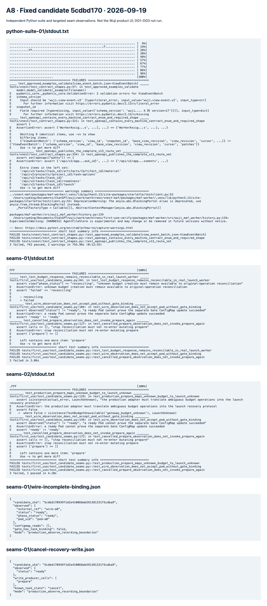

# 固定候选独立验收：未放行

被测源码：`5cdbd170939f1d2e410868ab591381331f5cdba9`，工作树 `first-use-verify` / `codex/first-use-verify`。2026-09-19。与旧 first-use-a8 分开；未编辑生产实现、共享合同或迁移。报告提交发生在测试后，不是被测 SHA。

## 一次完整 Python 执行

**745 collected；742 passed、3 failed、0 skipped、0 errors；exit 1。** pytest 耗时755.96s，整个子进程757.959s。开始/结束均核验HEAD保持固定值。没有使用skip、continue-on-error，也没有因失败重复运行全套。

收集：3.21s / exit0。完整运行原生材料：[stdout与实际trace](python-suite-01/stdout.txt)、[stderr（空）](python-suite-01/stderr.txt)、[JUnit](python-suite-01/junit.xml)、[命令/退出码/SHA/摘要](python-suite-01/manifest.json)。收集清单见[745个nodeid](collection-01/stdout.txt)。

```sh
PYTHONPATH=packages/wuji-core/src:packages/maf-worker/src:packages/task-runtime/src:tests/vnext \
PYTHONDONTWRITEBYTECODE=1 \
/Users/yym1ng/Documents/ChatGPT/wuji/work/worktrees/vnext-maf/packages/maf-worker/.venv/bin/python \
tests/first_use/run_candidate_suite.py \
--output docs/vnext/first-use/A8/final-candidate/python-suite-01
```

该目录已存在，不要原位覆盖/再次执行；复测必须指定新的输出目录和明确候选。runner的子命令是`python -m pytest tests/vnext -q --tb=short -ra --junitxml=...`。

环境：Python3.13.15、pytest9.1.1；`wuji_core`、`wuji_maf_worker`、`wuji_task_runtime`实际import均指向本树。work/toolchain及PG fixture manifest复用A0路径；每例单独PG数据库。本树M2 fixture硬编码`.venv/bin/python`，仅链接指定现有venv解决，没有uv同步或改共享editable。Node与依赖只作测试子进程底座，不代表独立Node/web套件已运行。

CI-08的Python部分为fail；CI-08包含的Node/web全套本次未单独执行，不将742个通过升级成CI-08或产品通过。告警两项为Starlette弃用提示、MAF AgentFileStore实验提示，不是失败归因。

## 三项套件失败：合同资料漂移

| 测试及实际行 | 实际trace | 归因/责任 |
| --- | --- | --- |
| `test_contract_shapes.py:57`，`test_approved_examples_validate[view_event_batch.json-ViewEventBatch]` | literal要求`wuji.view-event.v3`，输入仍v2；必需`snapshot_id`缺失 | `docs/vnext/examples/view_event_batch.json`未同步；A0更新示例，保留历史v2为明确历史样本 |
| `test_contract_shapes.py:321`，`test_openapi_contains_every_machine_contract_enum_and_required_shape` | ViewEventBatch的required集合只差`snapshot_id` | `docs/vnext/contracts.json`机器字段索引仍旧；A0按当前wire同步 |
| `test_contract_shapes.py:334`，`test_openapi_publishes_the_complete_s13_route_set` | 左侧多五个实际首用路由 | 冻结测试清单未加options/task-get/readiness/launch/artifact-material；A0精确补清单，不能改成无约束子集比较 |

保留v3、snapshot绑定和实际接口，不删除安全字段修绿。建议只复测这三项及对应生成检查；未变742项复用本SHA证据。此结论已先发A0。

## 新增接缝反例（另一次定向运行）

`tests/first_use/test_candidate_seams.py` 是独立审查期间新增的必要测试，不在先收集的745项中。**3 failed，exit1，2.06s**；原生[stdout](seams-01/stdout.txt)、[stderr](seams-01/stderr.txt)、[JUnit](seams-01/junit.xml)、[执行记录](seams-01/manifest.json)。

随后按A0明确反馈修订预算恢复断言：原用例在第二tick后要求reconciling不够精确，且旧Fixture.observe未真正GET Key。该旧断言已被替代，历史失败不改写。修订后的[第二轮定向输出](seams-02/stdout.txt)为 **1 passed、3 failed / exit1 / 4.10s**：真实PG+LaunchWorker在显式LaunchUnknown适配协议下，第一轮reconciling；明确预算observe通过同一个NativeTaskBudget查询原Key；精确请求序列GET info→POST generate（丢响应）→GET info，没有第二次POST，最终ready/succeeded。这个通过只证明正确协议可恢复。另一个直接ProductionLaunchProvisioner.prepare用例确认生产仍抛TaskBudgetUnavailable而非LaunchUnknown；加上wire/cancel两项，三处生产接缝仍未关闭。[第二轮执行记录](seams-02/manifest.json)包含全部边界。没有重跑745项。

| 发现 | 严重度/位置 | 观察与影响 | 责任/阻断 |
| --- | --- | --- | --- |
| F-LAUNCH-01 | P1 `execution/launch.py:801`、`task_model_keys.py::NativeTaskBudget` | 原Key已在合成网关持久化、响应ReadTimeout；真实LaunchWorker把`TaskBudgetUnavailable(gateway_budget_unknown)`写failed/launch_adapter_failed；下一轮空队列，不再GET原Key。真实Task维持同一launch且无allowed_actions | A0/A2/A7；阻断DG1恢复/API-07/09。未知管理操作应保留reconciling并按原Key核对，不能换Task洗掉原操作 |
| F-LAUNCH-02 | P1 `launch_adapter.py:854`–`observe(wire)` | Gate仍无该Task绑定，只有Pod ready，observe返回ready；记录到的ConfigMap读取次数为0。真实wire先runtime后gates写入，存在半写崩溃窗口 | A0/A7；阻断DG1启动恢复。核对同Task Gate/Profile/资源绑定后才能ready/capability；不得用Pod就绪替代连接完整性 |
| F-LAUNCH-03 | P2 `launch_adapter.py:841`–`observe(prepare)`，与LaunchWorker停止分支衔接 | 已知cancel且admission/executor未齐，observe再调用prepare写生产者；记录为`write_producer_calls=[prepare]` | A0/A7；阻断相关取消窗口。停止核对应只读，不重入预算/admission/seed创建 |

F-LAUNCH-01使用真实隔离PG、正式签名Task API、原生LaunchWorker/NativeTaskBudget，网关是明确的httpx合成transport。后两项使用真实生产observe控制流，DB/Pod/写生产者为记录型边界；证明调用/判定缺口，**不声称K8s实机已重现**。原始观察：[预算](seams-01/budget-lost-response.json)、[wire](seams-01/wire-incomplete-binding.json)、[取消](seams-01/cancel-recovery-write.json)。三个发现已先发A0，未修改生产。

修订后的恢复观察：[首轮reconciling、同Key GET恢复至ready](seams-02/budget-lost-response.json)、[生产异常类型不符合恢复协议](seams-02/production-budget-classification.json)。正常恢复可在重验许可后明确允许repair；cancel/paused分支应默认只读。后续修复由A0实施，当前记录不预填关闭状态。

```sh
PYTHONPATH=packages/wuji-core/src:packages/maf-worker/src:packages/task-runtime/src:tests/vnext \
WUJI_A8_SEAM_EVIDENCE=<新输出目录> \
/Users/yym1ng/Documents/ChatGPT/wuji/work/worktrees/vnext-maf/packages/maf-worker/.venv/bin/python \
-m pytest tests/first_use/test_candidate_seams.py -q --tb=short -ra
```

## 证据与未覆盖



[完整脱敏Task API请求/响应](http-reproduction.md)来自预算恢复反例的真实ASGI交换；合成网关和纯适配边界不能被冒充真实供应商HTTP。没有新目标资产；本轮涉及既有create/commands/launch/readiness/material接口，发现状态为“已用无害本地反例验证/待修复”，不是目标漏洞利用。

材料renderer/Session/WorkerBridge/工具材料代码与`de958b1`相比未变化；没有为重复审查单独重跑旧材料probe。完整套件自然包含相关检查；此前A8对de958b1的两项独立关闭证据保留其原SHA。

DG0未放行（合同三项+上述接缝）；DG1完整浏览器/部署链未运行；DG2真实DeepSeek、DG3现场均未运行。A0负责配置/部署准备；745项内的合成provider测试不能作为DG2。等待明确入口和受限凭据路径后再做用户首用。用户既有模型/金额/单实例授权不重复索取，A8没有读取真实Key/会话或访问K8s/目标。

交接状态：A0已告知修复`f957a46`及其作者定向测试。本A8按停测指令不复测该提交，不修改历史`5cdbd17`结果；由新Sol/xhigh验收代理接续。预算语义修订和seams-02已在停测指令到达前完成，记录保留原事实。此后只整理已发生输出、脱敏报文和日志浏览器截图，未安排新业务测试。
