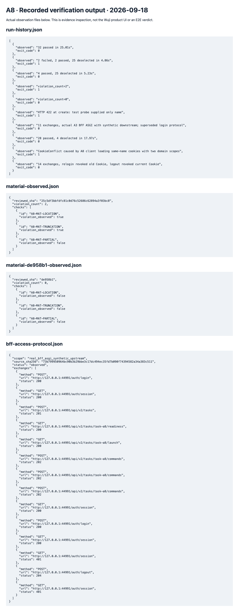

# A8 独立复核：现场未验收

日期：2026-09-18。代码修复提交 `1ddf90b658e7eeed9969209712b6b6aa24f39ad4`，最终可重登协议补丁 `f3230c34cccc58199656de66dee564847ddf5178`；仅 A8 driver/tests。按授权 cherry-pick 了 A0 的三个共享合同，未自行编辑生产文件/DTO/迁移/锁，未 push。

## driver 修正与实际验证

- 按 A3 最终协议走可重登 `X-Wuji-Local-Access` → Cookie → Origin → `session.mode`；单独 create/start/read/pause/cancel，不自动启动后立即暂停。Cookie 只存仓库外 0600 文件；普通 ledger 全部脱敏。
- 状态轮询只用 `observed_state`。cancel 的 paused/reconciling/quiescing 不满足 closed；closed 也不自动证明进程、工具、费用结算。
- 发送前与响应后持久写 ledger。丢响应保留原键、原正文及 pending 状态，不自动再次发送或换键。
- 读链核对从控制动作解耦。需要原始源字节、精确 BlobRef(id/version/sha)、read-set 完整引用、UTF-8 长度/摘要和两轮原始模型 HTTP 报文；支持 JSON/SSE call ID。第一请求不得含 marker，第二请求必须含匹配原生 ToolCall 的完整材料正文。
- 所有控制输出保持 `http_control_only`、`e2e_status=not_run`；离线文件检查只给 `offline_capture_consistency`，不认证手写文件的来源。

实测命令（cwd 为 first-use-a8）：

```sh
PYTHONPATH=packages/wuji-core/src:packages/maf-worker/src:packages/task-runtime/src:tests/vnext \
WUJI_A8_PG_MANIFEST=/Users/yym1ng/Documents/ChatGPT/wuji/work/worktrees/vnext-maf/work/vnext/postgres-fixture.json \
/Users/yym1ng/Documents/ChatGPT/wuji/work/worktrees/vnext-maf/packages/maf-worker/.venv/bin/python \
-m pytest tests/vnext/test_first_use_acceptance.py tests/first_use -q
```

实际 **32 passed / exit 0 / 25.01s**。包含真实 loopback HTTP、丢响应/不重发、原始采集包篡改反例、A1 隔离 PG 四项。运行时 HEAD 为 `835ee42` 加上述代码差异；相同代码随后提交为 `1ddf90b`，没有仅为获得提交后测试标签而重跑。共享解释器不改变 editable/lock，PYTHONPATH 指向本树。

另执行 `tests/first_use/bff_protocol_probe.py --gateway-source <A3工作树>/services/wuji-web-gateway/main.py --output .../bff-protocol.json`：**exit 0，11 次真实 BFF ASGI HTTP 交换**，包括登录、会话、创建、readiness/launch、start/pause/cancel、注销后401。BFF 源 SHA256 `0eff8f75a831f399ae8036911abf62b8bcfc2ad2ac8a37dc6fd0c23e7f754035`，当时是 A3 未提交工作代码；下游 API 使用合成 transport。它证明协议对接，不证明真 PG/MAF/E2E。

上段一次性协议随后被 A3 最终实现替代。最终协议定向复测：`--gateway-commit 1d46893163a54e5acd6a50f1f430c828fd777aa8` **exit 0，14 次真实BFF交换**，源码摘要 `73b799950964bc90b3b29bbe3c17dc494ec35fd7b090f74394582a34a383c511`，新增重新登录→旧Cookie401。driver曾在复用CookieJar时出现同名不同domain的CookieConflict；清空已有jar再载入/兑换，定向复测通过，失败ledger保留。可重登协议的socket/读链测试另 **28 passed / 4 deselected / exit 0 / 17.97s**；未变的A1四项复用前述证据。

## A5 `25c5df3` 审查及 `de958b1` 独立复测

| ID | 严重度与位置 | 原提交实际问题 | 修复复测 |
| --- | --- | --- | --- |
| A8-MAT-LOCATION | P1 `model_material.py::_safe_location` | Location 的 userinfo 被原样交付模型，redaction_applied=false；无 query 时也发生 | 固定 `de958b1` 探针不再含 synthetic-password，已关闭本反例 |
| A8-MAT-TRUNCATION | P2 `render_http_exchange_v2` | response.truncated=true、源元数据complete，却交付 complete 且没有任何截断提示 | 固定 `de958b1` 返回 omitted/capture_truncated，已关闭本反例 |
| A0 已识别兼容问题 | P1 `factory.py`、`worker_bridge.py` | 旧 profile 无字段却自动升级 HTTP v2，v2 字段无法发布/恢复 | 已读 `de958b1`：kw-only 字段、None 不进入旧snapshot、显式v2才渲染。该项独立完整恢复实测仍未执行 |
| A0 已识别派生伪造问题 | P1 `sessions.py::delivered_result` | 修改text并重算表示hash可通过，与源无关系 | 已读 `de958b1`：源字节重渲染并比较 packet。复用 A0 测试描述仅作输入，不列为 A8 实测 |

独立探针命令（同解释器/PYTHONPATH）：

```sh
python tests/first_use/review_material.py --output docs/vnext/first-use/A8/review-20260918/material-observed.json
python tests/first_use/review_material.py --commit de958b1 --output docs/vnext/first-use/A8/review-20260918/material-de958b1-observed.json
```

原固定 `25c5df3bbfdfc81c0d76c52686c62894a3f03bc8`：exit **1**，两项反例复现。新固定 `de958b1319c81e3f252d69de4fc16e6cbba2fc29`：exit **0**，两项反例均关闭、partial 来源保留正确。直接从 `git show` 装载被审 renderer，依赖使用本树生成 DTO；不是在移动主树上臆测通过。原始数据不改写。

权限静态核对：material API 使用当前 access/UOW/RLS，ToolGate 校验精确 Task/Work/Run/ToolCall，读取已封存字节不触发目标。A8 本轮没有重跑公开 preview 的跨主体/撤权真 PG 场景，不将静态检查算成权限测试通过。

## A1 `8b84081` 定向复核

固定 `8b84081dbaf124d3aa3eae009e732dedf16bf1e6` 原 ControlService 源码，真实隔离 PostgreSQL，基线依赖/迁移来自 A8 树：四项 exit **0**（5.23s，后收入32项集合）。

1. started 后 environment_stopped：保持 reconciling/operations_unsettled，不生成假 settlement。
2. unknown ToolAttempt 后环境结束：同样保持核对。
3. 从未产生执行证据的环境结束：failed/environment_stopped_before_observation。
4. exited + 空操作集：P06 写 settled；缺最终结果记 failed，不记业务成功。

该测试只使用合成进程元数据，没有启动真实 child/Pod。首轮 2 failed/2 passed 是 A8 fixture 前置错误：复用 P03 seed 自带 started ToolAttempt、output_expectation=unknown。按实际 SQL 核对后，在动作前显式设定空操作/最终输出前置，再复测四项通过；没有修改被测生产断言或抹去失败。日志路径见证据索引。

## 关口与未覆盖

87 项静态矩阵保持 not_run；这轮局部测试不自动覆盖整行。DG0 局部复核进行中；DG1 浏览器→新Task→Scheduler/Supervisor/MAF/Gate→材料→Reason→停止未运行；DG2/DG3 由 A0 协调实际运行。

用户最新授权已知：DeepSeek deepseek-flash、金额无上限和官方价、自建HTTP单实例8.146.204.146。A8 没有访问该实例/模型/真实Secret；不再把“缺Key/无预算授权”当作阻断。缺项是固定集成构建、原始完整链路与现场执行证据。

验证截图（只展示上述实际观察日志，不是正式产品首用截图）：



[完整脱敏 BFF 请求响应](review-20260918/http-reproduction.md)；[证据索引](evidence-index.md)。
