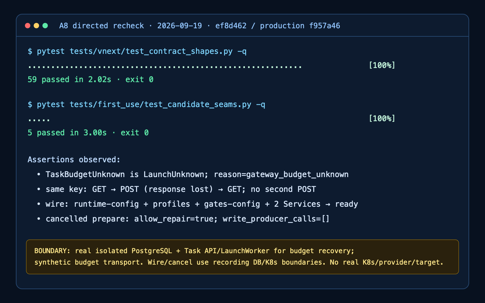

# A8 独立定向重验：通过（限定范围）

日期：2026-09-19。执行工作树 `codex/first-use-reverify@ef8d4624c80a4a6ba763654b1feab3ee0bb7f7e4`；该提交的父提交、也是本次实际生产修复截面，为 `f957a46dbafb6d842212aaeeed69085d03445e70`。本次只修改测试与本目录证据，没有修改生产代码、共享 Kubernetes、供应商或目标。

结论：A0 修复涉及的三项合同漂移均通过；F-LAUNCH-01/02/03 对应的定向代码接缝也通过。该结论不升级为真实 Kubernetes、真实 LiteLLM/DeepSeek、部署浏览器流程或 DG1–DG3 放行。

## 执行结果

| 检查 | 结果 | 证据 |
| --- | --- | --- |
| 完整 `tests/vnext/test_contract_shapes.py` | 59 passed，exit 0，2.02s | [manifest](contract-01/manifest.json)、[stdout](contract-01/stdout.txt)、[JUnit](contract-01/junit.xml) |
| seams 首轮 | 3 passed / 2 failed，exit 1，3.55s；测试 binding 漏 `namespace`，生产路径尚未读 ConfigMap，不作为生产失败或关闭 | [manifest](seams-01/manifest.json)、[完整 trace](seams-01/stdout.txt)、[JUnit](seams-01/junit.xml) |
| seams 第二轮（最终） | 5 passed，exit 0，3.00s | [manifest](seams-02/manifest.json)、[stdout](seams-02/stdout.txt)、[JUnit](seams-02/junit.xml) |

固定 `5cdbd17` 的一次完整 745 Python 执行（742 passed / 3 failed）没有重跑、覆盖或改写；`tests/first_use/run_candidate_suite.py` 仍固定原历史候选。新证据由 seam 记录函数读取实际执行时 HEAD，JSON 均写入 `candidate_sha=ef8d462...`。

## 定向关闭证据

- 合同三项：v3 `view_event_batch` 示例可验证；`contracts.json` 含 `snapshot_id`；OpenAPI 完整 route 集合与冻结断言一致。完整合同文件 59 项通过，未放宽集合或 required 字段断言。
- 预算未知分类：真实 `ProductionLaunchProvisioner.prepare` 控制流在记录型前置边界下得到精确 `TaskBudgetUnknown`；它同时是 `LaunchUnknown`，reason 为 `gateway_budget_unknown`。[结构化记录](seams-02/production-budget-classification.json)
- 同 Key 恢复：真实隔离 PostgreSQL、正式 Task API、原生 `LaunchWorker` 和 `NativeTaskBudget` 下，合成管理网关依次观察 `GET → POST（已持久化、响应丢失）→ 同 Key GET`，没有第二个 POST；首轮为 `reconciling`，次轮到 `ready/succeeded`。正常 observe 明确携带 `allow_repair=True`。[结构化记录](seams-02/budget-lost-response.json)
- Wire 失败关闭：缺 Task 绑定时实际读取 `runtime-config` 与 `gates-config` 后返回精确 `wire_incomplete/reconciling`，不读取 Pod、不写 ConfigMap。[结构化记录](seams-02/wire-incomplete-binding.json)
- Wire 正向继续：active repair 写入两份 ConfigMap，并补齐 runtime Task、Profile 与 Gate Task；随后只读 observe 对两项 Service selector 完成核对并返回 `ready`。未滚动 Deployment。[结构化记录](seams-02/wire-repair-continues.json)
- CancelledPrepare：桩按生产 `_row` 合同同时提供 `desired_state=cancel` 与 `observed_state=quiescing`；即使传入 `allow_repair=True`，结果仍为 `prepare_incomplete_readonly/reconciling`，`write_producer_calls=[]`。[结构化记录](seams-02/cancel-recovery-write.json)

## 证据边界

预算恢复用例中的 PostgreSQL、签名 Task API、Launch 状态机和 NativeTaskBudget 是真实实现；预算上游是明确的合成 HTTP transport。Production budget 分类、Wire 与 CancelledPrepare 用例调用真实生产控制流，但数据库、ConfigMap、Service、Pod 是记录型边界，不能称为真 PostgreSQL或真 Kubernetes。没有执行真实 K8s、模型供应商、收费调用或目标访问。

截图缺项（A0 集成纠正）：上图是 SVG 派生的日志可视化，不是真实验证截图，不计入用户要求的截图证据。原始 stdout/JUnit/HTTP 结果仍有效；本报告的截图交付尚未满足。2026-09-19 A0 补采时首先遇到宿主机磁盘耗尽，回收本轮临时工作树后，内置浏览器访问仅含本报告的本机 HTTP 服务仍返回 `net::ERR_BLOCKED_BY_CLIENT`。没有绕过浏览器策略。需要获准可用的截图入口后补采，不能以该生成 PNG 代替。

[完整脱敏 HTTP 请求/响应包](http-reproduction.md)包含 Task API 的方法、URL、Headers、请求体和响应体，以及明确标为合成网关的预算丢响应序列；没有把 synthetic 冒充真实服务。

## 未覆盖与资产

未重跑 745 项完整套件；未运行 Node/web 全套、真实部署浏览器链、共享 Kubernetes、真实 LiteLLM/DeepSeek 或现场目标。没有发现新资产或新接口，因此不更新资产梳理；既有 Task create/get/commands/launch 与预算管理测试端点的验证状态仅在本报告限定范围内更新。DG1–DG3 状态不由本轮改变。

交给 A0 集成的变更仅为 `tests/first_use/test_candidate_seams.py` 和 `docs/vnext/first-use/A8/recheck-20260919/`。报告提交发生在测试之后，不能反向作为被测 SHA。
