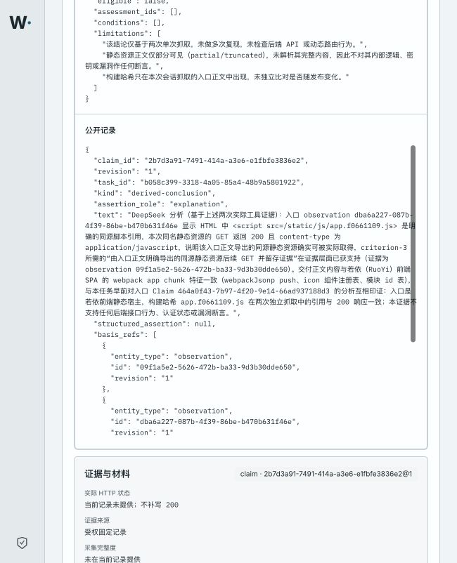
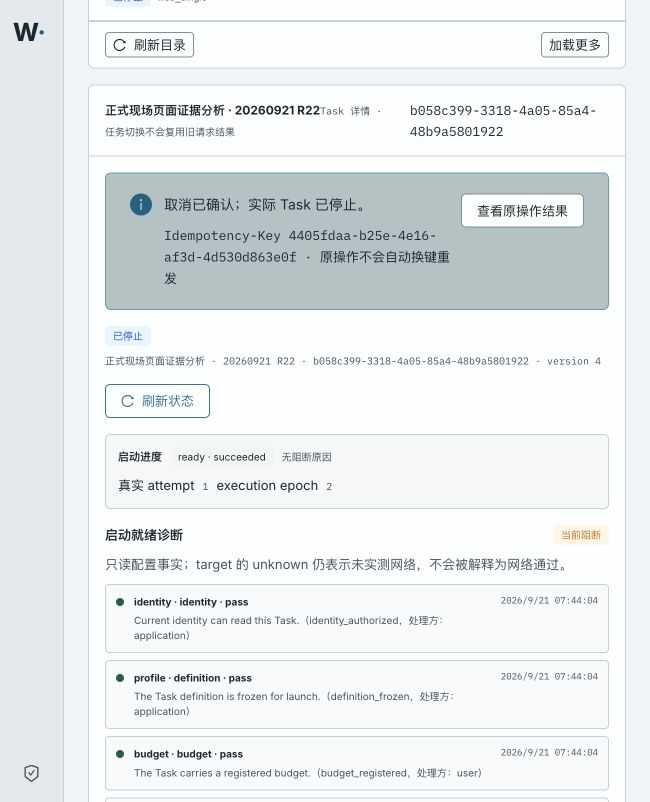

# Core first-use trial — 2026-09-20/21

Status: **core user flow passed on one fixed build**.

R22 (`b058c399-3318-4a05-85a4-48b9a5801922`) completed the requested path:
formal workbench creation, explicit start, real Scheduler/Supervisor/MAF/Gate
execution, actual HTTP results supplied to DeepSeek, an evidence-derived
follow-up, visible evidence-backed results, pause, cancel, and actual-state
reconciliation. The check stopped there; no unrelated suite or performance
matrix was added.

## Fixed deployment

- Platform/Agent/Kali source: `aae4a0485c701f766031382515398d284922d7cf`
- Web source: `0d73f2de7162f43b34d1082f64b59bde450c39ea`
- Platform: `127.0.0.1:55529/wuji-vnext-platform@sha256:20de12298ddea91edebaaf3559a9095040d1b92a08ac2c04b689693830040de6`
- Agent: `127.0.0.1:55529/wuji-vnext-agent@sha256:a180fffd67ba73b7437f10596ab108430bedc19fd45a2aebbbaa953c43cb501c`
- Kali: `127.0.0.1:55529/wuji-vnext-kali@sha256:bd7fa4e5113013d0035466834a18aca186ba3ede9c2769b358fceddb235d9045`
- Web: `127.0.0.1:55529/wuji-web@sha256:a8b8f8f96f590cd8e9dbeca04afb3883f18f81b286816d3278ff6ec69f95268a`
- Catalog Job: `first-use-catalog-deepseek-aae4a048-3439ebe3`
- Owner SecretRef: `first-use-deepseek-owner-v8`
- Isolated model TLS Secret: `first-use-litellm-tls-v3`
- Rollout: API, Runtime, Scheduler, Gates, Web, launch service, fixture and
  isolated LiteLLM were Ready before R22.

The web image is the previously reviewed image because the final fixes changed
worker/result handling and deployment configuration, not web assets.

## R22 actual result

### Create and start

- Created through the formal workbench as `已创建未启动` with the authorized
  origin `http://39.97.227.109:80`, expiry `2026-09-21 17:00 Asia/Shanghai`,
  separate target/external-analysis confirmations, and USD 1 Task budget.
- Explicit start reached `ready/succeeded`, runtime attempt `1`, execution
  epoch `2`.
- The first Reason Run produced exactly one admitted entrance GET Intent.

### Actual tool and model chain

- All three AgentRuns exited with `result_state=accepted`: one Reason and two
  Explore Runs. Both WorkItems are `done`.
- Entrance tool call `f528ec62-6397-4214-863a-9df05bebf842` performed
  `GET http://39.97.227.109/`: HTTP 200, `nginx/1.27.4`, 12,429 response bytes,
  complete and not truncated.
- DeepSeek linked the actual entrance observation to claims identifying the
  `若依管理系统` SPA shell and its explicit same-origin static references.
- A single follow-up Intent for `/static/js/app.f0661109.js` was admitted from
  the entrance evidence. Its redundant Artifact basis was removed while the
  supported Observation basis was preserved.
- Follow-up tool call `08074f0f-d43f-4f26-b6c2-ebcd3cb78f20` performed the
  same-origin GET: HTTP 200 and
  `content-type: application/javascript; charset=utf-8`.
- The origin response was 250,042 bytes. The product retained a 48,768-byte
  prefix inside a 65,536-byte exchange artifact and correctly exposed it as
  `partial/truncated`; it did not claim full-body capture.
- The final DeepSeek conclusion cites both actual Observations, confirms that
  the follow-up resource was derived from the entrance HTML and fetched, and
  explicitly avoids backend, authentication or vulnerability claims.
- Five real model calls completed with upstream HTTP 200 and reported usage:
  56,204 prompt tokens, 3,265 completion tokens, 59,469 total tokens.

### Pause, cancel and reconciliation

- Pause was submitted from the workbench and reconciled as
  `desired_state=pause`, `observed_state=paused`,
  `execution_allowed=false`, control version `3`.
- Cancel was then submitted from the paused Task. The workbench displays
  `取消已确认；实际 Task 已停止。`
- PostgreSQL records `desired_state=cancel`, `observed_state=quiescing`,
  `execution_allowed=false`, `close_trigger=user_cancel`, execution epoch `4`,
  control version `4`.
- All three AgentRuns are exited/accepted and there are zero non-terminal
  WorkItems. No R22 Task Pod remains; only its completed workspace-init Job is
  retained.

## Minimal validation actually run

- Focused result-basis and role-profile checks: `5 passed`, with one benign
  experimental warning.
- LiteLLM native startup-probe manifest check: `1 passed`.
- Final rollout guards passed and the eight required deployments reported
  Ready.
- R22 live trial: launch `ready/succeeded`; 3 accepted Runs; 2 completed HTTP
  tool calls; 5 completed DeepSeek calls, all HTTP 200; pause and cancel both
  reconciled.
- Final public API capture: Task, launch and readiness returned `[200, 200,
  200]`.

No full-suite rerun was performed because no broader boundary failed.

## Screenshot evidence

- [DeepSeek conclusion with both Observation basis references](screenshots/r22-deepseek-evidence-result.jpg)
- [Cancelled Task visibly reconciled as actually stopped](screenshots/r22-final-stopped.jpg)

## Complete HTTP packets

- [R22 packet manifest](http/r22-complete-http-packets.md)
- [Final Task/launch/readiness API packets](http/r22-final.json)
- [Entrance platform tool exchange — complete](http/r22-target-root.json)
- [Follow-up platform tool exchange — explicitly partial](http/r22-target-follow-up-partial.json)
- [Follow-up independent replay response headers](http/r22-follow-up-replay-response.headers)
- [Follow-up independent replay complete 250,042-byte body](http/r22-follow-up-replay-response.js)

The independent replay was one authorized, read-only GET used only to satisfy
the untruncated packet-packaging requirement. Its full-body SHA-256 is
`db87b8ab46a43cd8597dff922c2496b02f63e93b4c79a8cbb113942679ac2abe`;
the platform-retained 48,768 bytes are an identical prefix. It is not presented
as the original platform tool capture.

Earlier R18/R19/R15 records remain in this directory as historical failed or
supporting attempts; they are not used in place of R22.

## Asset and interface inventory

| Asset/interface | Validation state | Evidence |
| --- | --- | --- |
| `http://39.97.227.109/` | 已利用（只读 GET，完整正文） | R22 entrance exchange |
| `/static/js/app.f0661109.js` | 已利用（平台 partial；独立复现完整） | R22 follow-up packets |
| `/static/css/app.07b3ceaf.css` | 未利用，仅正文引用 | R22 entrance body |
| `/static/css/chunk-libs.d52e5467.css` | 未利用，仅正文引用 | R22 entrance body |
| `/static/js/chunk-elementUI.32b5af96.js` | 未利用，仅正文引用 | R22 entrance body |
| `/static/js/chunk-libs.1c571370.js` | 未利用，仅正文引用 | R22 entrance body |
| `/favicon.ico` | 未利用，仅正文引用 | R22 entrance body |
| Task/launch/readiness API | 已验证，200 | R22 final API capture |
| Workbench pause/cancel/state read | 已验证 | R22 UI, PostgreSQL and screenshot evidence |

## Configuration and operation

- Workbench: `http://localhost:44180/`
- Authorized target: `http://39.97.227.109`, HTTP port 80 only.
- Model: published DeepSeek `deepseek-flash` profile. The API key remains behind
  the gateway SecretRef and is absent from Git, Task material and this report.
- Runtime: published `first-use-deepseek-runtime-v1` revision 1; Worker result
  transport is fixed at 8 MiB.
- Normal use: establish the local workbench session, create a Web single-target
  Task, confirm target access and external analysis separately, create the
  unstarted Task, click `显式启动`, inspect the topology/claims/evidence, then
  pause or cancel and refresh until the reconciled state is shown.

## Remaining boundaries

- The in-product large-response evidence limit still makes the 250,042-byte JS
  material partial. The flow is usable because the status, headers, retained
  body and explicit completeness flag reach DeepSeek and the UI, but the
  product does not yet retain that full origin response.
- Formal criterion assessment/report closure was not invoked. The requested
  user path ends with visible results and explicit pause/cancel state
  reconciliation, which R22 completed.
- Readiness deliberately reports target connectivity as `unknown`; only the
  actual tool observations establish target reachability.
- The expired local platform CA was rotated for this deployment. Automatic CA
  rotation is not productized; the committed LiteLLM startup probe prevents
  slow startup from causing the earlier rollout failure but does not automate
  future certificate renewal.

No SSH credential was used, no write/scanning/persistence request was sent to
the target, and no synthetic result is reported as a real-model or live-target
pass.
