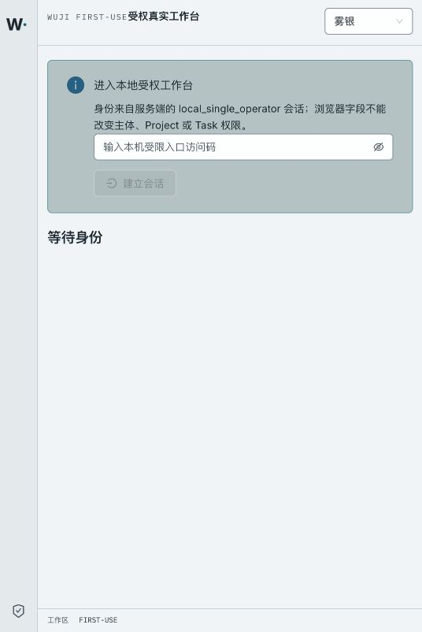
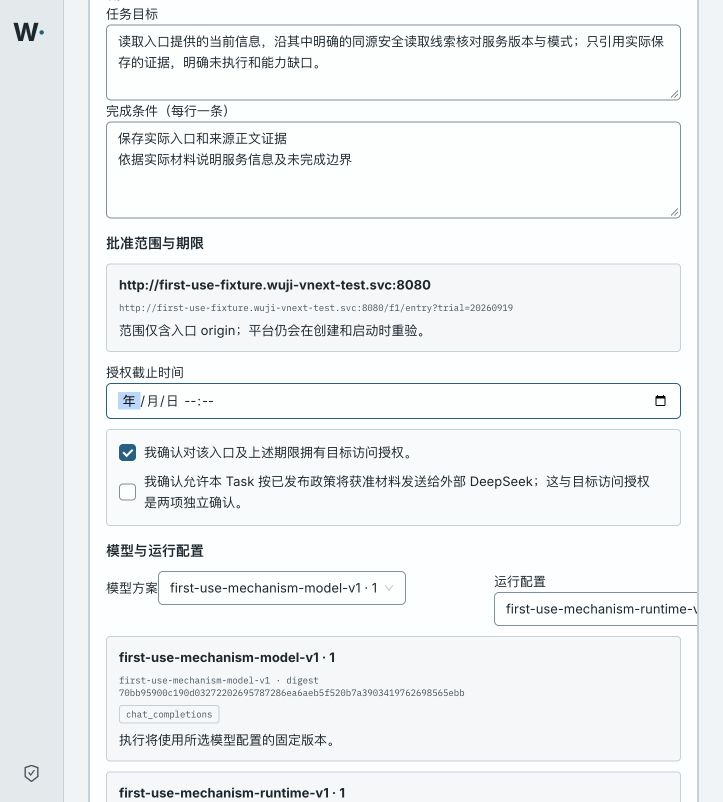

# 首用部署检查：入口可达，完整流程及现场未验收

执行者：A0。2026-09-19；固定部署操作代码 `a28c887d82660c9e0e66fc563d37e785c48f10be`。A8 Sol/xhigh 只独立静态审查发布边界，本页集群和浏览器操作不是独立验收。

## 实际交付

- 正式入口：[http://localhost:44180/](http://localhost:44180/)。本地单操作者身份，Project `81e8c413-ba26-45fb-8b5a-1bc477eef99f`。本地访问码在 `wuji-vnext-test/wuji-web-gateway-credentials` 的 `access.token`；不要发到聊天或写入Git。
- API、Runtime、Scheduler、Gate、Web、Launch、无凭据HTTP fixture均完成Ready及精确imageID核对；首用机制Profile已实际发布，Wuji migration=`vnext_0029_first_use_launch`。
- LiteLLM置于独立 `wuji-first-use-model`。新Pod精确digest匹配、严格TLS readiness200/db connected；旧网关已缩容为0、旧provider Secret已用UID/resourceVersion前置条件移除。新namespace及Keychain保留同一密钥，可恢复。`first-use-launch`身份对新namespace的provider Secret执行 `kubectl auth can-i get` 返回`no`；旧namespace无provider副本、无旧网关Pod。
- 用户现场现为 `http://39.102.208.182`；尚未访问。真实模型尚未调用，Task预算持久化仍待正式新Task验证。

[完整入口与拒绝边界HTTP](http-reproduction.md)。[旧namespace网关只读HTTP原始记录](gateway-r2-http.json)保留其原时间/位置，不当作迁移后的预算证据。截图证明工作台渲染，不冒充网关或Task预算截图。

## 固定版本

可携带的完整[镜像版本清单](images.json)与下表对应。

| 组件 | 构建来源与不可变引用 |
| --- | --- |
| core agent/platform/kali | 代码 `af36be86c3aedc20f11fcfd5e1d2853ecf1c66ea`；本机完整清单 `work/vnext/k8s/publish-hn_of44m/images-published.json`，构建与依赖复用证明 `work/vnext/k8s/first-use-rebuild-81vg32fj/` |
| Web | 编译资产仍为 `5cdbd170939f1d2e410868ab591381331f5cdba9`；另加本轮 Nginx 权限和Host端口配置层（`Dockerfile.web-permissions`），不是声称整张镜像未经改动。`127.0.0.1:55529/wuji-web@sha256:e84b4f467ea1ce5f12c1f761e0662844fe6b8e2021be8ec98f3b25242cd02925` |
| LiteLLM | `127.0.0.1:55529/wuji-first-use-litellm@sha256:11c59c67f03f4012d9000d210147ace1e0058144962d2301db916517c4494c1d`；LiteLLM1.100.0/Prisma Python0.11.0，未修改SDK私有源码；见冻结r2 |

复用构建只覆盖8个已核对核心源码文件；原5cdbd17依赖、manifest/lock及core Dockerfile逐字节一致。网络被禁用、未重新安装依赖，镜像保留base-source标签。首次overlay因本机umask导致600权限失败；已按Git mode增加COPY chmod。旧失败镜像和Job保留，不标通过。

## 本轮实际检查与失败历史

- 网关/发布守卫最终组合：`pytest tests/vnext/test_first_use_gateway_deployment.py tests/vnext/test_first_use_release_guards.py -q --tb=short`，14 passed/exit0；都是离线测试，不能代替集群实测。
- GET/HEAD窄方法发布：首次相关组7 passed/12 setup errors（本机PG夹具未运行），复用既有Unix-socket夹具启动后，`test_http_target_tool.py` 12 passed/exit0。未扩展目标方法，仍拒绝POST；未重跑完整Python。
- 构建helper修复后6 passed/exit0；三镜像构建/发布exit0，非root platform/agent导入smoke exit0。
- 两个失败catalog Job保留：`...-d3afb4dbb2` 为PermissionError；`...-d390585ff9` 为旧校验拒绝GET/HEAD。最终`first-use-catalog-mechanism-af36be86-5efb0f49` succeeded=1，配置digest `454f3f6af15224330a39db777c65af8a51e5c722de0f71216f1d0a3419b664fe`。
- 旧Web ConfigMap无owner标签；未接管或覆盖，改用新命名ConfigMap。Nginx镜像实际启动发现600配置权限、随后发现Host端口丢失，均定向修复；最终rollout exit0，7个Deployment通过守卫。中途失败状态保留，不能将第一次提交Job/Deployment视为就绪。
- 用户终端报Kubernetes EOF；A0随后`/readyz`返回ok且读取Secret元数据成功，未证明用户终端故障原因。A0经0600临时文件完成浏览器登录并删除临时副本，无密钥进入报告。

## 尚未验收

浏览器已登录并进入正式创建表单，表单中的原生datetime-local未被自动化可靠填写，已请用户只设置期限、不提交。此记录时没有创建/启动新的首用Task，因此DG1仍未完成；DG2/DG3未运行。还需：创建后零调用窗口、显式启动与完整F1/F2正文/Reason read-set、暂停取消及实际退出、原生Task key/预算重启核对、真实DeepSeek和新现场单实例读取、A8独立复核与87场景映射。

当前CA到期：2026-09-20 14:18:56 UTC（北京时间22:18:56），到期前后必须按真实证书状态处理，不关闭TLS。Registry为本机Docker VM loopback临时端口，Docker重启后需重新解析并重新发布引用；本轮未推送GitHub。
