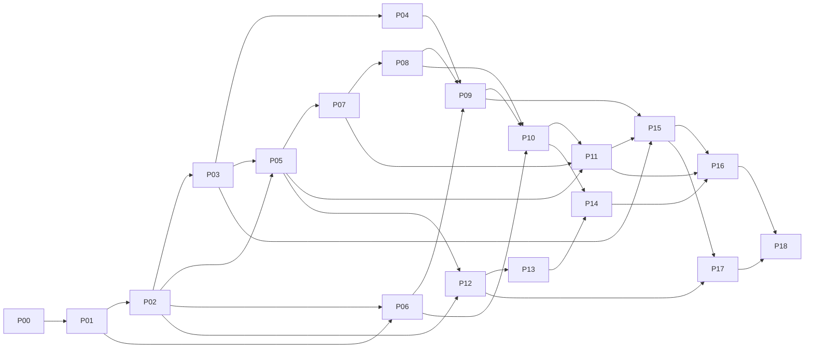

# Wuji vNext Implementation Plan

> **供实施 Agent 使用**：按任务逐项执行、测试和评审。可采用 `superpowers:subagent-driven-development` 或 `superpowers:executing-plans`；这些是执行流程建议，不是产品运行依赖。复用上下文必须同时读取本 Plan 与 Spec。

**Goal：** 在不依赖 Cairn/Pi 执行链的前提下，交付证据驱动黑板、持久 Scheduler、可控制的 MAF Worker 与 React Flow `TopologyFlowCanvas`。

**Architecture：** Wuji Core 拥有领域状态和执行准入；MAF 只负责单工作 Agent；可信采集生成受限 Fact；GraphProjection 生成可重建读模型，LayoutPreference 单独保存。首版一个活动 Scheduler、现有双容器运行边界和独立 LiteLLM。

**Tech Stack：** Python（当前仓库锁 3.13.15）、uv、PostgreSQL、FastAPI、Python MAF；Node 24.x、pnpm 10.32.1、React、Ant Design、`@xyflow/react`、Vitest、Playwright。具体新增发布包和锁由 P01/P13 的能力核验确定，不使用移动 main 或任意 latest。

**Spec：** [SPEC.md](SPEC.md) v1.0-review；[REVIEW.md](REVIEW.md) 解释对上传草案的改动。

**状态：** 计划已编写，产品代码未实施，以下命令与测试均是未来实施步骤，不是本轮执行记录。

## 全局约束

- 新运行、查询和部署均无 Cairn/Pi 依赖；历史资料只读离线导入。不能先把 MAF 塞回旧 Cairn 返回格式再当作目标完成。
- Agent 不能写 Fact；只有可信采集/版本化抽取路径可以生成 Fact。工具文本中一个结论不自动成为可信命题。
- Origin/Goal 不是 Fact；WorkItem.done、Goal.met、Task.closed、Assessment.complete 分别判断。
- 所有调用经 Run/Task/环境代次检查；旧租约过期不自动重跑；未知调用先核对。
- Session 消息和 provider state 都保存；未通过 SDK 能力门不得标记任意崩溃点 resumable。
- `TopologyFlowCanvas` 只修改布局及发出领域命令意图，不能通过连线/删除改写证据。
- 原始 Artifact/结果与上下文压缩副本分离；旧报告冻结版本不被改写。
- 首批测试仅离线资料、自建夹具和合成模型；不进行收费调用、真实目标操作或部署变更，除非另行明确授权。
- 每项先增加失败测试，再实施最小改动，最后定向和相关回归通过后提交。失败、未执行、受阻分别记录。
- 不擅自删除旧数据库、卷或活动执行；切换前需要 P17 的停机/归档授权和停止证据。

## 路径说明与代码组织

当前仓库基线是 `1d73a767599732d9a53f81ad2cc553f4bf11d84e`。以下“新增路径”是建议的目标结构，不声称已经存在；P00 发现本地已有 `TopologyFlowCanvas` 时，应迁入或对齐唯一实现，不能并存两个不同同名组件。

```text
packages/wuji-core/src/wuji_core/
  contracts/        # 身份、领域/命令/结果/图DTO，框架无关
  persistence/      # PostgreSQL事务、聚合锁、RLS与outbox
  evidence/         # Artifact封存、Observation、FactExtractor
  blackboard/       # Claim/Intent/引用/修订/结果接纳
  scheduling/       # 纯策略、触发合并、准入、工作状态
  completion/       # Goal与完成收敛、报告冻结
  projection/       # GraphProjection、快照、事件游标
  audit/            # 决策审计、脱敏与交付Profile
packages/maf-worker/src/wuji_maf_worker/
  factory.py        # 公开接口组装MAF
  runtime.py        # AgentRuntimePort实现
  context.py        # 固定黑板引用与受限输入
  history.py        # 原生HistoryProvider适配
  sessions.py       # SessionManifest/CAS/恢复
  tools.py          # 受控函数工具适配
  approvals.py      # 原生审批与平台关联
  telemetry.py      # 非敏感运行观测
services/wuji-scheduler/main.py
services/execution-control/v2_api.py
services/execution-control/model_gate.py
services/task-workers/supervisor.mjs   # 现有文件，去Pi启动分支
apps/api/src/wuji_api/v2/
  routes.py / topology.py / commands.py / evidence.py / archives.py
apps/web/src/features/topology/
  TopologyFlowCanvas.tsx / TopologyContainer.tsx
  types.ts / toFlowElements.ts / topologyReducer.ts
  layout.ts / layout.worker.ts / useTopologyStream.ts
  nodes/ / panels/ / TopologyListView.tsx
packages/contracts/openapi-v2.yaml
packages/contracts/src/v2/             # 生成产物，不手改
apps/api/migrations/versions/          # 从实际迁移头分配新编号
scripts/vnext/                        # 核查、能力测试、离线归档
ops/vnext/                            # 新部署清单，无旧引擎
tests/vnext/                         # Python契约/事务/恢复
tests/topology/                      # Vitest纯状态逻辑
tests/e2e/topology/                  # Playwright真实浏览器
```

推荐先建立独立 `wuji_core` 包，不把新职责继续塞入现有 `services/execution-control/core.py`。现有入口可以调用新包；API、Scheduler、Worker 共用合同，不互相 import 具体运行时。

## 测试夹具合同

P02 建立 `tests/vnext/conftest.py`、`tests/vnext/support/world.py`。下文测试使用的 `world` 是**待实现的契约测试工具**，不是 MAF 或现有仓库 API。它调用真实新服务/数据库，仅外部模型与目标能力由夹具替代。

统一方法：

| 方法 | 行为与返回 |
|---|---|
| `create_task(profile="closed-records-v1")` | 创建带 Origin/Goal/固定 Profile 的任务，返回含 id/version 的记录 |
| `send(actor, operation, **payload)` | 以预置独立身份调用操作，返回含 code/data 的回执；不允许代码注入身份 |
| `query(kind, **filters)` | 返回当前只读记录；`count(kind, **filters)` 返回测试库计数 |
| `race(*calls)` | 用独立连接并行执行已定义函数并收集回执，不共享一个SQL Session |
| `fault(name)` | 在下表命名边界单次注入受控失败，默认不触发其他错误 |
| `restart(component)` | 重建相应应用对象/进程，保留测试数据库与磁盘回执 |
| `tick()` | 运行一个有限调度/核对步，不自动调用付费模型 |
| `advance(seconds)` | 仅推进测试时钟；不用于证明真实运行停止 |
| `receipt_fixture(**changes)` | 产生带 fixture_capture 标记、真实测试字节及摘要的采集回执 |
| `seed(case_name)` | 按不可变 JSON fixture 建立指定状态，并返回相关ID；不得直接伪造测试目标的最终断言 |

必备 fixture：`pending_claim`、`ready_work`、`running_two_works`、`pending_approval`、`completion_with_reason`、`graph_with_restricted_node`、`closed_archive`。这些建模前置状态，测试仍调用真实命令处理器产生结果。

测试工具的 operation 对应如下（不是额外的产品路由）：

| operation | 实际被测入口 |
|---|---|
| ingest_evidence | FactLedger.ingest / internal evidence API |
| execute_fixture_read | 已注册只读 fixture ToolDefinition → Router → 实际自建读取 → 采集 |
| submit_review_opinion | ResultCommitter.accept，kind=review_opinion |
| submit_reason | ResultCommitter.accept，ReasonResult 判别联合 |
| hold_work | ControlService.hold / work-items commands |
| model_request | ModelAdmission / 流式准入入口，调用计数由真实夹具网关记录 |
| save_checkpoint | SessionRepository.publish，经 Worker 持久化适配 |
| evaluate_goal | GoalEvaluator.evaluate，不运行模型 |
| get_topology | GraphProjection 的受权查询API |
| render_public_event | PublicEventRenderer.render，生产公开schema白名单 |
| run_closed_acceptance | AcceptanceRunner.run，实际SDK与合成上游 |
| import_archive | ArchiveImporter.import，不创建执行WorkItem |

故障名：`after_start_receipt_before_response`、`after_tool_capture_before_agent_receive`、`before_session_manifest_commit`、`after_result_commit_before_response`、`during_completion_settlement`、`drop_sse_batch`、`model_stream_disconnect`。测试报告记录精确注入点，不能用 monkeypatch 返回“成功”代替产品行为。

## 任务依赖与关口



G0：P00–P02；G1：P06；G2：P03–P11；G3：P12–P15；G4：P16–P18。G5 的真实模型/生产/场景验收独立，不因 G4 通过自动解锁。

## P00：确认实施基线与不可逆操作边界

**依赖：** 无。**文件：** 新增 `docs/vnext/implementation-baseline.md`、`docs/vnext/decision-register.md`；只读核查根 package/pyproject、`apps/web/src`、现有 migrations 与 ops。

- [ ] 用户批准 SPEC 目标合同后才开始业务代码修改；记录批准范围，停机/费用/数据删除单独记录。
- [ ] 运行并保存：`git status --short`、`git rev-parse HEAD`、`git ls-files '*TopologyFlowCanvas*'`、`git grep -n '@xyflow/react'`。无匹配退出码1表示未找到，不解释成运行失败。
- [ ] 记录本地与公开基线差异；找到 TopologyFlowCanvas 时读取其 props、状态来源和依赖，不只按名字复用。
- [ ] 列出旧活动 Task/unknown 操作的只读清单。没有访问条件时明确“未核验”，禁止切换/删除。
- [ ] 固定需保留的产品语义和 DeliveryProfile 决策；不得把上传草案的全部历史陈述当作本次批准。
- [ ] 独立提交基线文档；不创建生产任务、不执行旧/新模型。

**出口：** 可复核的基线 SHA、唯一画布实现位置或新建决定、批准边界。此步不能标记任何产品测试通过。

## P01：依赖与干净新核心骨架

**依赖：** P00。**需求：** REQ-001, REQ-030, REQ-031。**验收：** A01,A40。

**文件：** 新增 `packages/wuji-core/pyproject.toml`、`packages/maf-worker/pyproject.toml`、两个包的 `__init__.py`、`scripts/vnext/check_dependencies.py`、`tests/vnext/test_dependencies.py`；修改根 `pyproject.toml`/`uv.lock` 与 `package.json` 的新检查入口。旧依赖退出在 P18 全面验证。

**接口：** 产出可独立安装的 `wuji_core`、`wuji_maf_worker` 和 `DependencyEvidence`（包版本、wheel摘要、Python版本、公开API签名、测试结果）。新包不得导入 Cairn。

- [ ] **1. 增加失败测试。** 最小契约测试如下；本任务所需 fixture 与服务实现一起新增，但禁止把待验证结论直接写死在 fixture 中。

```python
def test_new_core_does_not_import_cairn():
    import subprocess, sys
    result = subprocess.run(
        [sys.executable, "-c", "import wuji_core,wuji_maf_worker,sys; assert not any(k == 'cairn' or k.startswith('cairn.') for k in sys.modules)"],
        capture_output=True, text=True,
    )
    assert result.returncode == 0, result.stderr
```

- [ ] **2. 运行上述测试，确认失败定位在未实现的目标行为。** 环境/导入错误先单独记录；它不是所需行为失败的充分证据。

```bash
./scripts/uv.sh run --frozen pytest tests/vnext/test_dependencies.py -q
```

- [ ] **3. 实现最小功能。** 在隔离环境从已发布 wheel 固定 MAF 及其传递依赖；核验 Python 3.13.15 兼容。若失败，记录原因并走版本决定，不静默改框架。Node/pnpm 沿用仓库锁。新增发布包依赖组与测试 markers；显式包含 tests/vnext，不遗漏原 apps/api/tests。
- [ ] **4. 补充边界与故障用例。** 保存实际 wheel/lock 摘要与 import 签名；源码参考 commit 不能替代发布物记录。新建 clean env 检查不安装 legacy 依赖组。
- [ ] **5. 重跑同一命令及本任务依赖的相关回归。** 预期全部目标断言通过；保存命令、退出码、版本与未测清单到 `artifacts/vnext/p01/`，不能提前记录 PASS。
- [ ] **6. 独立评审并提交。** 只提交本任务明确文件、测试及合同更新；审查 SPEC 对应要求和产物，不使用无范围的全仓库自动重构。

**退出条件：** A01,A40 的相关机制有实际测试证据；任何未通过的权限、去重、恢复或持久化条件阻断下游发布，不由文档豁免。

## P02：领域合同、PostgreSQL 约束与测试底座

**依赖：** P01。**需求：** REQ-002, REQ-006, REQ-007, REQ-009, REQ-010, REQ-026。**验收：** A02,A25,A34。

**文件：** 新增 `wuji_core/contracts/{identity,knowledge,execution,commands,events}.py`、`persistence/{models,uow,outbox}.py`、`tests/vnext/support/world.py`、`tests/vnext/conftest.py`、`tests/vnext/test_domain_contracts.py`；新增实际迁移编号；新增 `packages/contracts/openapi-v2.yaml`。模块路径相对上方包根。

**接口：** 产出 Spec §10.2 公共类型；`UnitOfWork.for_task(task_id)` 聚合事务；`SnapshotRepository.read(task_id,access) -> BoardSnapshot`；实现 world 测试工具，不在夹具绕过被测命令处理器。

- [ ] **1. 增加失败测试。** 最小契约测试如下；本任务所需 fixture 与服务实现一起新增，但禁止把待验证结论直接写死在 fixture 中。

```python
def test_origin_goal_are_not_captured_facts(world):
    task = world.create_task()
    assert world.count("origin", task_id=task.id) == 1
    assert world.count("goal", task_id=task.id) == 1
    assert world.count("fact", task_id=task.id) == 0
```

- [ ] **2. 运行上述测试，确认失败定位在未实现的目标行为。** 环境/导入错误先单独记录；它不是所需行为失败的充分证据。

```bash
./scripts/uv.sh run --frozen pytest tests/vnext/test_domain_contracts.py -q
```

- [ ] **3. 实现最小功能。** 建立复合归属FK、revision唯一性、一个活动持有者、命令幂等与事件序号表。Root Origin/Goal 单独建模；事务快照用 Repeatable Read。新增 Task 写统一锁序。禁止将库中通用JSON字段直接当可信引用。
- [ ] **4. 补充边界与故障用例。** 以真实临时 PostgreSQL 检查跨租户FK拒绝、并发事务水位与回滚不发布事件；SQLite 内存测试不能替代。生成 v2 TypeScript DTO 并用现有 contracts 脚本增量纳入检查。
- [ ] **5. 重跑同一命令及本任务依赖的相关回归。** 预期全部目标断言通过；保存命令、退出码、版本与未测清单到 `artifacts/vnext/p02/`，不能提前记录 PASS。
- [ ] **6. 独立评审并提交。** 只提交本任务明确文件、测试及合同更新；审查 SPEC 对应要求和产物，不使用无范围的全仓库自动重构。

**退出条件：** A02,A25,A34 的相关机制有实际测试证据；任何未通过的权限、去重、恢复或持久化条件阻断下游发布，不由文档豁免。

## P03：Artifact、Observation 与可信 FactLedger

**依赖：** P02。**需求：** REQ-003, REQ-005, REQ-018, REQ-026。**验收：** A03,A04,A05,A06。

**文件：** 新增 `wuji_core/evidence/{models,collector,extractors,ledger}.py`、`apps/api/src/wuji_api/v2/evidence.py`、`tests/vnext/test_fact_ledger.py`、`tests/vnext/fixtures/capture/`。

**接口：** `FactLedger.ingest(actor: CollectorIdentity, receipt: ToolReceipt) -> EvidenceReceipt`；`FactExtractor.extract(observation,artifact_version) -> list[FactDraft]`；EvidenceReceipt 包含原回执摘要、Observation/Fact引用与sealed状态。

- [ ] **1. 增加失败测试。** 最小契约测试如下；本任务所需 fixture 与服务实现一起新增，但禁止把待验证结论直接写死在 fixture 中。

```python
def test_agent_cannot_mint_a_fact(world):
    task = world.create_task()
    receipt = world.receipt_fixture(task_id=task.id)
    denied = world.send("agent", "ingest_evidence", receipt=receipt)
    assert denied.code == "FORBIDDEN_COLLECTOR"
    assert world.count("fact", task_id=task.id) == 0
```

- [ ] **2. 运行上述测试，确认失败定位在未实现的目标行为。** 环境/导入错误先单独记录；它不是所需行为失败的充分证据。

```bash
./scripts/uv.sh run --frozen pytest tests/vnext/test_fact_ledger.py -q
```

- [ ] **3. 实现最小功能。** 实现采集身份、输入摘要、sealed对象、范围定位、版本化抽取器和fixture标记。只实现离线字段读取/固定自建HTTP元数据的窄断言。Agent 写入口无权限；工具宣称成功只能记录tool_reported。
- [ ] **4. 补充边界与故障用例。** 用同一 operation 重投、不同参数冲突、partial证据和未sealed对象测试。Fact的typed value必须来自原始内容重读而非Agent提供的提取字段；SHA只做完整性检查。
- [ ] **5. 重跑同一命令及本任务依赖的相关回归。** 预期全部目标断言通过；保存命令、退出码、版本与未测清单到 `artifacts/vnext/p03/`，不能提前记录 PASS。
- [ ] **6. 独立评审并提交。** 只提交本任务明确文件、测试及合同更新；审查 SPEC 对应要求和产物，不使用无范围的全仓库自动重构。

**退出条件：** A03,A04,A05,A06 的相关机制有实际测试证据；任何未通过的权限、去重、恢复或持久化条件阻断下游发布，不由文档豁免。

## P04：工具回执到证据的独立闭环

**依赖：** P03。**需求：** REQ-017, REQ-018, REQ-022。**验收：** A04,A06,A24,A18。

**文件：** 新增 `wuji_core/evidence/receipt_ingestion.py`、`wuji_core/contracts/tools.py`、`tests/vnext/test_tool_receipts.py`；修改 `services/task-workers/supervisor.mjs` 与现有工具 Router 的明确入口，保留独立工具实现。

**接口：** `ToolReceiptIngestor.accept(receipt) -> EvidenceReceipt`；`ToolAttemptRepository.get(operation_id)`；长操作查询只读原句柄，不重发业务操作。

- [ ] **1. 增加失败测试。** 最小契约测试如下；本任务所需 fixture 与服务实现一起新增，但禁止把待验证结论直接写死在 fixture 中。

```python
def test_agent_crash_does_not_erase_capture(world):
    case = world.seed("ready_work")
    world.fault("after_tool_capture_before_agent_receive")
    world.send("supervisor", "execute_fixture_read", work_item_id=case.work_item_id)
    world.restart("worker")
    assert world.count("observation", task_id=case.task_id) == 1
    assert world.count("fact", task_id=case.task_id) >= 1
```

- [ ] **2. 运行上述测试，确认失败定位在未实现的目标行为。** 环境/导入错误先单独记录；它不是所需行为失败的充分证据。

```bash
./scripts/uv.sh run --frozen pytest tests/vnext/test_tool_receipts.py -q
```

- [ ] **3. 实现最小功能。** 将真实采集登记放到返回Agent之前；Supervisor保存启动与结束回执，未知状态可查。可信采集身份不置于Agent可写工作区。外部/不可信工具的stdout只作为报告内容，不能冒充平台独立观察。
- [ ] **4. 补充边界与故障用例。** 注入采集失败、回执重发和进程退出但正文不完整；不得让完整Agent最终结果成为事实入账的必要条件。
- [ ] **5. 重跑同一命令及本任务依赖的相关回归。** 预期全部目标断言通过；保存命令、退出码、版本与未测清单到 `artifacts/vnext/p04/`，不能提前记录 PASS。
- [ ] **6. 独立评审并提交。** 只提交本任务明确文件、测试及合同更新；审查 SPEC 对应要求和产物，不使用无范围的全仓库自动重构。

**退出条件：** A04,A06,A24,A18 的相关机制有实际测试证据；任何未通过的权限、去重、恢复或持久化条件阻断下游发布，不由文档豁免。

## P05：Claim、Intent 与结果接纳

**依赖：** P02,P03。**需求：** REQ-004, REQ-009, REQ-010。**验收：** A07,A08,A26。

**文件：** 新增 `wuji_core/blackboard/{claims,intents,relations,committer}.py`、`tests/vnext/test_result_commit.py`；接入 `services/execution-control/v2_api.py`。

**接口：** `ResultCommitter.accept(identity, submission: ResultSubmission) -> ResultReceipt`；`IntentAdmission.review(proposal,snapshot) -> ProposalReceipt`；`VerificationService.record(input) -> VerificationRef`。

- [ ] **1. 增加失败测试。** 最小契约测试如下；本任务所需 fixture 与服务实现一起新增，但禁止把待验证结论直接写死在 fixture 中。

```python
def test_second_model_agreement_is_not_verification(world):
    case = world.seed("pending_claim")
    result = world.send("agent", "submit_review_opinion", claim_id=case.claim_id,
                        opinion="同意该主张")
    assert result.code == "ACCEPTED_AS_OPINION"
    claim = world.query("claim", id=case.claim_id)[0]
    assert claim.evidence_state == "unassessed"
```

- [ ] **2. 运行上述测试，确认失败定位在未实现的目标行为。** 环境/导入错误先单独记录；它不是所需行为失败的充分证据。

```bash
./scripts/uv.sh run --frozen pytest tests/vnext/test_result_commit.py -q
```

- [ ] **3. 实现最小功能。** 保存原文后解析；Claim正文与评估状态独立；逐项接纳合法Intent提案；校验引用与依赖DAG。旧快照不冲突追加允许，修改/完成重验版本。支持原结果回执查询与historical_only补交。
- [ ] **4. 补充边界与故障用例。** 同时提交两个无冲突结果均接纳；跨Task引用、相同submission不同载荷和依赖环拒绝。提交原文与语义接纳两阶段失败各有可查状态。
- [ ] **5. 重跑同一命令及本任务依赖的相关回归。** 预期全部目标断言通过；保存命令、退出码、版本与未测清单到 `artifacts/vnext/p05/`，不能提前记录 PASS。
- [ ] **6. 独立评审并提交。** 只提交本任务明确文件、测试及合同更新；审查 SPEC 对应要求和产物，不使用无范围的全仓库自动重构。

**退出条件：** A07,A08,A26 的相关机制有实际测试证据；任何未通过的权限、去重、恢复或持久化条件阻断下游发布，不由文档豁免。

## P06：真实 MAF Harness 能力验证与运行适配

**依赖：** P01,P02。**需求：** REQ-012, REQ-013, REQ-014, REQ-019, REQ-031。**验收：** A17,A18,A19,A20,A21。

**文件：** 新增 `wuji_maf_worker/{factory,runtime,context,history,tools,approvals,sessions}.py`、`tests/vnext/test_maf_capabilities.py`、`tests/vnext/support/synthetic_provider.py`、`scripts/vnext/check_maf_capabilities.py`。

**接口：** Spec §7.2 AgentRuntimePort；`HarnessFactory.build(profile, dependencies) -> AgentRuntimePort`；`CapabilityEvidence`逐项记录public API、实际包版本、测试输入和结论。

- [ ] **1. 增加失败测试。** 最小契约测试如下；本任务所需 fixture 与服务实现一起新增，但禁止把待验证结论直接写死在 fixture 中。

```python
def test_maf_profile_exposes_only_registered_tools(maf_probe):
    result = maf_probe.run_profile("closed-records-v1")
    assert result.sdk_was_real is True
    assert result.model_was_synthetic is True
    assert set(result.observed_tool_names) <= set(result.registered_tool_names)
    assert result.unregistered_tool_calls == []
```

- [ ] **2. 运行上述测试，确认失败定位在未实现的目标行为。** 环境/导入错误先单独记录；它不是所需行为失败的充分证据。

```bash
./scripts/uv.sh run --frozen pytest tests/vnext/test_maf_capabilities.py -q
```

- [ ] **3. 实现最小功能。** 采用真实MAF SDK、合成兼容模型上游和只读工具；验证调用循环、禁用默认工具、独立Session、Todo/Mode/记忆配置、原生审批与真实压缩触发。只使用公开API；不能将driver mock通过写成MAF通过。
- [ ] **4. 补充边界与故障用例。** 本任务新增 maf_probe fixture，内部启动真实SDK合成往返并返回观测记录，不硬编码布尔值。保存能恢复/不能恢复的具体边界；压缩输出质量不由合成测试证明。G1未通过不得开放集成执行。
- [ ] **5. 重跑同一命令及本任务依赖的相关回归。** 预期全部目标断言通过；保存命令、退出码、版本与未测清单到 `artifacts/vnext/p06/`，不能提前记录 PASS。
- [ ] **6. 独立评审并提交。** 只提交本任务明确文件、测试及合同更新；审查 SPEC 对应要求和产物，不使用无范围的全仓库自动重构。

**退出条件：** A17,A18,A19,A20,A21 的相关机制有实际测试证据；任何未通过的权限、去重、恢复或持久化条件阻断下游发布，不由文档豁免。

## P07：WorkItem 调度、Reason 触发与策略

**依赖：** P02,P05。**需求：** REQ-007, REQ-008, REQ-020, REQ-021。**验收：** A09,A13,A14,A15,A16。

**文件：** 新增 `wuji_core/scheduling/{policy,admission,triggers,progress,repository}.py`、`services/wuji-scheduler/main.py`、`tests/vnext/test_scheduler.py`。

**接口：** `SchedulerPolicy.select(SchedulingSnapshot) -> list[DispatchDecision]`；`TriggerAccumulator.record(event)`；`Scheduler.tick() -> TickReceipt`；原子领取在repository中，不在纯策略内。

- [ ] **1. 增加失败测试。** 最小契约测试如下；本任务所需 fixture 与服务实现一起新增，但禁止把待验证结论直接写死在 fixture 中。

```python
def test_wait_requires_a_registered_condition(world):
    case = world.seed("ready_work")
    result = world.send("agent", "submit_reason", task_id=case.task_id,
                        decision={"kind":"wait","conditions":[]})
    assert result.code == "INVALID_WAIT"
```

- [ ] **2. 运行上述测试，确认失败定位在未实现的目标行为。** 环境/导入错误先单独记录；它不是所需行为失败的充分证据。

```bash
./scripts/uv.sh run --frozen pytest tests/vnext/test_scheduler.py -q
```

- [ ] **3. 实现最小功能。** 先实现单活动Scheduler，扫描持久候选；聚合锁内重验准入/容量/持有者。Reason触发消费水位、有效wait、ExactExecutionKey与ProgressSummary独立模块。限制来自冻结Policy/Profile，不在代码里暗藏无限重试。
- [ ] **4. 补充边界与故障用例。** 并发领取用真实独立DB连接；多事件合并/Reason中途崩溃/无价值新增/相同语义换标题/策略版本不一致均有独立参数化用例。
- [ ] **5. 重跑同一命令及本任务依赖的相关回归。** 预期全部目标断言通过；保存命令、退出码、版本与未测清单到 `artifacts/vnext/p07/`，不能提前记录 PASS。
- [ ] **6. 独立评审并提交。** 只提交本任务明确文件、测试及合同更新；审查 SPEC 对应要求和产物，不使用无范围的全仓库自动重构。

**退出条件：** A09,A13,A14,A15,A16 的相关机制有实际测试证据；任何未通过的权限、去重、恢复或持久化条件阻断下游发布，不由文档豁免。

## P08：Supervisor、幂等启动与工作级停止

**依赖：** P07。**需求：** REQ-007, REQ-008, REQ-015, REQ-022。**验收：** A09,A10,A11,A12。

**文件：** 修改 `services/task-workers/supervisor.mjs` 以只启动受控Python入口；新增 `wuji_core/scheduling/dispatch_outbox.py`、`wuji_maf_worker/entrypoint.py`、`tests/vnext/test_dispatch_recovery.py`、`tests/task-workers/maf-supervisor.test.mjs`。

**接口：** `PUT /internal/v2/runs/{id}`、StartReceipt、WorkerControl 与RunIdentity；`Reconciler.inspect(run) -> ObservedExecution`。

- [ ] **1. 增加失败测试。** 最小契约测试如下；本任务所需 fixture 与服务实现一起新增，但禁止把待验证结论直接写死在 fixture 中。

```python
def test_lost_start_response_does_not_spawn_twice(world):
    case = world.seed("ready_work")
    world.fault("after_start_receipt_before_response")
    world.tick()
    world.restart("scheduler")
    world.tick()
    assert world.count("actual_spawn", work_item_id=case.work_item_id) == 1
```

- [ ] **2. 运行上述测试，确认失败定位在未实现的目标行为。** 环境/导入错误先单独记录；它不是所需行为失败的充分证据。

```bash
./scripts/uv.sh run --frozen pytest tests/vnext/test_dispatch_recovery.py -q
```

- [ ] **3. 实现最小功能。** 启动回执先持久化再启动进程；同operation/query复用，不重新spawn。撤销/hold先落控制状态，再发停止信号；单工作hold不影响其他Run。环境UID/代次不一致拒绝。
- [ ] **4. 补充边界与故障用例。** 另运行 `node --test tests/task-workers/maf-supervisor.test.mjs`。真实子进程回执测试不得通过fake clock推断已停止；确认pid/receiver/attempt/退出回执，PID相等不足以证明同一进程。
- [ ] **5. 重跑同一命令及本任务依赖的相关回归。** 预期全部目标断言通过；保存命令、退出码、版本与未测清单到 `artifacts/vnext/p08/`，不能提前记录 PASS。
- [ ] **6. 独立评审并提交。** 只提交本任务明确文件、测试及合同更新；审查 SPEC 对应要求和产物，不使用无范围的全仓库自动重构。

**退出条件：** A09,A10,A11,A12 的相关机制有实际测试证据；任何未通过的权限、去重、恢复或持久化条件阻断下游发布，不由文档豁免。

## P09：Run 模型准入与统一工具治理

**依赖：** P04,P06,P08。**需求：** REQ-016, REQ-017, REQ-022, REQ-026。**验收：** A11,A16,A22,A23,A18。

**文件：** 新增 `services/execution-control/model_gate.py`、`wuji_core/contracts/{models,tool_registry}.py`、`tests/vnext/test_model_gate.py`、`tests/vnext/test_tool_gate.py`；接入现有LiteLLM与受控Tool Router。

**接口：** `ModelAdmission.authorize(identity, model_request) -> ModelPermit`；`ToolAdmission.authorize(identity, tool_request) -> ToolPermit`；permit绑定当前代次、接收方、deadline与参数摘要。

- [ ] **1. 增加失败测试。** 最小契约测试如下；本任务所需 fixture 与服务实现一起新增，但禁止把待验证结论直接写死在 fixture 中。

```python
def test_revoked_run_cannot_make_another_model_call(world):
    case = world.seed("running_two_works")
    world.send("operator", "hold_work", work_item_id=case.first_work_id)
    denied = world.send("first_agent", "model_request", model="approved-model")
    allowed = world.send("second_agent", "model_request", model="approved-model")
    assert denied.code == "STALE_EXECUTION"
    assert allowed.code == "ADMITTED"
```

- [ ] **2. 运行上述测试，确认失败定位在未实现的目标行为。** 环境/导入错误先单独记录；它不是所需行为失败的充分证据。

```bash
./scripts/uv.sh run --frozen pytest tests/vnext/test_model_gate.py tests/vnext/test_tool_gate.py -q
```

- [ ] **3. 实现最小功能。** MAF只拿Run凭据，Task网关Key留在准入层。工具定义版本、用途、资源与证据能力固定。流有限缓冲并分别记录下游断开/上游状态；费用保持网关权威，累计限额不因Run/Session变化重置。
- [ ] **4. 补充边界与故障用例。** 函数和MCP入口分别请求同一已撤销ToolDefinition，均须由同一Router策略拒绝；另测身份与证据接纳一致性。网关费用机制用受控合成上游留证；不产生真实公司模型费用。辅助摘要、注入和重试同一账本；不通过返回假的原模型文本“修复”断流。
- [ ] **5. 重跑同一命令及本任务依赖的相关回归。** 预期全部目标断言通过；保存命令、退出码、版本与未测清单到 `artifacts/vnext/p09/`，不能提前记录 PASS。
- [ ] **6. 独立评审并提交。** 只提交本任务明确文件、测试及合同更新；审查 SPEC 对应要求和产物，不使用无范围的全仓库自动重构。

**退出条件：** A11,A16,A22,A23,A18 的相关机制有实际测试证据；任何未通过的权限、去重、恢复或持久化条件阻断下游发布，不由文档豁免。

## P10：会话 manifest、审批续接与控制恢复

**依赖：** P06,P08,P09。**需求：** REQ-013, REQ-014, REQ-015, REQ-019。**验收：** A11,A12,A19,A20。

**文件：** 完善 `wuji_maf_worker/{sessions,history,approvals}.py`；新增 `wuji_core/scheduling/control.py`、`apps/api/src/wuji_api/v2/commands.py`、`tests/vnext/test_session_approval_recovery.py`。

**接口：** `SessionRepository.publish(manifest, expected_revision) -> SessionReceipt`；`ApprovalService.decide(request, actor, expected_version)`；`ControlService.hold/resume/pause/cancel(command)`。

- [ ] **1. 增加失败测试。** 最小契约测试如下；本任务所需 fixture 与服务实现一起新增，但禁止把待验证结论直接写死在 fixture 中。

```python
def test_half_written_session_is_not_resumable(world):
    case = world.seed("pending_approval")
    before = world.query("session_manifest", id=case.session_id)[0]
    world.fault("before_session_manifest_commit")
    world.send("supervisor", "save_checkpoint", session_id=case.session_id)
    world.restart("worker")
    after = world.query("session_manifest", id=case.session_id)[0]
    assert after.checkpoint_revision == before.checkpoint_revision
```

- [ ] **2. 运行上述测试，确认失败定位在未实现的目标行为。** 环境/导入错误先单独记录；它不是所需行为失败的充分证据。

```bash
./scripts/uv.sh run --frozen pytest tests/vnext/test_session_approval_recovery.py -q
```

- [ ] **3. 实现最小功能。** 不可变对象/消息终点齐全后CAS发布manifest。审批按原call_id和参数版本绑定，续接显式移交新run_epoch。会话与Run状态分开；未通过G1的边界不标resumable。取消后批准失效，历史读取不授予新执行权。
- [ ] **4. 补充边界与故障用例。** 批准两次、换参数、过期、Scope撤销、Task取消、旧Run迟到、进程重启无完整checkpoint都要定向测试。默认不把SDK abort的接受回执当已停止。
- [ ] **5. 重跑同一命令及本任务依赖的相关回归。** 预期全部目标断言通过；保存命令、退出码、版本与未测清单到 `artifacts/vnext/p10/`，不能提前记录 PASS。
- [ ] **6. 独立评审并提交。** 只提交本任务明确文件、测试及合同更新；审查 SPEC 对应要求和产物，不使用无范围的全仓库自动重构。

**退出条件：** A11,A12,A19,A20 的相关机制有实际测试证据；任何未通过的权限、去重、恢复或持久化条件阻断下游发布，不由文档豁免。

## P11：Goal 判据与完成收敛

**依赖：** P05,P07,P10。**需求：** REQ-006, REQ-011, REQ-028, REQ-032。**验收：** A08,A27,A28,A29,A38。

**文件：** 新增 `wuji_core/completion/{criteria,review,settlement,reports}.py`、`tests/vnext/test_completion_races.py`；复用经过核验的现有评估规则，而非Cairn complete适配。

**接口：** `CompletionService.propose(submission) -> CompletionReview`；`SettlementService.tick(task_id)`；`GoalEvaluator.evaluate(goal_version, evidence_refs) -> CriterionResults`。

- [ ] **1. 增加失败测试。** 最小契约测试如下；本任务所需 fixture 与服务实现一起新增，但禁止把待验证结论直接写死在 fixture 中。

```python
def test_empty_criteria_do_not_prove_goal(world):
    case = world.seed("completion_with_reason")
    result = world.send("reviewer", "evaluate_goal", task_id=case.task_id,
                        required_criteria=[])
    assert result.data["goal_status"] == "unknown"
```

- [ ] **2. 运行上述测试，确认失败定位在未实现的目标行为。** 环境/导入错误先单独记录；它不是所需行为失败的充分证据。

```bash
./scripts/uv.sh run --frozen pytest tests/vnext/test_completion_races.py -q
```

- [ ] **3. 实现最小功能。** 先接纳并结算发起Reason，再冻结派发；结算已登记调用并重读事实/判据。Task锁内最终关闭，过期提案不能覆盖新反证。空判据不可met；报告模板在无模型预算时可输出已有数据。
- [ ] **4. 补充边界与故障用例。** 注入 during_completion_settlement：新反证使完成失效；正在评审的Reason不等待自身；未知副作用使Task保持reconciling。冻结之后并发派发请求必须被拒绝。
- [ ] **5. 重跑同一命令及本任务依赖的相关回归。** 预期全部目标断言通过；保存命令、退出码、版本与未测清单到 `artifacts/vnext/p11/`，不能提前记录 PASS。
- [ ] **6. 独立评审并提交。** 只提交本任务明确文件、测试及合同更新；审查 SPEC 对应要求和产物，不使用无范围的全仓库自动重构。

**退出条件：** A08,A27,A28,A29,A38 的相关机制有实际测试证据；任何未通过的权限、去重、恢复或持久化条件阻断下游发布，不由文档豁免。

## P12：GraphProjection、一致快照与事件 API

**依赖：** P02,P05。**需求：** REQ-002, REQ-010, REQ-023, REQ-025, REQ-026。**验收：** A25,A32,A33,A34。

**文件：** 新增 `wuji_core/projection/{dto,builder,snapshots,events,authorization}.py`、`apps/api/src/wuji_api/v2/topology.py`、`tests/vnext/test_topology_api.py`；更新 `openapi-v2.yaml` 和生成类型。

**接口：** `GraphProjection.build(snapshot,access,query) -> TopologySnapshot`；`TaskEventStream.read(cursor,access) -> EventBatch`；稳定节点ID与类型化边，scope变化触发resync。

- [ ] **1. 增加失败测试。** 最小契约测试如下；本任务所需 fixture 与服务实现一起新增，但禁止把待验证结论直接写死在 fixture 中。

```python
def test_hidden_endpoint_removes_its_edges(world):
    case = world.seed("graph_with_restricted_node")
    graph = world.send("restricted_viewer", "get_topology", task_id=case.task_id)
    ids = {n["node_id"] for n in graph.data["nodes"]}
    assert case.hidden_node_id not in ids
    assert all(e["source"] in ids and e["target"] in ids for e in graph.data["edges"])
```

- [ ] **2. 运行上述测试，确认失败定位在未实现的目标行为。** 环境/导入错误先单独记录；它不是所需行为失败的充分证据。

```bash
./scripts/uv.sh run --frozen pytest tests/vnext/test_topology_api.py -q
```

- [ ] **3. 实现最小功能。** 实现Spec §12的三视图、窗口/分页、KnowledgeRef定位与当前权限过滤。隐藏任一端点则不返回边。快照和SSE起点一致；游标过期410或resync_required，不混用latest。布局不在本接口业务权威中。
- [ ] **4. 补充边界与故障用例。** 分页固定snapshot；追加事件与结束评审同Task序号锁；乱序提交不能以global sequence最大值跳过未提交批。对隐藏事件返回受控水位而非敏感内容。
- [ ] **5. 重跑同一命令及本任务依赖的相关回归。** 预期全部目标断言通过；保存命令、退出码、版本与未测清单到 `artifacts/vnext/p12/`，不能提前记录 PASS。
- [ ] **6. 独立评审并提交。** 只提交本任务明确文件、测试及合同更新；审查 SPEC 对应要求和产物，不使用无范围的全仓库自动重构。

**退出条件：** A25,A32,A33,A34 的相关机制有实际测试证据；任何未通过的权限、去重、恢复或持久化条件阻断下游发布，不由文档豁免。

## P13：TopologyFlowCanvas 与独立布局

**依赖：** P01,P12。**需求：** REQ-002, REQ-023, REQ-024, REQ-032。**验收：** A30,A31,A36。

**文件：** 新增或迁入 `apps/web/src/features/topology/TopologyFlowCanvas.tsx`、`toFlowElements.ts`、`types.ts`、`layout.ts`、`layout.worker.ts`、`nodes/`、`TopologyListView.tsx`；修改正式web package/lock；新增 `tests/topology/flow-projection.test.ts`。

**接口：** Spec §12.1 Props；`toFlowElements(dto,layout) -> {nodes,edges}`；`LayoutEnginePort.compute(input) -> positions`；`LayoutPatch`只含坐标/视口/折叠。

- [ ] **1. 增加失败测试。** 最小契约测试如下；本任务所需 fixture 与服务实现一起新增，但禁止把待验证结论直接写死在 fixture 中。

```typescript
import { expect, test } from 'vitest';
import { toFlowElements } from '../../apps/web/src/features/topology/toFlowElements';
import { graphFixture, layoutFixture } from './fixtures';
test('moving a node does not change its knowledge identity', () => {
  const a = toFlowElements(graphFixture, layoutFixture);
  const b = toFlowElements(graphFixture, { ...layoutFixture, positions: { [a.nodes[0].id]: { x: 99, y: 77 } } });
  expect(b.nodes.map(n => n.id)).toEqual(a.nodes.map(n => n.id));
  expect(b.nodes[0].data.ref).toEqual(a.nodes[0].data.ref);
});
```

- [ ] **2. 运行上述测试，确认失败定位在未实现的目标行为。** 环境/导入错误先单独记录；它不是所需行为失败的充分证据。

```bash
pnpm exec vitest run tests/topology/flow-projection.test.ts
```

- [ ] **3. 实现最小功能。** 采用@xyflow/react受控nodes/edges，自定义节点与边；Origin/Goal/Fact/Claim/Intent/Verification/CompletionReview类型明确。禁用任意onConnect/onReconnect和业务删除；拖拽只触发布局回调。稳定回调/节点定义，保留五主题、键盘和列表替代视图。
- [ ] **4. 补充边界与故障用例。** 新增fixtures.ts与版本化小图；candidate布局ELK需通过固定数据集，不能因布局器困难更换ReactFlow。另运行 `pnpm --filter @wuji/web typecheck` 与 `pnpm --filter @wuji/web build`，不要误用根spike的typecheck/build。
- [ ] **5. 重跑同一命令及本任务依赖的相关回归。** 预期全部目标断言通过；保存命令、退出码、版本与未测清单到 `artifacts/vnext/p13/`，不能提前记录 PASS。
- [ ] **6. 独立评审并提交。** 只提交本任务明确文件、测试及合同更新；审查 SPEC 对应要求和产物，不使用无范围的全仓库自动重构。

**退出条件：** A30,A31,A36 的相关机制有实际测试证据；任何未通过的权限、去重、恢复或持久化条件阻断下游发布，不由文档豁免。

## P14：画布事件同步、操作入口与浏览器验收

**依赖：** P10,P12,P13。**需求：** REQ-023, REQ-024, REQ-025, REQ-026, REQ-032。**验收：** A30,A31,A32,A33,A34,A35,A36。

**文件：** 新增 `TopologyContainer.tsx`、`topologyReducer.ts`、`useTopologyStream.ts`、`panels/`（同上feature目录）；新增 `tests/topology/event-reducer.test.ts`、`tests/e2e/topology/topology.spec.ts`、`playwright.vnext.config.ts`；更新正式路由入口。

**接口：** `applyEventBatch(state,batch) -> {state,resyncRequired}`；`TopologyContainer`执行域命令并等待服务端回执；history模式无业务写动作。

- [ ] **1. 增加失败测试。** 最小契约测试如下；本任务所需 fixture 与服务实现一起新增，但禁止把待验证结论直接写死在 fixture 中。

```typescript
import { expect, test } from 'vitest';
import { applyEventBatch } from '../../apps/web/src/features/topology/topologyReducer';
import { stateAt41, batch42 } from './fixtures';
test('a duplicate event does not roll state forward twice', () => {
  const first = applyEventBatch(stateAt41, batch42);
  const duplicate = applyEventBatch(first.state, batch42);
  expect(duplicate.state).toEqual(first.state);
  expect(duplicate.resyncRequired).toBe(false);
});
```

- [ ] **2. 运行上述测试，确认失败定位在未实现的目标行为。** 环境/导入错误先单独记录；它不是所需行为失败的充分证据。

```bash
pnpm exec vitest run tests/topology/event-reducer.test.ts && pnpm exec playwright test --config playwright.vnext.config.ts
```

- [ ] **3. 实现最小功能。** Snapshot后按固定游标订阅；重复丢弃、缺口重取、权限变化清空受限缓存、历史固定版本、保持选择与视口。Intent控制与审批走API，不能靠隐藏按钮替代授权。列表与画布共享选择状态。
- [ ] **4. 补充边界与故障用例。** 浏览器真实测试拖动、键盘、五主题、证据侧栏、SSE断开和两组图规模；不能只靠jsdom证明ReactFlow测量/布局。保存录像/截图和性能数据，明确是UI证据而非业务结论。
- [ ] **5. 重跑同一命令及本任务依赖的相关回归。** 预期全部目标断言通过；保存命令、退出码、版本与未测清单到 `artifacts/vnext/p14/`，不能提前记录 PASS。
- [ ] **6. 独立评审并提交。** 只提交本任务明确文件、测试及合同更新；审查 SPEC 对应要求和产物，不使用无范围的全仓库自动重构。

**退出条件：** A30,A31,A32,A33,A34,A35,A36 的相关机制有实际测试证据；任何未通过的权限、去重、恢复或持久化条件阻断下游发布，不由文档豁免。

## P15：审计、隐私、保留与证据交付

**依赖：** P03,P09,P11。**需求：** REQ-026, REQ-027, REQ-028, REQ-032。**验收：** A37,A38。

**文件：** 新增 `wuji_core/audit/{events,redaction,retention,delivery}.py`、`wuji_maf_worker/telemetry.py`、`tests/vnext/test_audit_delivery.py`、`docs/vnext/data-retention.md`。

**接口：** `AuditWriter.append(event)`；`PublicEventRenderer.render(event,access)`；`DeliveryEvaluator.evaluate(profile,artifacts) -> DeliveryResult`；原始件与脱敏派生件分别定位。

- [ ] **1. 增加失败测试。** 最小契约测试如下；本任务所需 fixture 与服务实现一起新增，但禁止把待验证结论直接写死在 fixture 中。

```python
def test_public_event_omits_sensitive_material(world):
    result = world.send("auditor", "render_public_event", event={
        "kind":"tool_finished", "request_id":"r1", "secret":"fixture-secret",
        "raw_body":"fixture-private-body", "reason_code":"DONE"})
    text = str(result.data)
    assert "fixture-secret" not in text
    assert "fixture-private-body" not in text
    assert "DONE" in text
```

- [ ] **2. 运行上述测试，确认失败定位在未实现的目标行为。** 环境/导入错误先单独记录；它不是所需行为失败的充分证据。

```bash
./scripts/uv.sh run --frozen pytest tests/vnext/test_audit_delivery.py -q
```

- [ ] **3. 实现最小功能。** 关联Trace ID但保留独立业务账本；黑名单/白名单控制公开字段。保留策略由发布Profile固定，staged对象和已发布manifest引用分别回收。媒体适用性明确，不能伪造HTTP或截图补齐验收。
- [ ] **4. 补充边界与故障用例。** 非HTTP附件在适用Profile下不要求伪造网络记录；Profile明确要求的截图缺失则incomplete。当前读权限保护已冻结报告的敏感附件。
- [ ] **5. 重跑同一命令及本任务依赖的相关回归。** 预期全部目标断言通过；保存命令、退出码、版本与未测清单到 `artifacts/vnext/p15/`，不能提前记录 PASS。
- [ ] **6. 独立评审并提交。** 只提交本任务明确文件、测试及合同更新；审查 SPEC 对应要求和产物，不使用无范围的全仓库自动重构。

**退出条件：** A37,A38 的相关机制有实际测试证据；任何未通过的权限、去重、恢复或持久化条件阻断下游发布，不由文档豁免。

## P16：新闭环、恢复故障与场景机制验收

**依赖：** P04,P06,P07,P08,P09,P10,P11,P14,P15。**需求：** REQ-012, REQ-015, REQ-016, REQ-018, REQ-028, REQ-031。**验收：** A18,A23,A24,A40。

**文件：** 新增 `tests/vnext/test_closed_loop.py`、`scripts/vnext/run_closed_acceptance.py`、`tests/vnext/fixtures/scenarios/closed-records-v1.json`、`docs/vnext/acceptance.md`；新增隔离CI流程配置。

**接口：** `AcceptanceRunner.run(fixture, fault_matrix) -> AcceptanceReport`；报告明确mechanism/sdk/model/environment来源，列每个Axx的pass/fail/not_run/blocked。

- [ ] **1. 增加失败测试。** 最小契约测试如下；本任务所需 fixture 与服务实现一起新增，但禁止把待验证结论直接写死在 fixture 中。

```python
def test_new_loop_uses_real_sdk_and_separate_fact_writer(world):
    result = world.send("operator", "run_closed_acceptance", scenario="closed-records-v1")
    assert result.data["sdk"] == "real-maf"
    assert result.data["model"] == "synthetic"
    assert result.data["cairn_runtime_used"] is False
    assert result.data["agent_fact_writes"] == 0
    assert result.data["unsettled_side_effects"] == 0
```

- [ ] **2. 运行上述测试，确认失败定位在未实现的目标行为。** 环境/导入错误先单独记录；它不是所需行为失败的充分证据。

```bash
./scripts/uv.sh run --frozen pytest tests/vnext/test_closed_loop.py -q
```

- [ ] **3. 实现最小功能。** 贯通初始化→Reason→Intent接纳→Explore→独立证据/Fact→Claim验证→完成反馈→结束→画布。模型上游合成，MAF实际执行，读取自建记录；每项事实来源可追溯。对稳定回执和未知动作插入约定故障。
- [ ] **4. 补充边界与故障用例。** 完整报告包含镜像/依赖/数据库SHA、fixture摘要、实际调用数量和所有被跳过项。合成协议通过不证明自主探索效果；真实模型试验需要单独额度、版本与数据授权。
- [ ] **5. 重跑同一命令及本任务依赖的相关回归。** 预期全部目标断言通过；保存命令、退出码、版本与未测清单到 `artifacts/vnext/p16/`，不能提前记录 PASS。
- [ ] **6. 独立评审并提交。** 只提交本任务明确文件、测试及合同更新；审查 SPEC 对应要求和产物，不使用无范围的全仓库自动重构。

**退出条件：** A18,A23,A24,A40 的相关机制有实际测试证据；任何未通过的权限、去重、恢复或持久化条件阻断下游发布，不由文档豁免。

## P17：只读历史归档与停机切换准备

**依赖：** P02,P12,P15。**需求：** REQ-001, REQ-025, REQ-026, REQ-029。**验收：** A35,A39。

**文件：** 新增 `scripts/vnext/export_legacy_readonly.py`、`scripts/vnext/import_archive.py`、`wuji_core/blackboard/archive.py`、`apps/api/src/wuji_api/v2/archives.py`、`tests/vnext/test_legacy_archive.py`、`docs/vnext/cutover-checklist.md`。

**接口：** `ArchiveManifest`（source IDs/hash/counts/provenance/export time）；`ArchiveImporter.import(manifest) -> ArchiveReceipt`；只读GET /api/v2/archives/{id}，不导入Cairn Python包。

- [ ] **1. 增加失败测试。** 最小契约测试如下；本任务所需 fixture 与服务实现一起新增，但禁止把待验证结论直接写死在 fixture 中。

```python
def test_legacy_fact_is_not_promoted_to_verified_fact(world):
    case = world.seed("closed_archive")
    world.send("archive_operator", "import_archive", archive_id=case.archive_id)
    assert world.count("legacy_record", archive_id=case.archive_id) > 0
    assert world.count("fact", provenance_class="imported_unverified") == 0
    assert world.count("new_execution_from_archive", archive_id=case.archive_id) == 0
```

- [ ] **2. 运行上述测试，确认失败定位在未实现的目标行为。** 环境/导入错误先单独记录；它不是所需行为失败的充分证据。

```bash
./scripts/uv.sh run --frozen pytest tests/vnext/test_legacy_archive.py -q
```

- [ ] **3. 实现最小功能。** 先获停机/导出授权，再禁止旧系统新执行，核对活动/unknown，离线导出原图和原证据。导入保留LegacyClaim或imported_unverified，不触发Reason和Task启动；旧身份不能转成新执行许可。
- [ ] **4. 补充边界与故障用例。** 测试先在副本完成；没有旧实例权限或停止证据时本步骤blocked，不删卷不冒充迁移成功。新归档查看不需要启动旧Server。
- [ ] **5. 重跑同一命令及本任务依赖的相关回归。** 预期全部目标断言通过；保存命令、退出码、版本与未测清单到 `artifacts/vnext/p17/`，不能提前记录 PASS。
- [ ] **6. 独立评审并提交。** 只提交本任务明确文件、测试及合同更新；审查 SPEC 对应要求和产物，不使用无范围的全仓库自动重构。

**退出条件：** A35,A39 的相关机制有实际测试证据；任何未通过的权限、去重、恢复或持久化条件阻断下游发布，不由文档豁免。

## P18：彻底移除旧运行依赖与发布验收

**依赖：** P16,P17。**需求：** REQ-001, REQ-029, REQ-030, REQ-031。**验收：** A01,A39,A40。

**文件：** 移除新发布范围内 `services/cairn-dispatcher/`、`packages/cairn-bridge/`、旧Pi扩展/启动依赖；更新root pyproject/uv.lock、ops与CI、新库初始化和文档入口；新增 `scripts/vnext/assert_no_legacy_runtime.py`、`tests/vnext/test_no_legacy_runtime.py`。保留受控历史文档与归档，不删除证据。

**接口：** `ReleaseEvidence`=所有发布门、SBOM/lock、clean boot、迁移回执、维护回退清单。不存在新系统→legacy引擎的运行时回退接口。

- [ ] **1. 增加失败测试。** 最小契约测试如下；本任务所需 fixture 与服务实现一起新增，但禁止把待验证结论直接写死在 fixture 中。

```python
def test_release_has_no_legacy_runtime(release_inventory):
    forbidden = {"cairn", "wuji-cairn-bridge", "pi-coding-agent"}
    assert forbidden.isdisjoint(release_inventory.python_packages)
    assert {"cairn", "pi", "claude"}.isdisjoint(release_inventory.runtime_commands)
    assert {"@mariozechner/pi-coding-agent", "@anthropic-ai/claude-code"}.isdisjoint(release_inventory.npm_packages)
    assert release_inventory.legacy_sqlite_service_mounts == []
    assert release_inventory.dynamic_legacy_fallbacks == []
```

- [ ] **2. 运行上述测试，确认失败定位在未实现的目标行为。** 环境/导入错误先单独记录；它不是所需行为失败的充分证据。

```bash
./scripts/uv.sh run --frozen pytest tests/vnext/test_no_legacy_runtime.py -q
```

- [ ] **3. 实现最小功能。** 全量扫描import、容器命令、镜像、env、SQLite挂载、readiness和前端Cairn路由；区分历史文档中的文字引用与可执行依赖。新库和归档查询都在无Cairn/Pi环境构建/启动。失败进入维护只读，而不是自动切回旧引擎。
- [ ] **4. 补充边界与故障用例。** 本任务实现release_inventory从实际lock/镜像/部署清单解析，不硬编码空集合。最终运行新全套、正式web build、contracts与归档回放；发布审批独立，G4通过不开放G5。
- [ ] **5. 重跑同一命令及本任务依赖的相关回归。** 预期全部目标断言通过；保存命令、退出码、版本与未测清单到 `artifacts/vnext/p18/`，不能提前记录 PASS。
- [ ] **6. 独立评审并提交。** 只提交本任务明确文件、测试及合同更新；审查 SPEC 对应要求和产物，不使用无范围的全仓库自动重构。

**退出条件：** A01,A39,A40 的相关机制有实际测试证据；任何未通过的权限、去重、恢复或持久化条件阻断下游发布，不由文档豁免。

## 最终执行与验收方式

命令按本计划新增的文件/配置执行，不声称当前仓库已存在这些测试：

```bash
./scripts/uv.sh sync --frozen
./scripts/uv.sh run --frozen pytest tests/vnext -q
pnpm contracts:check
pnpm exec vitest run tests/topology
pnpm --filter @wuji/web typecheck
pnpm --filter @wuji/web build
pnpm exec playwright test --config playwright.vnext.config.ts
./scripts/uv.sh run --frozen python scripts/vnext/assert_no_legacy_runtime.py
```

根仓库现有 `typecheck/build` 默认面向 frontend spike，不用它们替代正式 web 验收。[R1]

### 必须记录的故障矩阵

| 边界 | 注入 | 必须看到 |
|---|---|---|
| DB领取提交后 | 启动响应丢失 | 查相同operation，实际启动一次 |
| 工具执行后 | Agent崩溃 | 原始证据/Observation/Fact仍存在 |
| Session保存 | 对象已写、manifest未提交 | 旧manifest仍权威，新快照不可恢复 |
| 结果接纳后 | 回执丢失 | 原submission重投返回同回执，无第二份结论 |
| 完成冻结期间 | 新反证/旧回执到达 | 旧完成提案失效或历史补交，不错误成功 |
| Run撤销后 | 旧工具/模型请求 | STALE_EXECUTION，其他不相关Run不被撤销 |
| 图事件传播 | 丢失/重复/乱序/权限变化 | 去重或resync，无越权图、无版本倒退 |
| 共享资源 | 租约过期但进程未知 | 不签发新冲突持有者 |
| 模型流 | 下游断开、上游费用晚到 | 回答未知与费用结算分开，不伪造响应 |

### 测试来源分开

`mechanism_synthetic`：真实MAF/服务/数据库与合成模型；证明协议和控制链。

`sdk_real`：真实安装的MAF公开接口验证；不能用完全替代SDK的mock充当。

`effectiveness_real_model`：明确模型/数据/费用授权后的独立效果实验，本计划默认不执行。

`documentation_validation`：仅文档链接、REQ/Plan映射和示例格式检查；不替代任何产品测试。

### 协调规则

可以在接口冻结后并行开发UI纯投影与后端服务，但共享数据库合同、事件DTO、Session契约由一个明确集成负责人维护。禁止多个执行Agent各自重新命名状态、路由或字段。

遇到Spec与SDK现实不符：记录CapabilityEvidence → 阻断相应Profile/发布门 → 提出最小合同变更。不得通过私有monkeypatch、静默切框架、取消真实性检查或伪造SDK事件让验收通过。

遇到用户本地版本比公开基线新：P00记录实际差异；原计划文件路径是目标建议，不强制覆盖本地已有正确实现。

### 发布与回退

发布需要 G0–G4 各项证据和单独操作授权。新系统未过G4时只运行隔离夹具。切换失败保持维护/只读、保留数据与账本；自动回退到Cairn不在新架构中。停止/未知外部动作未结算，不做数据清理。

## 追溯文件

`traceability.json` 记录 REQ → Axx → Pxx，来源是 SPEC §17。每次修改枚举、合同或状态机都应更新对应测试和此映射。最终验收报告中每个Axx必须有 pass/fail/not_run/blocked，不能只写“全流程通过”。
