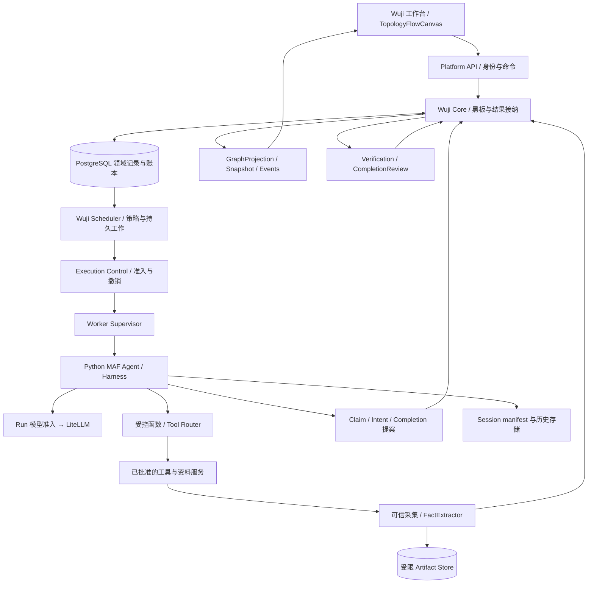
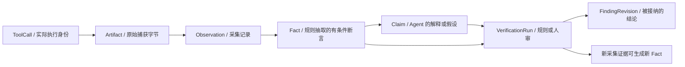
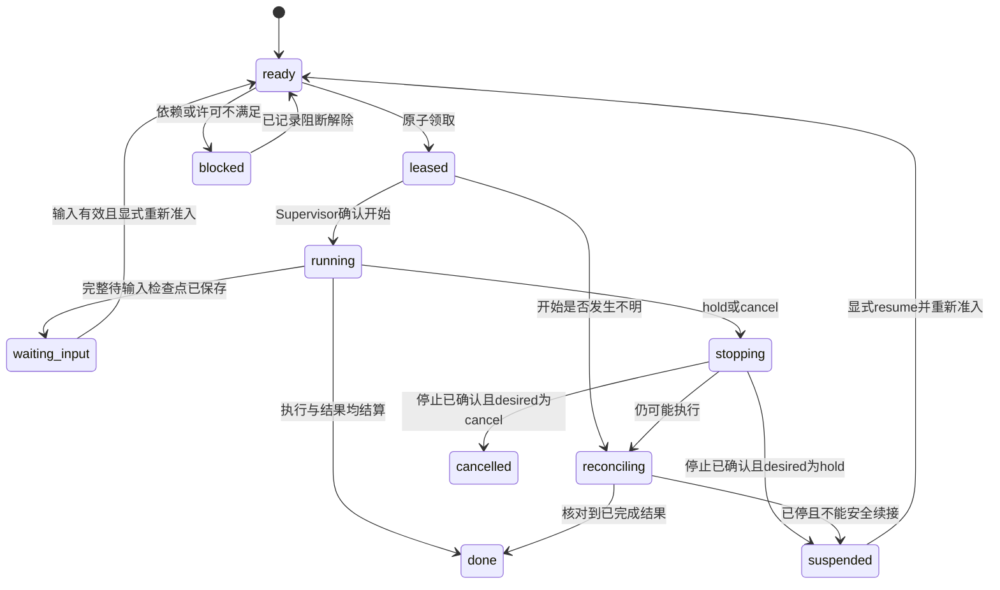
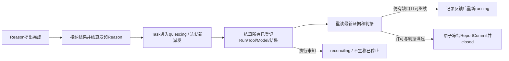

# Wuji vNext：证据驱动黑板、持久调度与 MAF Harness Spec

**版本**：1.0-review  
**日期**：2026-09-12  
**状态**：供评审的完整目标合同；本轮交付文档，不代表代码已实现或测试已通过。  
**范围决定**：新交付物不依赖 Cairn Server、Dispatcher、原生黑板或 Pi/Claude Code CLI 执行链。MAF 是 Agent 执行底座，`TopologyFlowCanvas` 是基于 `@xyflow/react` 的前端画布。  
**配套**：[实施计划](PLAN.md) · [草案审查](REVIEW.md) · [来源与边界](SOURCES.md) · [原始草案](INPUT_SPEC.md)

## 0. 如何阅读与规范语言

先读 §1–4 理解目标与概念，再读 §5–9 的执行语义，最后读 §10–17 的接口、画布和验收。本文所有新增模块、类型、状态和路由均为 **Wuji 目标合同**，不是 MAF 内置功能。

“必须/禁止”是实施验收条件；“首版”指完成新核心重构后的首个受限发布，不等于五类场景和生产工具全部交付；“候选”有明确验证关口，不允许实施者静默替换技术路线。具体发布依赖在 P01 锁定。

本轮用户已经确定技术方向，不等于已批准停机、删除数据、收费模型调用、真实目标访问或生产部署。上传草案中的历史成果/本地路径仅作为 D 类资料，未被本轮重复证明。来源分类见 SOURCES。

## 1. 目标、非目标与需求索引

### 1.1 目标

Wuji 拥有问题、共享证据、工作选择、执行准入、结论接纳和结束语义；MAF 拥有单个 Agent 的模型—工具循环及可配置的会话/上下文机制。每个结果都应能回答：谁观察的、观察了什么、适用什么条件、模型推断了什么、哪些结论被什么规则接纳。

新系统不是 Cairn API 的兼容外壳，也不是把全部黑板塞进 MAF Workflow。现有身份、主题、工具实现、预算及独立业务逻辑可以经过接口核验后复用；不要求为了“重构”重写与痛点无关的成熟代码。

### 1.2 首版明确不做

不做第二套 Agent 工具循环、自研摘要算法、任意 DSL/Python 策略上传、无限后台子 Agent、多调度活跃副本、协作编辑 CRDT、通用图数据库、向量索引强依赖、跨系统 exactly-once 承诺。五类场景保留配置与展示入口；首批仅用离线数据、自建封闭夹具和合成模型验证机制。

### 1.3 验收需求索引

| ID | 必须实现的要求 |
|---|---|
| REQ-001 | 新运行、查询、部署与依赖链无 Cairn/Pi 执行依赖；历史以离线归档读取。 |
| REQ-002 | 领域黑板、执行状态、拓扑投影、布局偏好分别有唯一所有者。 |
| REQ-003 | Agent 不能直接写 Fact；Fact 只能由可信采集/规则抽取路径生成。 |
| REQ-004 | Claim 与 Verification/Finding 分离，另一模型同意不自动成为验证。 |
| REQ-005 | Fact 有原始证据、采集主体、适用条件、时刻、完整性和抽取规则版本。 |
| REQ-006 | Origin/Goal 是输入与判据，不是假装已成立的 Fact；complete 是命令/评审。 |
| REQ-007 | Intent、WorkItem、AgentRun、Session 分离，状态与唯一活动写者有数据库约束。 |
| REQ-008 | 短事务准入、容量、领取和派发 outbox 原子提交；网络在事务外执行。 |
| REQ-009 | 类型化引用、复合归属校验、追加修订；知识关系与执行依赖分离。 |
| REQ-010 | 一致快照、Task 内提交序、事件批与失效/重复处理有明确合同。 |
| REQ-011 | 完成评审有冻结派发、结算、重新核验和原子关闭，避免完成竞态。 |
| REQ-012 | MAF 通过公开接口组装，工具与隐式默认能力有确定白名单。 |
| REQ-013 | 完整 Session manifest、消息游标、CAS 与兼容恢复；不承诺任意崩溃点续接。 |
| REQ-014 | 审批持久化、限定调用、一次消费、当前授权复核及跨 Run 明确移交。 |
| REQ-015 | 单工作 hold、Task pause/cancel 和真实停止分别处理；旧 epoch 不得启动新动作。 |
| REQ-016 | 模型准入限定 Run，LiteLLM 负责费用；隐式重试、断流与未知响应被记录。 |
| REQ-017 | 函数/MCP 共用工具治理；真实执行端核验许可，不依赖提示词授权。 |
| REQ-018 | 工具证据在 Agent 最终响应前独立入账，Agent 崩溃不丢已采集证据。 |
| REQ-019 | 上下文按固定引用构建；注入/工具返回是不可信数据，不扩权。 |
| REQ-020 | Reason 触发持久合并、单实例、消费水位与可观测等待条件完整。 |
| REQ-021 | 策略可版本化、去重可解释、进展规则与独立硬上限防止无限探索。 |
| REQ-022 | 共享可变资源声明与执行端锁有 fencing，未知持有者不直接接管。 |
| REQ-023 | `TopologyFlowCanvas` 使用受控 React Flow，统一稳定节点/关系身份。 |
| REQ-024 | 布局仅改变坐标/视口/个人偏好；连线或删除不能修改证据事实。 |
| REQ-025 | 画布快照/增量/SSE/重连/历史回放/权限变化有统一版本合同。 |
| REQ-026 | API、采集、执行、读图及证据下载均鉴权；隔离与脱敏不是客户端责任。 |
| REQ-027 | 业务审计与 OpenTelemetry/费用分离，观测脱敏并有保留策略。 |
| REQ-028 | Scenario/Goal/DeliveryProfile 分离；真实能力逐项发布，不伪造覆盖。 |
| REQ-029 | 离线迁移、只读旧记录、可验证退出依赖；失败不自动切回 Cairn。 |
| REQ-030 | 源码参考与发布包 lock 分离；保留 Python/Node 工具链并验证精确组合。 |
| REQ-031 | 产品测试、合成模型机制测试、真实效果测试与文档检查分别留证。 |
| REQ-032 | 图规模、可访问性、性能目标、证据交付与发布关口可验证。 |

## 2. 总体架构与部署



图只表达逻辑依赖。工具和模型的外部行为仍经过现有许可边界；测试首版不访问外部目标。

| 部署单元 | 职责 | 不承担 |
|---|---|---|
| apps/web + Platform API | 任务与身份、配置发布、审批命令、读图与证据入口 | 不在浏览器执行 Agent，不由 UI 状态决定任务成功 |
| execution-control / Wuji Core | Blackboard、Evidence/Fact 接纳、命令、准入、结果结算、模型代理、恢复 | 不维护另一套模型计价器，不执行模型推理做硬授权 |
| wuji-scheduler | 扫描持久工作、纯策略排序、申请派发 | 不直接写已验证事实，不管理整个 Pod |
| Runtime Controller | Pod 期望状态、UID/attempt、资源回收 | 不处理 MAF 会话和业务完成 |
| 每 Task 的双容器环境 | agent 容器管理独立 Harness；tool 容器沿用现有 Kali/工具实现与受限工作区 | 不宣称同 Pod 两容器有网络强隔离，不接受相互恶意的任意代码 |
| LiteLLM | 上游适配、原生凭据、用量与 Task USD 预算 | 不管理 Session 或黑板 |
| PostgreSQL + 产物存储 + 观测后端 | 分别保存业务、原文与运行观测 | 不互相代替 |

部署可复用镜像，调度入口必须独立于 HTTP 请求生命周期。首版一个活动 Scheduler；数据库约束不因单实例而取消。LISTEN/NOTIFY 或其他唤醒仅为优化，持久扫描负责补偿。

## 3. 信息语义：什么才是 Fact

### 3.1 记录链与信任边界



**Fact 不等于“绝对真理”**。它证明在指定采集点、输入、环境版本和时间下记录到了某个值；它不能无条件代表整个系统状态。真实工具执行可能报错、只返回部分结果或转述不真实内容。

| 类型 | 例子（离线记录比较） | 权威写入者 |
|---|---|---|
| Origin | 用户提供“附件 A 与 B 应当一致”及文件摘要 | Task 创建/明确变更命令；这是输入假设 |
| Artifact | 实际读取返回的字节、输出文件、截图 | 可信采集服务；内容地址受控 |
| Observation | 在文档版本 X 读取字段 status，收到返回值及回执 | 采集服务；有 tool_attempt_id |
| Fact | “该次读取的文档 X 中 status 字段等于 ready” | 版本化确定性 FactExtractor |
| Claim | “两个系统可能存在同步问题” | Agent 或人工提案；默认 unassessed |
| VerificationRun | 固定规则比较两个版本和时间范围 | 已发布规则/有资格的人审；记录判定依据 |
| FindingRevision | 通过指定验收规则接纳的结论与限制 | 评估服务；模型不得直接写 |
| GoalContract | “解释差异且每个结论有有效引用” | 用户/管理员批准的判据版本 |

如果工具返回字符串“系统正常”，首先得到的 Fact 最多是 `tool_reported(text="系统正常")`，不能自动得到 `system_is_healthy=true`。退出码 0 只证明进程成功返回，不证明业务结果正确。对截断正文可以抽取确实捕获的字段，但不得生成依赖完整正文或“未出现某内容”的断言。

### 3.2 FactLedger 合同

Fact 的不可变载荷包含：

| 字段 | 约束 |
|---|---|
| fact_id、tenant_id、project_id、task_id | 平台生成；复合归属校验 |
| fact_kind、subject_ref、predicate、value、unit | 来自已发布 schema，不接受模型任意增加“已验证”字段 |
| observation_ids、evidence_spans | 引用已封存 Artifact/Observation；span 是偏移、JSON Pointer 或受控定位 |
| collector_id、tool_attempt_id、tool_definition_version | 采集身份来自认证通道，不来自模型参数 |
| extractor_id、extractor_version | 确定性规则及实现摘要可追溯 |
| observed_at、received_at、environment_ref、conditions | 区分观察时间与入库时间；时间由平台校验 |
| completeness | complete / partial / unknown，按断言所需证据范围判断 |
| provenance_class | live_capture / fixture_capture；imported_unverified 只属于 Observation/LegacyRecord，不直接进入 FactLedger |
| canonical_digest | 稳定序列化载荷摘要，用于完整性和幂等，不宣称密码学证明外部事实真实 |

Fact 正文不更新。撤回、过期、冲突使用独立 `FactAssessment` 追加记录：effective / disputed / stale / retracted，注明依据和规则；历史报告保留当时状态。相互矛盾的 Fact 可同时存在，因为时间、环境、工具可信度可能不同。

Agent 无 `fact:create` 权限。它可提交候选抽取建议，但最终仍必须由可信解析器重新从证据读取字段。无法可靠确定性抽取的内容保留为 Observation + Claim；不得为满足 UI 的“真 Fact”标签强行升级。合成夹具事实必须始终显示 fixture 标记，不能混入生产评估。

### 3.3 Claim 与验证

ClaimRevision 保留 kind（observation-summary / hypothesis / derived-conclusion）、正文、依据、作者、来源 Run 和 supersedes。评估状态 unassessed / supported / contradicted / inconclusive 独立于正文版本，由验证结果或明确人审产生。

`VerificationRun` 必须固定被核验 ClaimRevision、所用事实/证据、规则版本、适用条件、运行主体和结果。另一个 Agent 可产生 `review_opinion`，不能通过“二号模型同意”自动变为 supported。缺少可核验规则时保持 inconclusive 或进入人审。

## 4. 黑板实体、关系与唯一所有权

### 4.1 保留与新增对象

保留 Task、Origin、GoalContract、Observation、Artifact、Claim、Intent、Hint、VerificationRun、EvidenceLink、CoveragePlan、CompletionReview、FindingRevision、ReportCommit 等概念。新增 FactLedger/FactAssessment、持久 WorkItem、SessionManifest、DispatchDecision、GraphProjection 和 LayoutPreference。

Blackboard 是领域记录的统一访问层，不是另一套可独立编辑的 node/edge 数据库。已有 W1 记录只能在真实 schema/来源核验后复用；无法建立采集链的历史 Fact 以 `LegacyClaim` 或 `imported_unverified` 资料呈现，不重新命名为可信 Fact。

### 4.2 关系矩阵

| edge_type | 合法来源 → 目标 | 含义 | 是否调度依赖 |
|---|---|---|---|
| input_to | Origin/Fact/Claim → Intent | 这项工作引用的输入 | 否 |
| produced_by | Observation/Claim → AgentRun 或 ToolAttempt | 记录来源 | 否 |
| extracted_from | Fact → Observation | 事实抽取依据 | 否 |
| supports / contradicts | Fact/VerificationRun → ClaimRevision/GoalCriterion | 指定规则认可的证据关系 | 否 |
| proposes | AgentRun → Intent | 工作建议来源 | 否 |
| depends_on | IntentRevision → IntentRevision | 前者等待后者指定结算条件 | 是，必须无环 |
| supersedes | 新 revision → 旧 revision | 追加修订关系 | 否，不用于工作拓扑排序 |
| assesses | CompletionReview → GoalContract | 完成判断作用对象 | 否 |
| references | Hint/ReportCommit → 受权对象 | 明确引用 | 否 |

所有引用用 `KnowledgeRef={entity_type,id,revision}`；实体类型和外键匹配、Task/租户归属由服务端检查。跨 Task 引用通过单独的受权导入记录，不直接写一条跨租户边。知识图可以有交叉、反证与回链；只有 `depends_on` 子图必须为 DAG。

节点在画布上是展示对象；Cairn 将 Intent 表示为边，不要求新画布也这样做。新画布将 Intent 画成节点，多个输入和输出自然通过多条有类型的边表达。**显示方向不是未经验证的因果证明。**

### 4.3 写入主体

- 用户命令：Origin/Goal 版本、Hint、审批与控制动作；无权伪造采集 Fact。
- Agent：ResultSubmission 中的 Claim、IntentProposal、CompletionProposal；不直接改写 Task/Fact。
- 可信采集服务：Artifact、Observation、Fact 及采集回执。
- Committer/评估服务：接纳、验证关联、状态投影、完成评审和报告冻结。
- UI：LayoutPreference 及上述受权限命令，不直接更新领域表。

## 5. 生命周期与持久执行

### 5.1 概念

| 对象 | 含义 | 不能混同 |
|---|---|---|
| IntentRevision | 要解决的问题、依据、预期结果及依赖的固定版本 | 不是一次进程 |
| WorkItem | 可被调度、暂停、等待及结算的持久工作 | 不是模型 Todo |
| AgentRun | 一次实际执行段/进程，包含执行代次与回执 | 不是全部会话 |
| AgentSession | 同一逻辑工作的可兼容续接状态 | 不是共享黑板 |

WorkItem.kind 首版为 bootstrap / reason / explore；bootstrap 是普通程序初始化，不强制创建 AgentRun。验证是业务对象，可使用确定性函数或显式 Explore 工作；report 作为注册的只读工作类型扩展，不默认新增永久 Agent。

一个 Explore WorkItem 绑定一个 IntentRevision；一个 IntentRevision 默认最多一个未结算 WorkItem，重试/续接增加 Run 而不是悄悄创建第二项相同工作。新方法或新依据通过新 IntentRevision/新 Intent 明确表达。每次独立 Reason 使用新 Session；同一 Reason 等待审批续接仍是同一 WorkItem。

### 5.2 状态轴

| 对象 | 枚举与语义 |
|---|---|
| Intent.acceptance_state | proposed / admitted / rejected / superseded |
| WorkItem.desired_state | run / hold / cancel |
| WorkItem.state | ready / leased / running / waiting_input / blocked / stopping / suspended / reconciling / done / failed / cancelled |
| AgentRun.process_state | registered / starting / running / stopping / exited / unknown |
| AgentRun.result_state | none / received / accepted / rejected / historical_only / incomplete |
| Task.desired_state | run / pause / cancel / finish |
| Task.observed_state | ready / running / quiescing / paused / reconciling / closed / failed |
| Task.close_reason | completed / partial / inconclusive / cancelled / failed / budget_exhausted / time_limit / no_progress，未关闭为空 |
| Goal.status | met / not_met / unknown / not_applicable |
| Assessment.outcome | complete / partial / inconclusive / not_assessed，保留既有业务含义，不等同 Goal |

UI 必须分开显示执行状态和评估结果。WorkItem.done 只表示结果和执行已结算；不是 Claim 真实，也不是总 Goal met。



任何状态变化都带 expected_version、command_id、actor、reason_code。终态不自动回到 ready。failed 是确定失败；unknown 必须进入 reconciling，不把“没收到回包”当失败后重试。

### 5.3 Fencing 与容量

三层代次：Task `execution_epoch`，环境 `runtime_attempt + pod_uid`，工作持有者 `run_epoch`。数据库、模型准入、工具执行端和 Session 保存都核对当前代次。

唯一约束至少覆盖：Task 内一个未结算 Reason；WorkItem 一个有效写持有者；稳定 operation_id 一次输入；稳定 submission_id 一次载荷；Session 一个写持有者；工具操作身份不因 Run 改变而重置。跨租户外键使用复合归属，RLS 不能代替接口鉴权。

租约到期只撤销继续执行资格并触发核对。旧进程、工具或共享写资源未确定停止时，不签发新的冲突执行许可。新 Run 不能以新 ID 遮蔽旧 unknown 操作。

## 6. Scheduler 与探索策略

### 6.1 调度顺序

扫描持久候选 → 检查硬准入 → 纯策略排序 → 短事务重验容量与持有者 → 写 DispatchDecision/AgentRun/lease/outbox → 事务外启动。

硬准入包括显式 start、desired_state、Scope/Profile/Goal 版本、依赖、未知操作、当前环境、允许模型/工具、并发/调用/时间/资源额度及预算阻断。策略只能排序已经 eligible 的工作，不能扩大权限。

首版策略：Task/租户公平轮转；同任务先满足必需依赖和完成缺口，再处理人工批准的优先级，最后按等待老化和创建顺序排序。具体规则封装为纯函数：

```text
SchedulerPolicy.select(input: SchedulingSnapshot) -> list[DispatchDecision]
```

SchedulingSnapshot 包含 candidate_refs、capacity、policy_version、now、已计算的 admission reasons。DispatchDecision 包含 work_item_id、profile_version、selection_reason、input_revision。纯策略禁止网络、模型调用和数据库写。

### 6.2 Reason 触发

每 Task 保存 TriggerAccumulator：pending_reasons、highest_pending_board_revision、consumed_revision、inflight_work_item_id。初始化、新有效 Fact/验证、依赖结算、有效 Hint、完成反馈和明确阻断解除可以触发；Token、心跳、布局、工具轮询不触发。

领取 Reason 时固定 consumed_up_to 候选值但不立即消费；结果接纳/明确结算后才提交消费水位。运行期间新增变化合并到下一轮。不能因进程崩溃丢掉触发，也不对每条事实调用一次模型。

ReasonResult 是判别联合：propose_intents / wait / propose_completion / blocked。wait 必须携带已登记 dependency/question/event；没有这些条件的“再等一会儿”拒绝为 INVALID_WAIT。blocked 要有 reason_code、解除动作和责任人。

### 6.3 去重与无进展

`ExactExecutionKey` 由规范化工作目标、方法族与版本、身份条件、相关依据版本、预期输出组成；不能仅用自然语言标题，也不能仅用参数 hash 猜测某外部操作已经执行。文本相似只提示合并。

新 Run 的续接不是新探索额度。相同方法但新事实依据的复测必须记录 `supersedes/retest_reason`。存在等价活动工作则引用它，不重复派发。

ProgressSummary 是发布规则计算的结构化投影：新可用证据范围、判据状态变化、已解决阻断、未覆盖项减少、有效新假设的接纳；原始 Fact 数量增加不自动代表进展。忽略重复内容、时间戳噪声、改措辞和布局变化。progress_digest 只是该投影摘要，不是“语义理解算法”。

每 ScenarioProfile 必须另有独立 hard limits：总工作数、模型请求数、工具调用数、累计输出体积、时限、Reason 次数、同方向重试上限。无进展规则不能重置这些限额。预算耗尽用已存数据结束，不额外要求模型付费总结。

### 6.4 资源与单 Agent 控制

共享文件发布、浏览器身份上下文、端口等写资源用 resource_key 和执行端 fencing 协调；只读可并行。租约到期不等于旧写者已停。

UI 的“停止这个 Agent”默认操作是 `hold WorkItem + revoke run_epoch + stop Run`。不能自动重新 ready。只有显式 ResumeWork 或新的受权工作提案才能继续。Task pause/cancel 则撤销 execution_epoch，并影响全部相关 Run。

## 7. MAF Agent / Harness 适配

### 7.1 原则与采用矩阵

使用公开 factory、Provider、中间件和原生序列化；不 monkeypatch MAF、不复制工具循环、不伪造厂商工具消息。工厂与部分可选实验特性要分别验证。[R2/E1]

| 能力 | Reason | Explore | 约束 |
|---|---|---|---|
| 模型与函数循环 | 使用 | 使用 | 显式有限请求/调用上限，平台再累计限制 |
| Todo | 默认关闭 | 开启 | 局部清单，不写全局 Intent，不触发 Task 完成 |
| Mode | 关闭默认交互模式 | 同左 | 工作类型和工具表由平台分配，保留局部计划能力 |
| Session | 独立 Reason 工作一份 | 一项工作可兼容续接 | 单写者、完整 manifest |
| 文件记忆 | 默认关闭 | 受控 AgentFileStore | Task/WorkItem 作用域，不能挂宿主目录 |
| Compaction | 显式策略 | 显式策略 | 已验证上下文容量，工具配对不破坏，原始证据不删除 |
| 工具审批 | 平台接入 | 平台接入 | 禁用宽泛站立批准，保留原生审批协议 |
| 后台 Agent / 外层循环 | 关闭 | 关闭 | 全局派发只有 Scheduler |
| 默认 WebSearch/Shell/共享文件访问 | 关闭 | 关闭 | 仅注册受控工具；CLI/Shell 能力不是首批测试前提 |
| Skills | 版本化受信资源 | 同左 | 不自动发现宿主知识，不通过加载知识执行脚本 |
| 观测 | 开启脱敏埋点 | 同左 | 不向用户展示隐藏推理或敏感正文 |

### 7.2 AgentRuntimePort

Worker Supervisor 只认识 Wuji 协议，MAF 类型留在适配包内部：

```text
AgentRuntimePort.execute(assignment: WorkerAssignment) -> AsyncIterator[WorkerEvent]
AgentRuntimePort.cancel(run: RunIdentity, reason: str) -> ControlReceipt
AgentRuntimePort.deliver_input(run: RunIdentity, input: HumanInput) -> InputReceipt
```

WorkerEvent.kind：run_started、model_call_observed、tool_call_observed、todo_updated、input_required、checkpoint_saved、result_submitted、run_exited。事件来自原生公开钩子或适配器观测；不能伪称不存在的原生事件 API。

上下文包含冻结 Assignment、Origin/Goal、相关 KnowledgeRef、允许工具与预算提示、已知限制。提示里的限额只用于告知，真正限额由服务端执行。来源文本是数据，不可升级为系统指令。

### 7.3 依赖能力门 G1

P01/P06 必须在真实安装的发布包上验证：factory 参数；函数调用；审批完整往返；消息/工具配对；Session 序列化；压缩；自定义 HistoryProvider；取消；默认工具集合。

不以源码 HEAD 的版本号当 wheel 兼容证明。若某个持久化边界或审批续接不能通过公开 API 实现，发布该 Profile 前选择：仅支持已结算工作段恢复，或停止发布并提交明确差异；不能静默改用 Pi/Cairn，也不能直接修改 MAF 私有实现。

## 8. Session、上下文与人工输入

### 8.1 SessionManifest

完整 manifest 包含 session_id、work_item_id、owner_run_id/run_epoch、checkpoint_revision、message_high_watermark、state_blob_ref/hash、history_ref、profile/model/client/framework_lock_digest、pending_call_ids、pending_approval_ids、recovery_class、saved_at。

`recovery_class` 为 settled_boundary / approval_boundary / non_resumable。是否支持更细边界由 G1 的实际证据决定；首版不默认任意模型调用后都可恢复。

持久化流程：写不可变状态/历史对象 → 校验完整性 → 短事务 CAS 发布 manifest 和消息终点 → 才允许下一项需持久保障的动作。历史单独存储时 manifest 固定终点；不能用“最后一个文件名”拼出未提交状态。文件记忆也需要受控写入及版本关联。

MAF 的 per-service-call history persistence 不是业务事务。History 与 provider state 更新时机可能不同，必须在 G1 证明某个边界完整，否则不得标 resumable。[E2]

### 8.2 上下文与资料

BoardSnapshot 只读固定引用；大正文通过受权接口取不可变版本。刷新返回新 snapshot_id，保留已经读取的引用及版本，不静默从 latest 补入不同记录。

压缩只影响模型输入副本；原始 ModelCall/ToolCall/Artifact 账本不裁剪。上下文不能因摘要而丢失待批调用关联。跨 Task 笔记需要显式授权，不能自动加载。

### 8.3 输入与审批

Hint 用于共享规划；HumanInput 绑定某 WorkItem；控制命令用于 hold/pause/cancel/Scope 变更。这三种入口分开。

ApprovalRequest 绑定 task/work/session、checkpoint、原 call_id、参数摘要、tool/profile/scope version、请求 Run、审批人资格和 expires_at。批准与消费分开去重；批准后再准入。恢复由新 Run 显式继承原操作，不给未知旧 ToolCall 新建执行 ID。[E3]

待审批要求完整保存后可以结束当前执行段；不长期占用模型连接。拒绝结果通过原生支持协议返回，不能伪造工具成功。InputReceipt 的 delivered 不代表模型已经理解；acknowledged 仅表示适配器在确定输入边界接纳。

## 9. 工具、事实采集与模型入口

### 9.1 ToolDefinition 与工具调用

ToolDefinitionVersion 固定 schema、实现摘要、用途、所需能力、适用阶段、读写属性、最长时限、取消能力、幂等策略、资源声明、证据要求、采集器和 FactExtractor。

函数工具与 MCP Adapter 都经过 Tool Router；不允许模型提供任意 URL 作为 MCP server 或跨任务选择身份。Reason 只有现有数据读取能力。Todo/记忆可由会话适配执行，但仍要配额和持久化，不必走工具容器。

逻辑 `tool_call_id` 跨 Run 续接稳定；实际 `tool_attempt_id` 表示一次具体执行。相同 operation_id + 相同规范输入返回原回执；相同 ID 不同输入是 409。新 ID 即便参数相同仍是新操作，不能靠参数 hash 自动宣称去重。

### 9.2 证据独立入账

Tool Router 登记 → 执行端保存启动回执 → 实际工具运行 → 可信采集端封存 Artifact/Observation → 确定性抽取 Fact → 原子公布 evidence receipt → 向 Agent 返回受限摘要及引用。

采集器的认证密钥、代码与回执存储必须位于 Agent/不可信工具不可改写的信任域。对可运行任意代码的工具环境，不可仅凭“同容器 Supervisor 签名”宣称强可信采集：优先由控制面或独立受控转发链记录它真正接收的结果，事实断言限定于该采集点。不能完成这种隔离的 Profile 不发布强证据能力。

Agent 的最终 ResultSubmission 不负责制造原始事实；它只引用已经存在的证据。Agent 在工具返回后崩溃时，证据仍留在黑板。采集失败不能用模型描述代替；工具确实发生但证据不全时记录 partial/unknown。

操作凭据与历史回执提交凭据分离。过期 Run 不能继续调用工具，但可信 Supervisor 可补交先前操作的事实；补交记录为 historical_only，不能触发已终止 Task 重新执行。

### 9.3 模型准入

MAF ChatClient → Run 限定准入层 → LiteLLM Task 限定 Key → 上游。准入层检查身份、三种代次、模型别名与发布能力、请求数和截止时间；不实现厂商路由、会话压缩或另一套计价。

ModelCall 记录逻辑请求与实际 attempt；重试显式有界。流转发有 backpressure 和有限缓冲，记录 downstream_disconnected、upstream_status 和费用核对状态；客户端断流不保证上游停止或退款。原响应正文未知时不得编造回答继续工具循环。

LiteLLM 仍为 Task USD 预算与费用权威；跨 Run、Reason、压缩、收尾共用预算，不保证并发零超支。首个协议候选为应用侧历史的 Chat Completions 路径；真实兼容性由发布能力检查决定，不能静默丢字段。

### 9.4 网络与敏感资料

Task Pod 的网络边界是 Pod，而不是单个容器。工具服务不能借共享网络访问控制面数据库或模型管理凭据。生产出口/环境隔离必须单独验收；此 Spec 不提供外部目标操作、任意执行工具或突破隔离的实现步骤。

所有网络/工具行为以已授权、受控的业务用途为前提；第一批测试使用自建夹具和离线记录。没有该能力的 Profile 不得发布。

## 10. 事务、事件与公开合同

### 10.1 版本与事件排序

- `board_revision`：黑板语义变化提交序号；不因 Token、布局、心跳增长。
- `assessment_revision`：验证/覆盖变化版本。
- `task_event_seq`：同 Task 所有对外持久领域事件批的顺序。
- `layout_revision`：用户布局版本；独立于前三者。

所有会影响同 Task 语义状态的写事务，按固定锁序获取 Task 聚合锁，在事务内分配该 Task 的事件批序号和 board_revision。回滚不发布序号。不能使用全局 sequence 的已见最大值推断事务提交完整性。

读取 BoardSnapshot 使用短 Repeatable Read 事务固定引用清单、三个水位及访问策略摘要；大正文在事务外按不可变引用读取。默认 Read Committed 下多条 SELECT 不是一个稳定快照。[E7]

队列领取可使用 `FOR UPDATE SKIP LOCKED`，但还必须重查 Task/租户/Profile 容量。锁顺序统一为 tenant_capacity → task → workitem → session/resource，死锁/serialization failure 仅重试尚未发送网络操作的数据库事务。

### 10.2 公共类型

```text
KnowledgeRef = {entity_type, id, revision}
RunIdentity = {tenant_id, project_id, task_id, work_item_id, agent_run_id,
               execution_epoch, runtime_attempt, pod_uid, run_epoch}
BoardSnapshot = {snapshot_id, board_revision, assessment_revision, task_event_seq,
                 access_scope_digest, knowledge_refs, created_at}
ResultReceipt = {submission_id, digest, status, accepted_refs, board_revision,
                 error_items, historical_only}
CommandReceipt = {command_id, state, affected_ref, observed_version, reason_code}
```

所有业务写 API 从服务端认证上下文派生归属；请求中重复的归属字段只作一致性校验，不能切换身份。未知字段默认拒绝，schema_version 不认识返回稳定错误。规范输入摘要由服务端按带 canonicalization_version 的固定规范化过程生成；对象键顺序/空白不改变逻辑摘要，数组顺序保留，拒绝 NaN/Infinity 等非合同数值；金额用十进制字符串。原始证据摘要始终对实际捕获字节计算，不先做文本规范化。跨语言合同测试固定这些样例。

### 10.3 HTTP API v2

具体实现可挂接现有 FastAPI，以下路径作为新合同固定；旧执行路由不再接收新动作。

| 方法与路径 | 合同/作用 | 关键前置条件 |
|---|---|---|
| POST /api/v2/tasks | TaskCreate → Task | Origin/Goal/Profile 输入及权限 |
| POST /api/v2/tasks/{id}/commands | TaskCommand → CommandReceipt | Idempotency-Key、expected_version |
| POST /api/v2/tasks/{id}/hints | HintCreate → KnowledgeRef | 明确作者、用途、作用域 |
| POST /api/v2/tasks/{id}/intents/proposals | IntentProposal → ProposalReceipt | 依据与 Goal 引用有效 |
| POST /api/v2/work-items/{id}/commands | hold/resume/cancel → CommandReceipt | expected_version、当前权限 |
| POST /api/v2/approvals/{id}/decisions | ApprovalDecision → CommandReceipt | 固定调用、资格、有效期 |
| GET /api/v2/tasks/{id}/topology | GraphQuery → TopologySnapshot | 固定快照/投影范围 |
| GET /api/v2/tasks/{id}/events | SSE EventBatch / resync_required | 受权游标及 Last-Event-ID |
| GET /api/v2/tasks/{id}/records/{type}/{rid} | RecordView | 当前读权限、明确 revision |
| PUT /api/v2/tasks/{id}/layouts/{view} | LayoutPreference | If-Match layout_revision |
| GET /api/v2/artifacts/{id}/content | 受权流或短期引用 | 当前权限、审计、版本 |
| GET /api/v2/archives/{id} | 只读 ArchiveView | 当前权限；无旧引擎调用 |
| POST /internal/v2/results | ResultSubmission → ResultReceipt | Supervisor/Run 特定提交身份 |
| POST /internal/v2/evidence | ToolReceipt → EvidenceReceipt | 仅可信采集身份，不对 Agent 开放 |
| POST /internal/v2/dispatch/claims | ClaimWork → DispatchReceipt | Scheduler 身份、事务容量 |
| PUT /internal/v2/runs/{id} | WorkerAssignment → StartReceipt | 稳定 operation_id、RunIdentity |
| POST /internal/v2/runs/{id}/control | WorkerControl → ControlReceipt | Run-specific hold/cancel/input |

错误体统一为 `{code,message,request_id,retryable,details}`；敏感归属不进入 details。常用错误：INVALID_SCHEMA、FORBIDDEN_COLLECTOR、STALE_VERSION、INVALID_REFERENCE、WRONG_SCOPE、STALE_EXECUTION、INPUT_DIGEST_CONFLICT、EVIDENCE_NOT_SEALED、INVALID_WAIT、CAPABILITY_UNAVAILABLE、OPERATION_UNKNOWN、SNAPSHOT_EXPIRED、RESYNC_REQUIRED。

内部可信采集入口的身份禁止用 FORBIDDEN_COLLECTOR（HTTP 403）；成功回执 code 可用 ADMITTED、ACCEPTED、ACCEPTED_AS_OPINION，业务状态仍以 data 中的固定枚举为准。

HTTP 401 未认证；403 已认证但禁止；404 对外隐藏不可访问对象；409 版本/身份/幂等冲突；410 快照/游标已过期；422 语义或 schema 无效；429 当前额度阻断；503 依赖不可用。`retryable=true` 只允许重试同一幂等命令/查询，不授权新执行。

### 10.4 结果提案示例

示例为业务 JSON，不是 MAF 返回类型，也不是执行代码。Agent 不提交 fact 数组。

```json
{
  "schema_version": "wuji.result.v1",
  "submission_id": "a811b765-effe-4e3a-9ca4-5fc05d43e4d0",
  "snapshot_id": "7b5d7913-bd57-4bce-a0f2-56883e193947",
  "outcome": "result",
  "claims": [{
    "client_ref": "claim-a",
    "kind": "hypothesis",
    "text": "两份记录的差异可能由版本不同导致。",
    "basis": [{"entity_type":"fact","id":"3b366e09-a628-46a0-bbde-9baef7f4d289","revision":1}]
  }],
  "intent_proposals": [],
  "limitations": ["尚未核验两个版本之间的变更说明。"]
}
```

示例实体 ID 仅为测试数据，生产实体 ID 由平台生成；client_ref 是本次提案内的局部关联值，不是事实 ID。SDK 生成的工具 call ID 按 opaque string 保存，不强行转 UUID。

## 11. 结果接纳与完成协议

### 11.1 两阶段结果接纳

先认证并查相同 submission_id 的原回执 → 保存原始正文/摘要 → 对不可变引用解析与校验 → 短事务核对状态和依赖 → 接纳 Claim/Intent 提案、结算 WorkItem/Run、追加事件及回执。

保存原文与语义接纳可以是两次事务，分别有 received/pending/accepted/rejected 状态。响应丢失后只重投同一份结果取回执，不重跑 Agent。部分非法提案的策略固定：核心结果整体 schema/归属失败则整单拒绝；合法结果中单个 IntentProposal 业务冲突可逐项拒绝并返回 error_items，不制造半写 Fact。

旧快照追加不冲突的 Claim/观察可接纳，并保存实际读取版本；修改已变更 Intent 或完成 Task 必须重验。终态后的可信旧回执可以只作 historical_only，不能新增 ready 工作。

### 11.2 完成的两步收敛



CompletionReview 检查必须排除“已经结算的发起 Reason”本身，不能等待自己的未结算记录造成死锁。quiescing 后不发新模型/工具许可；已持久操作允许补交结果。新反证到达使旧完成依据失效，最终关闭前重读 board/assessment/goal/policy 版本并在 Task 锁内再次检查。

Goal 全部 required 判据有适用证据才可 met；零条可执行 required 判据或无法映射的自由文本不能真空判真。`all([])` 不是完成依据。判据可为确定性规则或明确人审责任；模型自评仅供参考。

最终关闭还必须明确结算剩余 ready/blocked/waiting 工作：记录 cancelled/superseded 及 Task 结束原因，而不是把未执行工作改成 done。撤销具体待批操作；保留其原始请求供审计。

Task closed、Goal met、Assessment complete、资源 cleanup completed、费用 settled 分别记录。上游模型请求的费用可能仍在对账；此时可以说明本地执行已停止，但不能展示“全部外部请求已停止”。远端有副作用工具仍可能执行时必须保持 reconciling。

预算、时限、无进展允许部分/不确定结束，不把未执行项变成未复现。终态追加旧证据不重新打开 Task；真正复测创建关联新任务。

## 12. React Flow：TopologyFlowCanvas 的完整合同

### 12.1 组件职责

`TopologyFlowCanvas` 基于 `@xyflow/react`，是受控、可重建的图视图。它不是官方内置组件，不是 Cairn Server 的替代数据库。[R1/E5]

建议路径 `apps/web/src/features/topology/TopologyFlowCanvas.tsx`。本轮公开快照未检索到该组件；实施 P00 若找到本地版本，核对后沿用同名职责并记录迁入路径，不复制出两个同名画布。

```text
TopologyFlowCanvasProps = {
  snapshot: TopologySnapshot,
  layout: LayoutPreference,
  mode: "live" | "history",
  selection: KnowledgeRef | null,
  onSelect(ref),
  onLayoutChange(LayoutPatch),
  onCommandRequested(DomainCommandIntent),
  onExpandRequested(ExpansionQuery)
}
```

组件不持有 API 凭据，不直接调用模型/工具，不根据本地节点数量宣布完成。父层容器负责查询和命令，`toFlowElements` 纯函数负责 DTO 到 React Flow 的转换，store/reducer 负责版本一致性。

### 12.2 拓扑数据

TopologySnapshot 包含 schema_version、task_id、snapshot_id、board_revision、assessment_revision、task_event_seq、projection_version、access_scope_digest、nodes、edges、truncated、continuation、allowed_actions。

NodeDTO 包含稳定 node_id、KnowledgeRef、kind、标题与脱敏摘要、执行/证据状态、render_version、allowed_actions。node_id 由实体身份确定，不能用数组下标或随机渲染 ID。

EdgeDTO 包含稳定 edge_id、source/target node_id、edge_type、关系 revision、脱敏理由。隐藏任一端点就不返回该边；不得泄露隐藏节点的名字、数量、布局位置或关系解释。

第一版节点类型：Origin、Goal、Fact、Claim、Intent、Verification、CompletionReview。Observation/Artifact 按需展开或在侧边栏查看；AgentRun 可作为执行视图 overlay，不强制每个工具调用都画成全局节点。

### 12.3 三种视图

| 视图 | 默认显示 | 用途 |
|---|---|---|
| 探索图 | Origin/Goal/Fact/Claim/Intent 与依据关系 | 看“已知什么、准备做什么” |
| 执行视图 | Intent/WorkItem/AgentRun 状态与依赖 | 看“谁在做、为什么等待” |
| 证据视图 | Claim/Verification/Fact/Observation/Artifact | 看“结论依据什么” |

三个视图读同一领域权威。不能为每个 tab 维护一份可独立编辑的业务图。

### 12.4 交互

点击节点展示具体 revision、来源 Run、事实证据范围、验证记录与限制；点击 Intent 可申请 hold/resume/cancel；点击待审批显示特定调用；点击 Goal 显示 required 判据与未知项。

拖拽只修改个人布局；删除键默认只清除选择或隐藏个人视图节点，不删除领域对象。`onConnect`/`onReconnect` 第一版关闭；需要新增工作用“提出 Intent”表单，经 API 校验后由事件回显。审查关系更改必须走领域命令，不能先乐观显示为 accepted。

历史模式禁止所有执行和领域写命令，但证据读取仍按当前权限校验；历史回放不会重新调用模型/工具。状态用文字/图标加样式，不只靠颜色；键盘可选择节点，提供同步列表视图和可读状态文本。保留现有 Ant Design 五主题。

### 12.5 布局与自动排布

LayoutPreference 的 key 为 user/task/view/layout_schema；保存 node positions、pinned nodes、viewport、collapsed groups、filter preference 和 layout_revision。不保存另一份 Fact/Claim 正文。`If-Match` 冲突时合并非冲突布局或提示重载，不反向覆盖服务器领域图。

布局器只影响坐标。候选 ELK 通过 LayoutEnginePort 隔离，在 Web Worker 计算，先用 input_to/depends_on 等结构排布，再渲染支持/反证回链；不要求知识图整体 DAG。[E6]

新增数据不每次 `fitView` 或全图重排；保持用户视口和 pinned positions，显示“有更新”。首次/显式重排才全局布局。原型阶段可先用确定性分层布局，候选 ELK 未通过则保留接口和可用简单布局，不更换 React Flow。

### 12.6 实时与重连

首次 GET topology 固定快照和 event_seq；随后 SSE 从该游标读取。事件是同一事务的 `TaskEventBatch`，含 prev_seq、seq、board_revision、assessment_revision、patches 或需要重取的受限引用。

前端只接受连续且更高版本的批；重复批丢弃，过期批不回退状态；缺口/游标过期/access_scope_digest 改变则 resync。服务端若过滤事件，返回不含敏感内容的水位批，不要求客户端通过猜缺失序号读取隐藏数据。SSE 断开只影响观察，worker 继续按持久控制状态工作。

子图查询和分页固定 snapshot_id；不在第二页切换 latest。快照过期返回 410；无法保留增量时返回 resync_required。初始节点/边上限防止巨图卡死，展开必须受权。内容补取时固定记录 revision；不能让旧 patch 混入新正文。

## 13. 安全、存储、观测与交付

### 13.1 存储与保留

PostgreSQL 存领域与控制权威；Artifact Store 存不可变原始内容、状态对象和报告；Session 历史可分行存，但 manifest 固定消息终点。新系统不需要 Cairn SQLite 或图数据库。

临时对象 staged → sealed → referenced；未 sealed 不可作为 Fact/报告依据；发布 manifest 后的对象不可被垃圾回收。保留规则通过 DataRetentionProfile 明确：原始敏感内容、历史、审计和非敏感指标分别设置；本轮不凭空设定监管期限。未批准保留策略则仅发布封闭夹具配置。

原始证据与脱敏派生件分别有 hash、来源和访问级别。采集端所见字节与原始网络包不同，必须如实标注。哈希保证入库后完整性，不证明采集端或远端一定真实。

### 13.2 观测

OpenTelemetry 关联 Task/WorkItem/AgentRun/ModelCall/ToolCall；指标记录队列等待、审批等待、调用错误、核对项、证据缺失和本地停止延迟。业务决定、授权变更、审批消费和最终评审写入持久审计，不依赖采样 Trace。[E4]

默认禁止写入完整 Prompt、隐藏推理、有效凭据、证据原文和任意工具参数。允许展示简短业务理由码与脱敏摘要。费用从 LiteLLM 对账，不从 Trace 推断。

### 13.3 DeliveryProfile 与报告

上传草案将“一律截图+完整 HTTP 交互”描述为既有要求，但本轮未再次确认其对所有媒介适用。新方案将它显式放入可批准的 DeliveryProfile，而不是静默删掉或强加给所有任务。

- UI/浏览器验证：按 Profile 要求截图及相关原始记录。
- HTTP 类观察：按 Profile 保存实际请求/响应、采集点与完整性，不伪造不存在的交互。
- 离线文档/源码：固定文件摘要、版本、位置与实际分析产物；没有 HTTP 时声明不适用。
- Profile 要求的证据缺失时不能标完整交付；用户若继续要求每项截图，该 Profile 明确要求，实施者不能自行放宽。

ReportCommit 冻结 Goal/Scope/Profile、事实/主张/验证版本、证据清单、正文和限制。后续新证据以补充记录或新报告修订呈现，不改旧交付正文。预算耗尽后确定性模板仍可交付已有结果。

## 14. 五类场景与产品保留

保留原稿的 Web 单点、CTF、代码审计、综合渗透、攻防演练场景标签及 Task 产品主体；这些名称不是开放全部执行能力的许可。差异放在 ScenarioProfile/GoalContract/ToolDefinition/DeliveryProfile 中，不为每个场景写一套 Scheduler。

本批只验证离线记录、固定源码快照和自建封闭站点上的既有受控读取能力。真实模型效果、外部网络操作、浏览器/通用工具和生产隔离必须分别通过发布关口。附件或旧文档中的目标访问描述不视为本轮执行授权。

## 15. 完全退出 Cairn 的迁移与发布

### 15.1 终态

新镜像、Python workspace、依赖 lock、部署清单、健康检查和查询路径不要求 `cairn`、`wuji-cairn-bridge`、原 Dispatcher、Cairn SQLite 服务或 Pi CLI。`engine_version` 只记录新实现版本，不保留运行中切换 legacy 的枚举入口。

历史归档保留原出处、ID、版本和导出时间；归档读取使用普通 JSON/数据库读取，不启动 Cairn API。旧 Fact 的名称不提供可信证据等级。

### 15.2 切换协议

建立隔离的新核心和夹具数据 → 关闭旧系统新建执行入口 → 停止并核对旧活动/未知操作 → 导出历史与证据 manifest → 校验计数/引用/摘要 → 新系统只读导入历史 → 切换新建 Task 入口 → 移除旧运行依赖。

导出/停机/数据删除需要单独授权。未确定旧执行停止时禁止以“全量重构”为理由删 PVC/数据库。旧数据备份保留在受控归档中，旧执行服务不属于新系统交付。

新系统切换失败进入维护/只读状态；保留新产生结果并冻结继续执行。不得在新系统内部自动切回 Cairn，不能把 MAF Session 转成 Pi 会话。要启用旧独立部署属于新的显式运维决定，不是此 Plan 的默认回退。

### 15.3 复用边界

可审查复用身份/主题/独立工具/Runtime Controller/价格配置/证据采集逻辑；退出原 Dispatcher、bridge、Cairn 完成协议适配与 Pi 启动配置。旧 migration 只为读取已存在历史保留时不能出现在新库初始化路径中；新核心 schema 初始化无需安装 Cairn。

## 16. 非功能目标与验证关口

以下数字是**建议验收目标，不是已测结果**。基准需记录硬件、数据库、浏览器、镜像、数据种子和冷/热缓存条件。

| 项目 | 首批验收目标 |
|---|---|
| 图默认窗口 | 默认最多 300 节点 / 600 边；显式展开后单视图上限 1000 节点 / 2000 边，超出明确截断/分页 |
| 图测试集 | 固定 300/600 与 1000/2000 两组，包含回链、反证、隐藏节点和历史 revision |
| 初始画布可交互 | 已取得 DTO 后，固定 CI 浏览器基准 p95 ≤ 2 秒；不含模型请求 |
| 增量应用 | 50 节点以内事件批在同基准 p95 ≤ 200 ms，不能重置视口 |
| 稳定性 | 100 次重复批、乱序/缺口、离线重连、权限撤销后无重复/越权节点 |
| 默认无障碍 | 键盘选择、可读状态、列表替代视图；不只用颜色表达真假或运行状态 |
| 上限 | Profile 必填工作数/请求数/工具数/字节/时限，无限制配置不得发布 |
| 停止 | 按 RuntimeProfile 的实测窗口展示，未实测不宣称即时停止；未知副作用不进入已停 |

发布关口：G0 依赖/来源与合同冻结；G1 MAF 真实 SDK 能力通过；G2 事实与调度/恢复测试通过；G3 React Flow 与契约/UI 安全通过；G4 新闭环和退出 Cairn 通过；G5 生产环境、实际模型与具体场景的独立授权及验收。G4 不自动解锁 G5。

## 17. 验收矩阵

测试 ID 与 Plan 任务必须一一可追溯。所有“通过”由未来测试记录支撑；本文件不预写结果。

| ID | 要观察的行为 | REQ | Plan |
|---|---|---|---|
| A01 | 不安装 Cairn/Pi 的干净环境可启动新核心并创建夹具 Task | REQ-001,REQ-030 | P01,P18 |
| A02 | Origin 与 Goal 独立类型，用户输入不自动生成 Fact | REQ-003,REQ-006 | P02,P03 |
| A03 | Agent 直接调用事实写入口被拒绝，未产生记录 | REQ-003,REQ-026 | P03 |
| A04 | 相同真实回执重交只产生一组 Observation/Fact，参数冲突拒绝 | REQ-005,REQ-018 | P03,P04 |
| A05 | 工具原文声称成功、退出0不自动形成业务成功 Fact | REQ-003,REQ-004 | P03,P05 |
| A06 | 截断/超时/合成证据被正确标记，不能支持超出范围的断言 | REQ-005,REQ-018 | P03,P04 |
| A07 | 另一 Agent 的赞同不让 Claim 自动变为 supported | REQ-004 | P05 |
| A08 | 反证/撤回追加修订，旧报告及原证据保持原样 | REQ-004,REQ-009 | P05,P11 |
| A09 | 两个领取竞争者下一个 WorkItem 仅一个活动 Run，容量不超发 | REQ-007,REQ-008 | P07,P08 |
| A10 | 启动响应丢失只查询同 operation，不第二次启动 | REQ-008,REQ-015 | P08 |
| A11 | 旧 run_epoch/attempt/Pod UID 不得启动模型/工具或保存新 Session | REQ-007,REQ-015,REQ-022 | P08,P09,P10 |
| A12 | 单工作 hold 后不会立即重新调度，其他工作继续 | REQ-015 | P08,P10 |
| A13 | Reason 期间多次更新合并，崩溃后触发未丢失 | REQ-020 | P07 |
| A14 | wait 没有已登记事件条件被拒绝，不空轮询模型 | REQ-020 | P07 |
| A15 | 改措辞/重复回执/Token 不重置无进展阈值，硬限额不重置 | REQ-021 | P07 |
| A16 | 新策略只对明确版本生效，准入拒绝不可被优先级绕过 | REQ-008,REQ-021 | P07,P09 |
| A17 | 未发布默认工具和内部子 Agent 不出现在 MAF 工具集合 | REQ-012,REQ-019 | P06 |
| A18 | 真实 MAF 合成模型循环正确；函数/MCP共用Router，Agent不直接写Fact | REQ-012,REQ-017,REQ-018 | P04,P06,P09,P16 |
| A19 | 审批完整往返只执行原调用一次，取消/改参数后批准无效 | REQ-014 | P06,P10 |
| A20 | Session 只保存完整 manifest；中途失败不发布可恢复快照 | REQ-013 | P06,P10 |
| A21 | 真实 MAF 压缩后原始证据不丢、工具配对及允许集合不变 | REQ-012,REQ-013 | P06 |
| A22 | 模型断流记录上游未知、费用待核对，不伪造原回答 | REQ-016 | P09 |
| A23 | 多 Run/摘要共享 Task 预算，重启不新建额度 | REQ-016 | P09,P16 |
| A24 | 工具成功而 Agent 崩溃，事实仍由独立采集留存 | REQ-018 | P04,P16 |
| A25 | 默认读并发写的混合快照测试失败；新快照全引用同水位 | REQ-010 | P02,P12 |
| A26 | 结果并行追加不因无关 board_revision 增长而全部拒绝 | REQ-009,REQ-010 | P05 |
| A27 | 完成发起 Reason 不等待自身；评审期间新反证使旧提案失效 | REQ-011 | P11 |
| A28 | quiescing 后不派发新工作，未知外部副作用不显示已停止 | REQ-011,REQ-015 | P11 |
| A29 | 空判据/Goal 自评/待验证 Claim 不导致 Goal met | REQ-006,REQ-011 | P11 |
| A30 | 拖节点只保存 Layout，board_revision/Fact 不改变 | REQ-002,REQ-023,REQ-024 | P13,P14 |
| A31 | 图删键/连线不能删证据或建立已验证支持关系 | REQ-023,REQ-024 | P13,P14 |
| A32 | 稳定节点 ID、增量重复和乱序处理不重复/倒退/丢选择 | REQ-010,REQ-025 | P12,P14 |
| A33 | SSE 缺口/过期游标重取快照，历史页不混入 latest | REQ-010,REQ-025 | P12,P14 |
| A34 | 隐藏证据端点/跨租户边不可见，权限变更后清除受限视图 | REQ-026 | P02,P12,P14 |
| A35 | 历史回放无执行动作；当前权限仍保护旧证据 | REQ-025,REQ-026 | P14,P17 |
| A36 | 五主题、键盘/列表替代视图及两组规模基准通过 | REQ-023,REQ-032 | P13,P14 |
| A37 | 审计/Trace/费用分开，敏感字段未进入公开事件和日志 | REQ-027 | P15 |
| A38 | 证据交付按 Profile 判断，不伪造截图或不适用的HTTP记录 | REQ-028,REQ-032 | P11,P15 |
| A39 | 旧归档可读而无 Cairn SDK，未知旧记录不自动激活或升级 Fact | REQ-001,REQ-029 | P17,P18 |
| A40 | 合成机制/真实模型效果/文档校验分别标记，发布门没有跳过 | REQ-028,REQ-030,REQ-031 | P01,P16,P18 |

## 18. 必须保持的最终边界

事实权威在可信采集链与可核查证据，不在模型措辞；任务权威在 Wuji 控制面，不在 MAF Todo；显示权威在可重建 GraphProjection，不在 React Flow 本地状态；计费权威在 LiteLLM，不在 Trace；恢复权威在持久账本与实际回执，不在过期租约。

实现按 PLAN 执行。所有未通过的 SDK、环境或场景能力都要明确阻断发布，不以“文档写了”替代实测，也不静默回退到 Cairn。

## 附录 A：实施前固定的最小线协议

下面补全 Plan 涉及的跨组件数据结构。公共 schema 由 P02 实现并生成 Python/TypeScript 合同；框架私有对象不得直接进入这些接口。所有时间为带时区 UTC 字符串；控制水位采用十进制整数字符串传输，避免浏览器数字精度损失；实体 revision 为受限正整数。外部 ID（SDK call ID、对象存储 key）作为 opaque string，不按路径执行。

### A.1 WorkerAssignment

| 字段 | 类型/规则 |
|---|---|
| schema_version | 固定 `wuji.assignment.v1` |
| operation_id | 平台 UUID，稳定启动身份 |
| identity | §10.2 RunIdentity，服务端全部核验 |
| work_kind | reason / explore / report；bootstrap普通程序不需要Harness |
| intent_ref | Explore必填固定IntentRevision；其他类型可空 |
| snapshot | 固定 BoardSnapshot，不携带任意SQL或本地路径 |
| origin_ref / goal_ref | 当前Task批准版本 |
| profile_ref / model_config_ref / policy_ref | 固定版本与摘要，禁止动态执行配置注入 |
| tool_definition_refs | 精确版本列表；与平台实时许可取交集 |
| session_ref | session_id、checkpoint_revision、recovery_class；新工作为空 |
| task_input | 受限文本/附件引用/预期结果schema，不含管理凭据 |
| limits | deadline、max_model_requests、max_tool_calls、max_output_bytes；全部有限 |
| resume_reason | new / approved_input / explicit_resume / reconciled；每种都需有原记录 |
| permit_ref | 指向独立受限凭据交付，不把Key放进普通Assignment日志 |

### A.2 ToolReceipt 与 EvidenceReceipt

ToolReceipt 必须包含 schema_version、operation_id、tool_call_id、tool_attempt_id、receiver_id、RunIdentity、ToolDefinitionRef、request_digest、started_at、ended_at、dispatch_state、observed_process_state、return_code、artifact_refs、observation_metadata、collector_attestation_ref。

`dispatch_state` = not_sent / sent / unknown；`observed_process_state` = running / exited / unknown。return_code 在非exited时为空；工具未发出时不能出现伪造的响应正文。ArtifactRef 固定 artifact_id、version、bytes_digest、size、capture_layer、completeness 和受控访问级别；URL仅是脱敏定位，不作为任意抓取命令。

EvidenceReceipt 返回 receipt_id、original_digest、state（pending / sealed / accepted / rejected / historical_only）、observation_refs、fact_refs、board_revision、reason_code。只有 accepted/sealed 且完整性满足抽取规则时，引用才可成为相关Fact依据；historical_only仍可能记录取消前的真实观察，但不能触发执行。

### A.3 ResultSubmission 与 ReasonResult

ResultSubmission 包含 schema_version、submission_id、raw_response_ref/digest、snapshot_id、read_refs、outcome、claims、intent_proposals、reason_decision、limitations。归属从认证上下文派生；Agent自行填写的身份不改变归属。

- outcome=result：接纳候选主张与后续工作建议；没有Fact写入字段。
- outcome=input_required：引用已持久的问题/待审批记录；不是最终业务成功。
- outcome=blocked：必须有稳定reason_code及解除条件。
- outcome=failed：表示明确失败；实际执行未知不能仅按模型此值结算。
- outcome=completion_proposed：必须有Goal版本、支持证据引用和限制；仍走CompletionReview。

ReasonResult 的 kind 与附属字段必须匹配：propose_intents 需要非空建议列表；wait 需要已登记 wait_refs；propose_completion 需要 GoalContractRef 与 basis；blocked 需要 reason_code 和 remedy。每项 IntentProposal 包含 client_ref、title、question、basis、goal_criterion_refs、method_family/version、required_capabilities、expected_output、dependency_refs、retest_reason（必要时）。Priority 是建议值，不是准入授权。

### A.4 EventBatch 与 LayoutPreference

EventBatch 包含 schema_version、task_id、event_id、prev_seq、seq、board_revision、assessment_revision、access_scope_digest、patches、resync_required。patches允许 upsert_node、upsert_edge、remove_from_view、invalidate_ref、status_changed；remove_from_view只影响当前投影，不代表物理删除证据。

多个patch属于一个事务批，客户端要么整批应用，要么重取，不能只应用一半。内容过大时patch仅提供受权固定版本引用。无权限内容不进入patch；服务端可以发空patch水位以继续消费，但不能暴露敏感事件类型。

LayoutPreference 包含 layout_schema、user_id（由认证派生）、task_id、view、layout_revision、positions、pinned、viewport、collapsed、filters。positions映射稳定node_id到有限{x,y}；viewport含有限x/y和限定zoom；未知领域ID不导致服务器创建节点。LayoutPatch必须只含这些字段，出现status、Fact正文或edge_type返回INVALID_SCHEMA。

### A.5 ModelCall 与调用身份

每个实际到达模型准入层的HTTP请求必须有独立 model_attempt_id、RunIdentity、model_alias、received_at、admission_state、upstream_state、usage_ref 和billing_status。逻辑 logical_request_id 只有在所选SDK公开接口支持可靠注入/续传时才用于分组；否则标记grouping_unknown，仍按实际请求累计限额，不声称同语义请求被去重。

没有安全、已验证的逻辑重试标识时禁用SDK隐式重试；响应不明时不得通过重新提交相同文本假装“恢复了原请求”。请求标识与内容摘要不进入模型可修改的业务参数。

## 附录 B：数据库与发布约束清单

1. 所有Task范围的领域FK同时核对tenant/project/task；审计actor来自可信请求上下文。不能仅凭全局UUID难以猜测视为授权。
2. 相同command/operation/submission ID只允许一个canonical_digest；重复输入返回原回执，不触发新执行。
3. 一个WorkItem只有一个有效run_epoch持有者；一个Session只有一个写者；Task一个未结算Reason。不同Run的只读查询不受单写者限制。
4. 对同Task的语义写和对外事件批统一获取聚合锁；事件序号不是各组件自己计算`max+1`。同库状态与outbox提交不可分离。
5. blocked/waiting工作的解除依据必须存在，不能被“重新tick”自动清空。hold只有明确ResumeWork命令能解除。
6. Fact与Artifact正文不可覆盖；FactAssessment、ClaimRevision、IntentRevision和ReportCommit以追加记录表达变化。引用旧报告不自动改为latest。
7. 原始staged对象尚未封存不参与事实生成/报告；manifest发布后引用对象不被垃圾回收。外部存储失败时保留pending，不伪装完整成功。
8. Goal met 要有非空且适用的必需判据集合，或者批准的明确人工判据；空数组、模型自报、Todo清空都不能满足。
9. 新发布的import图、依赖lock、镜像命令、挂载、readiness与归档查询均无需Cairn/Pi。历史文档中的名称不等于运行依赖。
10. 新核心初始化与增量迁移分别在空测试库/历史副本验证；已部署库的破坏性迁移需要单独授权，不能在普通测试中执行。
