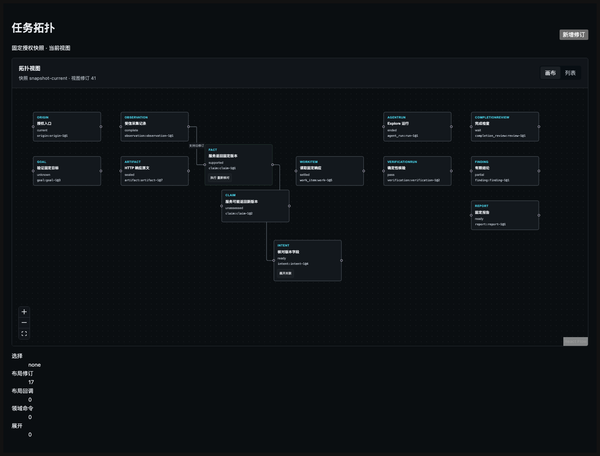

# P14 定向复审

> 永久归档 derived copy：源文件 `.superpowers/sdd/vnext-v2/P14-rereview.md`，源 SHA-256 `44c1bdc0647288a3f3cfc66480f7f6245bf41a3a3ab8f6806b7501b370d366fd`。仅将截图与 HTTP 证据的相对链接调整为本归档目录；固定提交、真实范围和审查结论未改。

日期：2026-09-13。**结论：PASS。**原审查 `P14-review.md` 的 F1—F4 均已关闭；在本轮限定的小 diff 中未发现残留问题或新增直接问题。

## 固定范围

- 原代码提交：`9a1c8e20ccd57b19e74d748129a3d5d524eab6f4`
- 修复代码提交：`bd3111a62a624aa5acef7d167ffe96b18747934a`
- 修复证据提交：`64bbdf2974b39856a2cb29dd1eee97cb1a70ca93`，其唯一父提交正是上述修复提交
- 复审输入：`.superpowers/sdd/vnext-v2/P14-review.md`、`tests/topology/review-fix-report.md`、修复提交自身的 P14 生产/测试 diff，以及报告记录的 16 Vitest、2 Chromium、web typecheck 结果

`9a1c8e2` 到修复父提交之间，本轮涉及的 8 个 P14 生产/测试文件没有漂移，因此 `bd3111a` 的提交自身 diff 可以直接对应原审查问题。中间 M1/P09 代码、证据和结论均未纳入复审。工作树没有 `.codegraph/`，本轮按仓库约定使用 `git show`/`git diff` 读取固定提交。

按本次要求，未重跑 Vitest、Chromium、typecheck、浏览器、数据库或其他检查，未修改源码和测试。

## F1—F4 逐项关闭

| 项目 | 结论 | 复核依据 |
| --- | --- | --- |
| F1：无损 revision 与 follow-latest | **关闭** | `revision.ts:1-13` 只接受 `0` 或无前导零的非负十进制字符串，并以长度、再字典序比较，不经过 `Number`；`toFlowElements.ts:43-55` 遍历同一逻辑 anchor 选择数值最大的 revision，不依赖数组顺序。`TopologyContainer.tsx:65-72,103-139` 同时把该校验用于 node revision 与 `view_revision`。新增用例直接覆盖乱序 `10/2`、`9007199254740993/9007199254740992` 和非规范 `01`、`1.0`。 |
| F2：请求维度立即隔离 | **关闭** | `TopologyContainer.tsx:196-206,359-367` 为 reader 建立稳定身份，并用 `taskId/mode/snapshotId/readSnapshot` 组成 React key；任一维度变化都会重建内部请求组件。原问题涉及的内部 snapshot、local selection、local layout 和动作提示随重建立即清空，history/live 的初始 selection mode 也重新派生。`TopologyContainer.tsx:282-296` 在 cleanup 中 abort，并在成功、失败和 finally 写状态前检查该请求的 abort 状态，所以忽略 abort 后迟到返回的旧 reader 也不能写回。浏览器用例 `browser.spec.ts:50-68` 证明更换 reader 后旧 A 快照立即消失、切到任务 B 后 A 的迟到完成仍不可见，最后只显示 B。 |
| F3：原 blackboard 默认 | **关闭** | `ExecutionObservation.tsx` 将正式任务页初始主视图恢复为 `blackboard`；拓扑 tab 与真实 v2 reader 保留，但未接好的 topology API 不再成为默认请求和默认页面。 |
| F4：真实中文 history 正负证据 | **关闭** | fixture 增加实际可见领域动作“重新核对”；`browser.spec.ts:70-89` 在 live 中用键盘触发“执行 重新核对”、点击“展开关联”，分别确认回调为 1；随后进入 history，直接确认这两个真实中文控件均不存在，并在节点键盘选择后确认两类回调仍为 0。断言与 `TopologyFlowCanvas.tsx:63,80-93` 的实际按钮生成规则一致，不再使用永远不会出现的“执行 expand/inspect”名称。 |

## 既有证据核对

证据提交只新增 `tests/topology/review-fix-report.md`，且正文绑定的被测代码为 `bd3111a62a624aa5acef7d167ffe96b18747934a`。固定提交中的 `projection.test.ts` 静态计数为 16 个测试；报告记录该文件 `16 tests passed; exit 0`。报告中的 Chromium grep 精确命中“request dimensions”和“live actions”两个新增用例，并记录 `2 Chromium tests passed; exit 0`。同一报告记录 `pnpm --filter @wuji/web typecheck` 的 `tsc --noEmit; exit 0`。

本轮只核对这些已有记录，没有把它们表述为本次新运行。既有截图和完整 HTTP 报文仍只证明固定 DTO 专用页面，不证明真实 P13 API/Auth/Layout/stream 闭环：

[既有完整 HTTP 请求与响应](http-reproduction.md)

按 owner 交接约定，本轮复审不补跑浏览器，也不新建正式截图/完整请求证据包；正式证据由 owner 后补。此项是证据归档后续动作，不影响本次对固定修复 diff 的 PASS 结论。

## 保持项与最终判断

P13 topology API、真实 Auth、服务端 Layout CAS、ViewStream/reset/重连、真实规模 p95 和记录详情仍保持原报告中的 `pending/not_run`，未被本轮提升为通过，也不构成 P14 F1—F4 的残留。修复没有扩展功能或样式矩阵，没有新增资产或接口，无需更新资产梳理。

**最终结论：PASS。F1、F2、F3、F4 全部关闭；无确切残留，无新增直接问题。**
