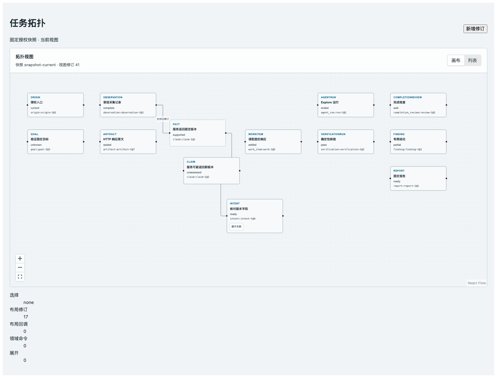

# P14 固定 DTO 正式画布切片独立代码/视觉审查

> 永久归档 derived copy：源文件 `.superpowers/sdd/vnext-v2/P14-review.md`，源 SHA-256 `135a6894a3ab58b16333761635d23f299090d3110b112e574fecfbd64a2b5e22`。仅将截图与 HTTP 证据的相对链接调整为本归档目录；固定提交、真实范围和审查结论未改。

2026-09-13。**结论：CHANGES REQUIRED。**发现 4 项：P1 × 2，P2 × 2。被审代码固定为 `9a1c8e20ccd57b19e74d748129a3d5d524eab6f4`（父提交 `bcd5a15692cc85b9421baed94d3a9fdfbbd8f732`），证据固定为紧随其后的 `e456425fe3deb6c3ada5c8f424aa1ac3a7a50fa7`；未把当前 HEAD `bcc64ffa67ea3b910f62b065853108cdb7d67614` 或其整体 diff 纳入 P14 结论。

本轮逐行读取固定提交的 24 个变更文件、P14 brief、vNext Spec S12/S14、P13 实施接口、`DESIGN.md`、`tests/topology/report.md`、浏览器测试和五张已保存截图。工作树没有 `.codegraph/`，因此按项目约定使用 `git show`、`rg` 和行号源码。未运行 P13/3、typecheck、build、数据库、模型或浏览器；未修改源码、测试、依赖、Git index、HEAD 或分支。

## Findings

### F1 · P1：`follow_latest` 取数组末项，会把较旧 revision 当成最新

**定位：** `apps/web/src/features/topology/toFlowElements.ts:35-47`，尤其 42-46；响应边界 `apps/web/src/features/topology/TopologyContainer.tsx:64-70,102-138`。相邻真实生产者在 `packages/wuji-core/src/wuji_core/projection/builder.py:214` 按完整 node ID 字典序输出节点。

`resolveSelectedNodeId` 过滤同一逻辑 anchor 后直接返回 `candidates.at(-1)`，没有按 `RevisionString` 的非负十进制数值语义比较。真实 builder 的稳定顺序是字符串顺序；例如同一 Claim 的 `@10` 会排在 `@2` 前，数组末项因而是 `@2`。增量页或后续 patch 的到达顺序同样不能代表 revision 大小。现有测试只用有序的 `@1,@2`，所以无法发现该问题。

同一边界还只把 `KnowledgeRef.revision` 和 `view_revision` 检查为非空字符串，没有执行 OpenAPI 的 `^(0|[1-9][0-9]*)$` 约束；报告中“严格检查固定 TopologySnapshot 形状”的表述因此过强。精确 ref 和 edge endpoint 在映射时没有被改写，旧边也没有被重新连接；问题集中在 latest 解析和 revision wire 校验。

**影响：** follow-latest 选择、后续详情读取和选择高亮可落到旧正文，直接不满足 AC-056；若用 `Number` 修复又会在大于 `2^53-1` 的 revision 上产生精度丢失。应先验证规范十进制字符串，再用无损比较（规范长度加字典序，或验证后的 `BigInt`），并覆盖乱序的 `2/10` 及超出 JS 安全整数范围的 revision。

### F2 · P1：请求维度变化时继续渲染上一份 view，形成跨 view/query 的陈旧数据混用

**定位：** `apps/web/src/features/topology/TopologyContainer.tsx:255-279,281-337`；模式派生布局位于同文件 208-215。

当 `taskId`、`mode`、`snapshotId` 或 `readSnapshot` 改变时，effect 会启动新请求，但不清空或按请求身份隔离 `snapshot`、`localSelection` 和初始 `localLayout`。只要已有 snapshot，282 行不会显示加载占位；新请求完成前仍渲染旧 `view_id/query_digest/access_scope_digest`。若新请求失败，299-306 行会继续保留它。与此同时画布已收到新的 `mode`，而 `initialLayout(mode)` 只在首次挂载运行，因此 live/history 的选择语义也可能与保留数据不一致。

**影响：** 同一容器从 live 切到历史、从 H1 切到 H2，或更换携带新授权上下文的 reader 时，会在新选择下展示旧受权快照；失败时可无限保留。当前正式挂载固定为 live，父 Task 路由也按 task/身份 generation 设置 key，所以这不是声称现有 P13 权限链已接通，而是已公开容器接口本身违反 view/query/access 不混用的消费边界。应把已确认 snapshot 绑定到完整请求 key，维度变化立即隔离旧数据；只有同一 key 的重读失败才可明确保留上一份快照。补一个不依赖 DB 的组件反例即可覆盖 pending/failure 两条路径。

### F3 · P2：未实现 topology API 已被设为正式任务页默认视图

**定位：** `apps/web/src/features/task-execution/ExecutionObservation.tsx:164-186`，尤其 165、182、186；请求实现位于 `apps/web/src/features/topology/TopologyContainer.tsx:141-190`。

该提交把 `ExecutionObservation` 初始视图从已工作的 blackboard 改成 topology，并在每次打开正式 TaskDetail 时立即请求 `/api/v2/tasks/{taskId}/topology`。固定提交中 `apps/api` 没有对应运行路由；`git grep` 只找到 v2 合同和纯投影代码。因此当前正式入口默认显示“拓扑数据尚不可用/读取失败”，用户必须手动切回原有视图。

**影响：** 这是本提交造成的当前产品回归，不是要求 P14 提前完成 P13 API/Auth/Layout CAS/流或 p95。正式窄挂载可以保留新增 tab 和真实 API reader，但在后端能力可用前应保持原 blackboard 默认，或由实际能力信号启用 topology；不能用当前必然失败的请求作为默认入口。该 reader 也尚未进入现有 `projectRequest` 的身份失效/401 处理，报告已把 Auth 统一列为 pending，本审查不把它记成已完成。

### F4 · P2：history 浏览器用例没有命中 fixture 中唯一可见的动作

**定位：** `tests/topology/browser.spec.ts:50-55`；实际按钮生成在 `apps/web/src/features/topology/TopologyFlowCanvas.tsx:80-93`；证据结论在 `tests/topology/report.md:51-53`。

fixture 的节点动作只有 `inspect` 和 `expand`。实现总是过滤 `inspect`，而 `expand` 的可访问名称是“展开关联”；history 用例却断言不存在“执行 expand”和“执行 inspect”。即使删除 63 行的 history 屏蔽并错误显示“展开关联”，现有用例仍会通过；`command-events` 初始值为 0，测试也没有点击任何可能动作。因此它不能支持报告所称“历史视图没有执行动作”的真实浏览器负向证据。

**影响：** 静态代码当前确实在 history 下把 actions 置空，但 AC-058 要求的浏览器防回归证据失效。修复测试应直接断言“展开关联”不存在，并加入一个非 `inspect/expand` 的 fixture action 以检查普通领域按钮；如要证明回调不触发，应对可触发控件执行实际键盘/点击操作后核对计数，而不是只读取初始 0。

## 其余范围判断

| 关注点 | 审查结论 |
| --- | --- |
| 受控 React Flow 与领域写隔离 | nodes/edges 由 props/state 控制；无 `onConnect`/`onReconnect`，connect、reconnect、Delete 和多选删除均关闭。节点变化过滤 remove/select；旧 edge source/target 原样消费。除 F4 的证据缺口外，未发现 Delete/连接隐式领域写。 |
| Fact/Claim 与精确端点 | `display_kind=fact` 只改变卡片显示，node ID 仍取 claim ref；两条测试边固定指向 `claim@1`，新增 `claim@2` 不迁移旧边。除 F1 的 latest 选择外通过静态审查。 |
| 布局、pin、viewport 与选择 | exact anchor 优先于逻辑 anchor，新 revision 继承位置并偏移；pinned 不可拖；新增 snapshot 不调用 fitView，viewport state 保留；explicit selection 使用完整 ref。服务端 LayoutPreference 读取、If-Match CAS、跨用户隔离仍按报告为 pending，未被本轮提升为通过。F2 是现有容器在请求 key 变化时的独立缺口。 |
| history 与动作 | 生产组件按 `mode === history` 清空节点动作，formal mount 未注入领域 command handler；无假命令 API。真实浏览器证明受 F4 限制。 |
| API 与 fallback | 默认 reader 只发同源 cookie GET，解析失败显示错误，没有回退到测试 DTO；fixture 只被 tests 引用。P13 topology API、真实 Auth、历史/分页/opaque cursor、P15 stream/reset/重连、记录详情无损 JSON 和 p95 均未接或未跑，现有报告明确保持 `pending/not_run`。 |
| 正式挂载 | 代码只在既有 `ExecutionObservation` 增加一个主视图和一个容器，没有新增平行路由、伪 Task 入口或 milestone 导航；F3 仍需修正默认行为。 |
| 五主题、键盘和列表 | 五张 1440 px Chromium 截图已逐张打开；silver/glacier/celadon/slate/graphite 均使用共享 palette，画布无明显裁切或重叠。节点和列表选择使用原生 button，有可见 focus 样式、文字 state 和关系列表。截图来自固定 DTO 专用页，不证明正式三栏、窄屏或真实 API。 |

## 已有证据核对

实施报告记录 Vitest 13 项、web typecheck、web build 和 Chromium 3 项均 exit 0；这些是 `e456425` 保存的既有结果，本审查没有重跑。代码提交与证据提交之间只新增 `tests/topology/report.md`，证据之后到当前 HEAD 的 P14 生产文件没有变化。两段固定 diff 的 `git diff --check` 本轮 exit 0。

其余四主题截图位于 `tests/topology/screenshots/`；[完整 HTTP 请求与响应](http-reproduction.md)只证明专用 Vite 页面真实返回并加载固定 DTO 组件，原报告也明确没有把它冒充 P13 topology API/Auth/持久快照证据。没有发现新的目标资产或接口；`GET /api/v2/tasks/{task_id}/topology` 与 layout/view 合同已在既有 v2 OpenAPI 登记，因此本轮无需更新资产梳理。

## 结论

**CHANGES REQUIRED。**F1 必须在 P15/详情消费前修复，否则 follow-latest 会在真实 builder 的字典序输出上选错 revision；F2 必须在容器支持历史、query 或权限上下文切换前建立请求身份隔离。F3 应避免未接后端成为当前任务页默认体验；F4 需修正已有浏览器负向用例。P13 API/Auth、Layout CAS、ViewStream、真实规模 p95 和记录详情仍保持 partial/pending/not_run，本结论不要求在 P14 修复中扩大交付。
