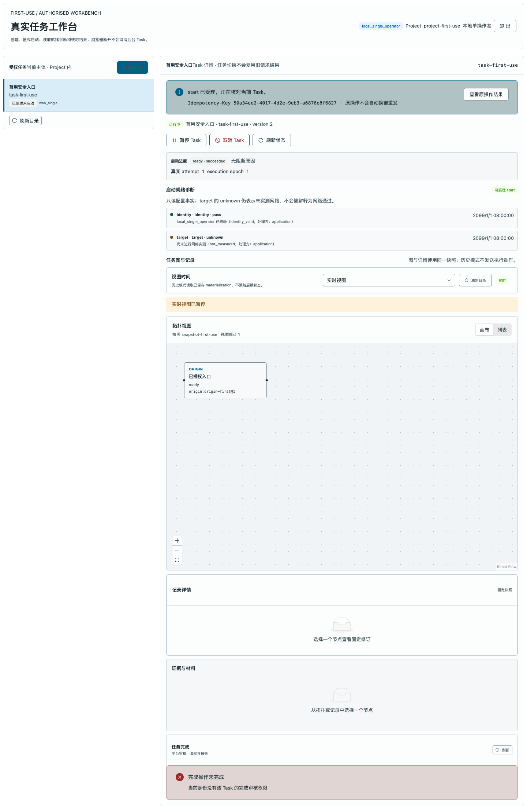

# A4 首用工作台浏览器证据

被测代码树：`codex/first-use-a4`。本记录只覆盖 A4 的浏览器状态/UI 合同回放，不冒称 A3 BFF、A2 API 或 A8 DG1 真实集成通过。

截图证据：



## 实际验证

| 用例 | 命令 | 退出码 | 观察 |
| --- | --- | ---: | --- |
| UI-01/02/03/05/06/07/08/09/10（前端合同回放） | `work/toolchain/bin/pnpm exec playwright test --config playwright.topology.config.ts -g "first-use workbench"` | 0 | 浏览器创建后保持“已创建未启动”；只有点击“显式启动”才发 TaskCommand；晚到刷新仍显示同一 Task；截图已保存。 |
| A4 状态/路径单测 | `work/toolchain/bin/pnpm exec vitest run --config tests/topology/vitest.config.ts tests/topology/first-use-workbench.test.ts` | 0 | 5 tests passed，覆盖状态映射、授权 Task 选择、generation、公开 material/download 路径、local access 登录 header。 |
| topology 相邻回归 | `work/toolchain/bin/pnpm exec vitest run --config tests/topology/vitest.config.ts` | 0 | 6 files / 33 tests passed。 |
| web 类型检查 | `work/toolchain/bin/pnpm --filter @wuji/web typecheck` | 0 | TypeScript strict 检查通过。 |
| web 生产构建 | `work/toolchain/bin/pnpm --filter @wuji/web build` | 0 | Vite build 通过；仅保留既有的大 chunk warning。 |

## 完整 HTTP 回放包（脱敏、无模型 Key）

以下是 Playwright 用例实际回放的应用请求/响应。浏览器由同一 Vite 测试服务发出；`Idempotency-Key` 是本次运行的完整值。测试回放没有登录 Cookie，A8 仍需用真实 A3 Cookie/Origin 重跑。

### 1. 读取当前主体的 Task 目录

```http
GET /api/v2/tasks?project_id=project-first-use&limit=20 HTTP/1.1
Host: 127.0.0.1:4194
Accept: application/json

HTTP/1.1 200 OK
Content-Type: application/json

{"items":[],"next_cursor":null}
```

### 2. 读取可用发布 Profile（打开新建表单后）

```http
GET /api/v2/projects/project-first-use/task-options HTTP/1.1
Host: 127.0.0.1:4194
Accept: application/json

HTTP/1.1 200 OK
Content-Type: application/json

{"project_id":"project-first-use","model_profiles":[{"ref":"profile/deepseek","name":"DeepSeek observe","revision":"7","digest":"sha256:model","capabilities":["chat_completions","non_thinking","max_calls:12"],"real_model_allowed":true}],"runtime_profiles":[{"ref":"runtime/fixture","name":"Fixture first-use","revision":"4","digest":"sha256:runtime","capabilities":["http_target","max_calls:12"],"real_model_allowed":true}],"missing":[]}
```

### 3. 创建 Task（只创建，不启动）

```http
POST /api/v2/tasks HTTP/1.1
Host: 127.0.0.1:4194
Accept: application/json
Content-Type: application/json
Idempotency-Key: 834addbe-f3cb-4b94-86f9-e8a2694a9892

{"schema_version":"wuji.api.v2","project_id":"project-first-use","name":"首用安全入口","scenario":"web_single","goal":{"text":"仅验证获准入口并保留正文证据","criteria":[{"criterion_id":"criterion-1","object":"获准入口的非破坏性验证","condition":"保存实际 HTTP 状态","evidence_requirements":["保存实际 HTTP/工具证据；未执行项保留明确原因"],"allowed_methods":["deterministic","reproduced_check","human_attestation"],"responsible_party":"operator","required":true},{"criterion_id":"criterion-2","object":"获准入口的非破坏性验证","condition":"保留未执行原因","evidence_requirements":["保存实际 HTTP/工具证据；未执行项保留明确原因"],"allowed_methods":["deterministic","reproduced_check","human_attestation"],"responsible_party":"operator","required":true}]},"authorization_scope":[{"host":"approved.example.test","protocol":"https","port":443}],"authorization_expires_at":"2099-01-01T00:00:00.000Z","entry_points":["https://approved.example.test/safe?view=summary"],"model_profile_ref":"profile/deepseek","runtime_profile_ref":"runtime/fixture","budget":{"amount":"1","currency":"USD"}}

HTTP/1.1 201 Created
Content-Type: application/json

{"task_id":"task-first-use","tenant_id":"tenant-first-use","project_id":"project-first-use","version":"1","name":"首用安全入口","scenario":"web_single","desired_state":"pause","observed_state":"ready","goal_revision":"1","execution_epoch":"0","activated_at":null,"close_trigger":null,"result_outcome":null,"allowed_actions":["start","cancel"]}
```

### 4. 创建后读取 Task、readiness、launch（证明没有隐式启动）

```http
GET /api/v2/tasks/task-first-use HTTP/1.1
Host: 127.0.0.1:4194
Accept: application/json

HTTP/1.1 200 OK
Content-Type: application/json

{"task_id":"task-first-use","tenant_id":"tenant-first-use","project_id":"project-first-use","version":"1","name":"首用安全入口","scenario":"web_single","desired_state":"pause","observed_state":"ready","goal_revision":"1","execution_epoch":"0","activated_at":null,"close_trigger":null,"result_outcome":null,"allowed_actions":["start","cancel"]}
```

```http
GET /api/v2/tasks/task-first-use/readiness HTTP/1.1
Host: 127.0.0.1:4194
Accept: application/json

HTTP/1.1 200 OK
Content-Type: application/json

{"task_id":"task-first-use","definition_digest":"sha256:definition-first-use","observed_at":"2099-01-01T00:00:00.000Z","can_request_start":true,"checks":[{"id":"identity","layer":"identity","status":"pass","reason_code":"identity_valid","observed_at":"2099-01-01T00:00:00.000Z","evidence_ref":null,"remediation_owner":"application","message":"local_single_operator 已核验"},{"id":"target","layer":"target","status":"unknown","reason_code":"not_measured","observed_at":"2099-01-01T00:00:00.000Z","evidence_ref":null,"remediation_owner":"application","message":"尚未进行网络实测"}]}
```

```http
GET /api/v2/tasks/task-first-use/launch HTTP/1.1
Host: 127.0.0.1:4194
Accept: application/json

HTTP/1.1 200 OK
Content-Type: application/json

{"operation_id":null,"command_id":null,"task_id":"task-first-use","definition_digest":"sha256:definition-first-use","profile_digest":null,"runtime_attempt":null,"execution_epoch":null,"phase":"not_requested","phase_status":"not_requested","reason_code":null,"allowed_actions":["start","cancel"],"observed_at":"2099-01-01T00:00:00.000Z"}
```

### 5. 显式 start（唯一执行命令）

```http
POST /api/v2/tasks/task-first-use/commands HTTP/1.1
Host: 127.0.0.1:4194
Accept: application/json
Content-Type: application/json
Idempotency-Key: 50a34ee2-4017-4d2e-9eb3-a6876e8f6827

{"schema_version":"wuji.api.v2","command":"start","expected_version":"1","reason":"workbench:start"}

HTTP/1.1 202 Accepted
Content-Type: application/json

{"command_id":"command-start-first-use","disposition":"accepted","resource_ref":{"entity_type":"task","id":"task-first-use","revision":"2"},"resource_version":"2","request_id":"request-start-first-use","code":null}
```

### 6. start 受理后的状态核对

```http
GET /api/v2/tasks/task-first-use HTTP/1.1
Host: 127.0.0.1:4194
Accept: application/json

HTTP/1.1 200 OK
Content-Type: application/json

{"task_id":"task-first-use","tenant_id":"tenant-first-use","project_id":"project-first-use","version":"2","name":"首用安全入口","scenario":"web_single","desired_state":"run","observed_state":"running","goal_revision":"1","execution_epoch":"1","activated_at":"2099-01-01T00:00:00.000Z","close_trigger":null,"result_outcome":null,"allowed_actions":["pause","cancel"]}
```

```http
GET /api/v2/tasks/task-first-use/launch HTTP/1.1
Host: 127.0.0.1:4194
Accept: application/json

HTTP/1.1 200 OK
Content-Type: application/json

{"operation_id":"operation-first-use","command_id":"command-start-first-use","task_id":"task-first-use","definition_digest":"sha256:definition-first-use","profile_digest":"sha256:profile-first-use","runtime_attempt":"1","execution_epoch":"1","phase":"ready","phase_status":"succeeded","reason_code":null,"allowed_actions":["pause","cancel"],"observed_at":"2099-01-01T00:00:00.000Z"}
```

## 安全断言与未覆盖

- 安全断言：创建响应是 `ready/pause` 且在 start 前没有命令请求；UI 不把 201/202 改写成运行完成。
- 安全断言：URL path/query 保留在 `entry_points`，授权 scope 仅是 `https://approved.example.test:443`；未授权 Task 不会被 URL 参数选中。
- 安全断言：材料预览固定使用公开 `/api/v2/tasks/{task}/artifacts/{artifact}/material?version=...`；下载使用独立 `/api/v2/artifacts/{artifact}/content?version=...`；页面以 `<pre>` 纯文本显示，不执行 HTML/脚本。
- 未覆盖：本报告使用前端 Playwright 回放；真实 A3 Cookie/Origin/访问码兑换、A2 PostgreSQL/RLS、A7 Runtime、真实模型和 A8 DG1 尚未在本树执行。A3 已提供真实网关提交 `1d46893163a54e5acd6a50f1f430c828fd777aa8`，需由 A0/A8 集成后重跑。
